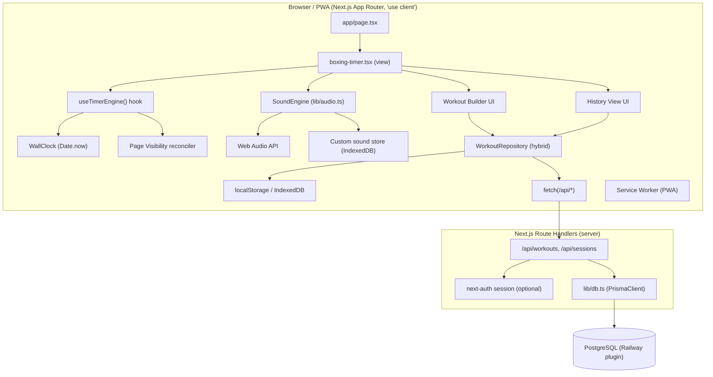
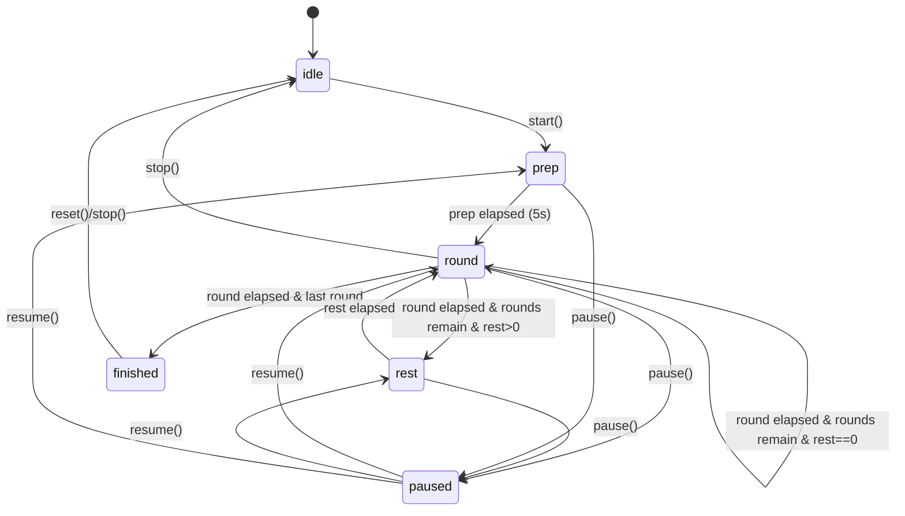
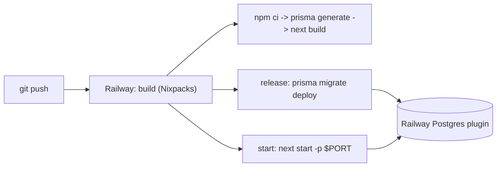

# Design Document: Boxing Timer Enhancements

## Overview

This document describes the technical design for a set of enhancements to the existing
`boxing-rounds-timer` app — a Next.js 14.2 (App Router) + TypeScript client-side application
whose UI lives almost entirely in `app/_components/boxing-timer.tsx` (a large `'use client'`
component) rendered by `app/page.tsx`.

The enhancements span two bug fixes and four features, plus a deployment track and a PWA track:

1. **Bug fix — Accurate background timer.** Replace the current tick-counting `setInterval`
   (which decrements a `remaining` React state value by 1 each second) with a wall-clock /
   timestamp-delta engine that computes elapsed time from `Date.now()` deltas and reconciles on
   tab resume using the Page Visibility API. This fixes the drift/stall that occurs when iOS
   Safari throttles or suspends background JS timers.
2. **Bug fix / feature — Custom sound selection.** Let the user choose from built-in synthesized
   sounds and upload/select their own audio file, persist the selection, keep the synthesized
   fallback, and use best-effort background audio (pre-scheduled Web Audio + optional Notifications).
3. **Feature — Workout history.** Persist completed workouts (date, type, rounds completed,
   duration, preset used) in Postgres via Prisma, with a history view. Works both anonymously and
   per-user (next-auth is already a dependency).
4. **Feature — Custom workout builder for Boxing and MMA.** Configurable rounds, round/rest
   durations, and workout type, with sensible Boxing and MMA default presets, built on top of the
   existing preset system (localStorage + optional DB hybrid).
5. **Deployment — Railway.** Full step-by-step deployment design: Railway project + Postgres
   plugin, `DATABASE_URL`, `prisma migrate deploy` in the release step, `next build` / `next start`,
   Node version pinning, and Nixpacks/`railway.json` config.
6. **PWA — "make it an app".** Installable PWA (manifest, service worker, add-to-home-screen,
   standalone display, icons) so the app can be installed on an iPhone home screen.
7. **Native future phase (documented only).** True background execution + Dynamic Island / Live
   Activity requires a native iOS wrapper (Capacitor + ActivityKit). Captured as an explicit
   out-of-scope Future Considerations section.

The guiding principle is **web-first now**: everything shippable in a browser/PWA is designed in
detail; the native path is documented as a future phase with a clear rationale.

### Grounding in the current codebase

| Area | Current file(s) | Change |
|------|-----------------|--------|
| Timer UI + logic | `app/_components/boxing-timer.tsx` | Extract engine into a hook; drive UI from engine snapshot; migrate hardcoded `red-500` accents to semantic tokens (see [UI / UX Design](#ui--ux-design-red--white-theme)) |
| Design tokens / theme | `app/globals.css` (`:root`/`.dark`), `tailwind.config.ts` | Retint `--primary`/`--ring`/hero-gradient/`--chart-*` from purple to a red-and-white palette; Tailwind mapping unchanged (see [UI / UX Design](#ui--ux-design-red--white-theme)) |
| Sound synthesis | `lib/audio.ts` | Extend into a `SoundEngine` with selectable sources + custom uploads |
| Presets | `lib/presets.ts` (localStorage `boxing_timer_presets_v1`) | Extend `Preset` with `type`; add hybrid local/DB repository |
| DB client | `lib/db.ts` (Prisma singleton) | Reuse as-is |
| Schema | `prisma/schema.prisma` (no models) | Add `Workout`, `WorkoutSession`, plus next-auth models |
| Dead code | `lib/types.ts` (Expense boilerplate) | Delete; replace with domain types |
| Config | `next.config.js` | Add PWA/service-worker wiring |
| Build/deploy | `package.json` scripts | Add `migrate:deploy`, Railway config |

---

## Architecture

### High-level component/module architecture



**Key architectural decisions:**

- **Engine extraction.** The timing logic is extracted out of the `boxing-timer.tsx` component
  into a self-contained `useTimerEngine` hook backed by a pure `TimerEngine` reducer. This makes
  the wall-clock logic unit- and property-testable independently of React rendering.
- **Wall-clock over tick-counting.** The engine never trusts `setInterval` frequency for
  correctness. `setInterval` (or `requestAnimationFrame`) is used only to *drive re-renders*; the
  authoritative remaining time is always derived from `Date.now()` deltas against fixed phase
  boundaries. This is the core of the background-accuracy fix.
- **Hybrid data layer.** A `WorkoutRepository` abstraction reads/writes locally (localStorage /
  IndexedDB) for anonymous users and syncs to Postgres via API routes when a next-auth session
  exists. The UI depends on the repository interface, not on the storage mechanism.
- **Progressive enhancement.** History/auth/DB are additive. If `DATABASE_URL` is unset (pure
  local dev with no DB), the app still functions fully in local-only mode.

### Runtime state machine (phases)

The existing phase model is preserved and formalized:



> Note: today `running` is a separate boolean and pausing is represented by `running=false`
> without a distinct `paused` phase. The new engine models `paused` explicitly (see State Model)
> so wall-clock reconciliation has an unambiguous "clock is not advancing" state.

---

## UI / UX Design (Red & White Theme)

> This section addresses a new user requirement: **"make the UI experience better, use tons of red
> color with white."** It defines a red-and-white visual refresh implemented **entirely through the
> existing design-token system** (shadcn/ui-style CSS variables in `app/globals.css` mapped to
> Tailwind in `tailwind.config.ts`), plus concrete UX improvements applied across the existing timer
> screen and the three new screens introduced elsewhere in this design (Workout Builder, History
> View, Sound Settings). It is additive: it changes token *values* and migrates hardcoded colors to
> tokens, but does not alter the timer engine, data models, or correctness contract.

### Design goals

1. **Red is the brand.** Red becomes the actual `--primary` token — not a scattering of hardcoded
   `red-500` utilities — so the whole app (buttons, links, focus rings, accents, charts, hero
   background) is red by default and centrally controlled from one place.
2. **White is the dominant surface.** In light mode the app is red-on-white: white backgrounds and
   cards, red accents, white text on red buttons. In dark mode red accents sit on near-black
   surfaces with white foreground text.
3. **Better mid-workout UX.** The app is used on a phone during training, so the refresh prioritizes
   a large high-contrast timer, big tap targets, and instant at-a-glance phase recognition.
4. **Token discipline (per STYLE_GUIDE).** "All colors use CSS variables — never hardcode color
   values." The refresh brings `boxing-timer.tsx` into compliance.

### Current-state findings (grounded in the code)

The current implementation is **internally inconsistent** about its accent color:

- `app/globals.css` defines `--primary` as **purple** — `262 83% 58%` (light) and `263 70% 50%`
  (dark) — and `--ring` matches purple (`262 83% 58%` / `263 70% 50%`). The `.hero-gradient` utility
  layers **purple/violet/indigo** radial gradients (`hsl(262 …)`, `hsl(280 …)`, `hsl(240 …)`), and
  `--chart-1` is purple.
- Yet `app/_components/boxing-timer.tsx` **hardcodes red** everywhere the user actually sees an
  accent: `bg-red-500 hover:bg-red-600 text-white` (Start button), `text-red-500` (headings, icons,
  active labels), `stroke-red-500` (progress ring during a round), `bg-red-500/10` + `ring-red-500/30`
  (active preset row, logo chip), and `text-red-500` icons in Settings/Presets headers.
- Result: the "brand" token (purple) and the visible accent (hardcoded red) disagree; the theme is
  neither centrally controlled nor token-driven, and dark-mode/`--ring`/charts still render purple.

**Refresh strategy:** make **red the real `--primary`** in `globals.css`, point `--ring`, hero
gradient, and charts at the red family, then **migrate every hardcoded `red-500`/`red-600` usage in
`boxing-timer.tsx` to semantic token utilities** (`bg-primary`, `text-primary`, `stroke-primary`,
`ring-primary`, `bg-primary/10`, etc.). No new color utilities are hardcoded.

### Proposed design tokens — `app/globals.css`

Replace the purple `--primary`/`--ring`/`--chart-*` values (and the hero gradient) with a
boxing-red palette. Keep the structure and all non-color tokens (radius, spacing, shadow, duration)
unchanged. Values below are HSL triplets (the format the file already uses); they may be refined
during implementation as long as the contrast requirements below hold.

**`:root` (light mode) — red-on-white:**

```css
:root {
  --background: 0 0% 100%;          /* white — unchanged, dominant surface */
  --foreground: 240 10% 3.9%;       /* near-black text — unchanged */

  --card: 0 0% 100%;                /* white cards — unchanged */
  --card-foreground: 240 10% 3.9%;

  --primary: 0 84% 55%;             /* CHANGED: boxing red (was 262 83% 58% purple) */
  --primary-foreground: 0 0% 100%;  /* white text on red — unchanged, AA on red */

  --secondary: 0 40% 96%;           /* CHANGED: red-tinted neutral (was 240 4.8% 95.9%) */
  --secondary-foreground: 240 5.9% 10%;

  --muted: 0 20% 96%;               /* CHANGED: faint red-tinted muted surface */
  --muted-foreground: 240 3.8% 46.1%;

  --accent: 0 60% 96%;              /* CHANGED: red-tinted hover/active tint */
  --accent-foreground: 0 72% 42%;   /* CHANGED: darker red for text-on-accent contrast */

  --destructive: 0 84.2% 60.2%;     /* unchanged (still red family, distinct usage) */
  --destructive-foreground: 0 0% 98%;

  --border: 0 15% 90%;              /* CHANGED: subtle red-tinted border (was 240 5.9% 90%) */
  --input: 0 15% 90%;
  --ring: 0 84% 55%;                /* CHANGED: focus ring = primary red (was purple) */

  /* radius / spacing / shadow / duration — UNCHANGED */

  --chart-1: 0 84% 55%;             /* CHANGED: red family */
  --chart-2: 0 72% 51%;
  --chart-3: 14 90% 55%;            /* warm red-orange for series contrast */
  --chart-4: 0 60% 40%;             /* deep red */
  --chart-5: 340 75% 55%;           /* red-pink */
}
```

**`.dark` (dark mode) — red accents on near-black, white foreground:**

```css
.dark {
  --background: 240 10% 3.9%;       /* near-black — unchanged */
  --foreground: 0 0% 98%;           /* white text — unchanged */

  --card: 240 10% 5.9%;
  --card-foreground: 0 0% 98%;

  --primary: 0 72% 51%;             /* CHANGED: red tuned for dark bg (was 263 70% 50% purple) */
  --primary-foreground: 0 0% 100%;  /* white text on red */

  --secondary: 0 25% 15%;           /* CHANGED: dark red-tinted neutral */
  --secondary-foreground: 0 0% 98%;

  --muted: 240 3.7% 15.9%;          /* keep neutral dark muted for readability */
  --muted-foreground: 240 5% 64.9%;

  --accent: 0 30% 18%;              /* CHANGED: dark red-tinted hover/active */
  --accent-foreground: 0 0% 98%;

  --destructive: 0 62.8% 30.6%;     /* unchanged */
  --destructive-foreground: 0 0% 98%;

  --border: 0 15% 18%;              /* CHANGED: subtle red-tinted dark border */
  --input: 0 15% 18%;
  --ring: 0 72% 51%;                /* CHANGED: focus ring = primary red */

  --chart-1: 0 72% 51%;             /* CHANGED: red family (dark) */
  --chart-2: 0 84% 60%;
  --chart-3: 14 85% 58%;
  --chart-4: 0 55% 45%;
  --chart-5: 340 75% 55%;
}
```

**Hero gradient (`@layer utilities`) — retint purple/violet → red:**

```css
.hero-gradient {
  background:
    radial-gradient(ellipse 60% 50% at 50% -10%, hsl(0 84% 55% / 0.12), transparent),
    radial-gradient(ellipse 40% 40% at 80% 0%,   hsl(0 72% 51% / 0.08), transparent),
    radial-gradient(ellipse 40% 30% at 20% 10%,  hsl(14 90% 55% / 0.06), transparent);
}

.dark .hero-gradient {
  background:
    radial-gradient(ellipse 60% 50% at 50% -10%, hsl(0 72% 51% / 0.20), transparent),
    radial-gradient(ellipse 40% 40% at 80% 0%,   hsl(0 84% 60% / 0.10), transparent),
    radial-gradient(ellipse 40% 30% at 20% 10%,  hsl(14 85% 58% / 0.08), transparent);
}
```

> The `::selection` rule in `globals.css` already uses `hsl(var(--primary) / 0.2)` /
> `hsl(var(--primary))`, so it automatically becomes red once `--primary` changes — no edit needed.

### Tailwind mapping — `tailwind.config.ts` (confirm: no change)

`tailwind.config.ts` already maps every relevant token to a Tailwind color:
`primary`/`primary-foreground`, `secondary`, `muted`, `accent`, `destructive`, `border`, `input`,
`ring`, and `chart-1..5`, each as `hsl(var(--…))`. Because the refresh only changes the *values* of
those CSS variables, **no change to `tailwind.config.ts` is required** — `bg-primary`, `text-primary`,
`ring-primary`, `stroke-primary`, `bg-accent`, etc. will all render red automatically. (The font
families `font-sans`/`font-display`/`font-mono` used below are also already mapped there.)

### Contrast & accessibility requirements (WCAG AA)

Red is a mid-luminance hue, so contrast must be verified, not assumed:

- **White text on red primary buttons:** use `text-primary-foreground` (white). A red at ~`0 84% 55%`
  (light) / `0 72% 51%` (dark) with white text clears AA (≥ 4.5:1) for the button label sizes used.
- **Red text on white (`text-primary` on `--background`):** at large sizes (headings, the countdown)
  this is comfortable. For **small red text** (`text-sm`/`text-xs`, e.g. captions), if the chosen red
  does not reach 4.5:1 on white, use a **darker red for small text** — `--accent-foreground`
  (`0 72% 42%`) is provided for exactly this, or fall back to `text-foreground`.
- **Red-tinted neutrals** (`--secondary`, `--muted`, `--accent`, `--border`) are kept high-lightness
  in light mode / low-lightness in dark mode so body text (`--foreground` / `--muted-foreground`)
  retains its existing contrast.
- **Focus rings:** `--ring` = primary red; ensure the ring remains visible against both white and
  near-black surfaces (it does at the chosen lightness). Do not remove focus outlines.
- **Reduced motion:** honor `prefers-reduced-motion` for the new/animated elements (progress-ring
  transitions, `FadeIn`/`Stagger`/`PressScale`) by disabling or shortening transitions.

### Phase color semantics (tradeoff & recommendation)

The timer distinguishes phases by color: today **round = red** (`text-red-500`/`stroke-red-500`),
**rest = emerald** (`text-emerald-400`), **prep = sky** (`text-sky-400`), **finished = amber**
(`text-amber-400`).

**Tradeoff:** A strict red-and-white-only scheme reinforces the brand but hurts *at-a-glance*
phase recognition mid-workout — the single most important glance is "am I working or resting?"
Distinguishing round vs. rest purely by shade of red (or red vs. white) is risky under sweat, motion,
and glance-only viewing, and is weak for color-vision-deficient users.

**Recommendation (chosen):** Keep **round = the brand red** (now `text-primary`/`stroke-primary`),
and keep a **clearly non-red rest color for differentiation**, but re-tune the secondary phase
colors to a cohesive, on-theme palette rather than the current saturated emerald/sky/amber:

| Phase | Semantic role | Token / class | Rationale |
|-------|---------------|---------------|-----------|
| `round` | Work (energetic) | `text-primary` / `stroke-primary` / `bg-primary/10` | Brand red = "go/work" |
| `rest` | Recover (calm, distinct) | keep a cool non-red (e.g. a tuned `emerald-500`/teal) | Must contrast red for instant recognition |
| `prep` | Get ready (neutral-cool) | a muted slate/sky, lower saturation than today | Reads as "about to start" |
| `finished` | Complete (celebratory) | keep amber/gold | Trophy moment, distinct from red/green |

The app still *reads* as red-and-white because red is the dominant, always-present brand color
(buttons, ring, header, hero, idle/active accents) and white is the dominant surface; the rest/prep/
finished colors appear only briefly and only as the active-phase accent. This preserves usability
while satisfying "tons of red with white." (An alternative pure red/white/neutral scheme is possible
— round = red, rest = neutral/white — but is **not recommended** for the reasons above.)

> Implementation note: the secondary phase colors may remain as Tailwind palette classes for now
> (they are semantic status colors, not brand accents). If full token discipline is desired later,
> introduce dedicated `--rest`/`--prep`/`--finished` tokens; that is optional and out of scope for
> this refresh, which focuses on making the **brand** red token-driven.

### Timer screen refresh (`app/_components/boxing-timer.tsx`)

**Token migration (hardcoded → semantic).** Every hardcoded red utility is replaced:

| Current (hardcoded) | Refreshed (token) | Location |
|---------------------|-------------------|----------|
| `bg-red-500 hover:bg-red-600 text-white` | `Button` default `variant` (already `bg-primary … text-primary-foreground`) — drop the custom classes | Start/Resume button |
| `text-red-500` | `text-primary` | "bell" word, header icons, active labels, Settings/Presets header icons |
| `stroke-red-500` | `stroke-primary` | progress ring during `round` |
| `bg-red-500/10` | `bg-primary/10` | logo chip, active preset row |
| `ring-red-500/30` | `ring-primary/30` | active preset row ring |
| `from-red-500/10 …` | `from-primary/10 …` | active-phase background tint |

Because the Start button becomes a stock `Button` (default variant), it inherits `bg-primary`,
`text-primary-foreground`, hover, and the red focus `ring` automatically — the reason the button
looked red before (a manual `bg-red-500`) is now handled by the theme.

**Hero timer & typography (per STYLE_GUIDE):**

- Make the circular timer the clear hero: increase the ring size on larger viewports, thicken the
  progress stroke slightly, and render the progress ring as **strong red (`stroke-primary`) on a
  light track** (`stroke-foreground/10`, already present).
- Countdown uses `font-mono` `tabular-nums` (already present); enlarge on desktop.
- Headings use `font-display` with `tracking-tight` (already present on the H1 and card titles);
  keep the `text-4xl → text-xl` scale from the guide.

**Mobile-first layout & tap targets:**

- The current controls use `size="lg"` buttons; ensure Start/Pause/Stop meet a ≥ 44px touch target
  and are reachable one-handed. On small screens stack the primary action full-width above Stop/Reset
  so the most-used control is the largest, thumb-friendly target.
- Keep the active-phase background tint (`bgTintClass`) but drive it from `--primary` for the round
  phase (`from-primary/10`) so the whole screen subtly glows red while working.
- Consider the `Drawer` (bottom sheet, "great for mobile" per STYLE_GUIDE) for Settings on phones
  instead of the side card, freeing vertical space for the hero timer.

### New screens — token consumption & navigation

The three new components introduced elsewhere in this design must consume tokens (never hardcode
colors) and reuse the STYLE_GUIDE component library:

- **Navigation:** introduce top-level `Tabs` (`@/components/ui/tabs` — `Tabs`, `TabsList`,
  `TabsTrigger`, `TabsContent`) to switch **Timer / Builder / History**. The active `TabsTrigger`
  uses primary-red styling; Sound Settings can be a `Dialog` or `Drawer` opened from the header.
- **`workout-builder.tsx`:** `Card` for the form surface, `Button` (default = red primary) for
  "Save", `Badge` (`variant="default"` red, or `secondary`) for the Boxing/MMA type, existing
  `NumberStepper`/`DurationField` inputs, and `toast.success()` (Sonner) on save.
- **`history-view.tsx`:** `Card` per session (or `Table`), `Badge` for the type (Boxing/MMA),
  `font-mono` for durations/dates, and summary aggregate cards on top. Wrap the list in
  `Stagger`/`StaggerItem` and each card in `HoverLift`.
- **`sound-settings.tsx`:** `Select`/`RadioGroup` for per-role sound source, `Slider` for volume,
  `Switch` for mute, `Button` for upload, and `toast` feedback. Surfaced in a `Dialog`/`Drawer`.

**Animation & feedback (per STYLE_GUIDE `@/components/ui/animate`):**

- `FadeIn` for section reveals, `Stagger`/`StaggerItem` for the history list and preset list,
  `HoverLift` on interactive cards, and **`PressScale` on the primary Start/Pause/Stop buttons** for
  tactile press feedback (valuable mid-workout).
- Continue using **Sonner** `toast` (`toast.success`/`toast.error`) for "Workout complete", "Saved",
  and error states — already wired via the `Toaster` in `app/layout.tsx`.

**Accessibility across all screens:**

- Focus rings via `--ring` (now red) on all interactive elements; never suppress outlines.
- Preserve/extend existing `aria-label`s (mute toggle, stepper +/- buttons, delete preset) and add
  labels to new controls (tabs, sliders, sound selectors).
- Respect `prefers-reduced-motion`; ensure red-on-white and white-on-red meet AA (see Contrast
  requirements above).

### Dark mode

Dark mode continues to work through `next-themes` (`ThemeProvider` in `app/layout.tsx`, per
STYLE_GUIDE) and the `.dark` token block above. Because all colors resolve from `.dark` CSS
variables, toggling theme (via `ThemeToggle`) automatically swaps to the dark red palette with white
foreground on near-black surfaces — no component-level dark-mode branching is required.

### Files impacted (UI/UX refresh)

| File | Change |
|------|--------|
| `app/globals.css` | Retint `--primary`, `--ring`, `--secondary`/`--accent`/`--muted`/`--border`/`--input`, `--chart-*` to the red palette (light + dark); retint `.hero-gradient` and `.dark .hero-gradient` to red. `::selection` auto-follows `--primary`. |
| `tailwind.config.ts` | **No change** — tokens already mapped to Tailwind colors; confirmed. |
| `app/_components/boxing-timer.tsx` | Migrate all hardcoded `red-500`/`red-600` → semantic tokens (`bg-primary`, `text-primary`, `stroke-primary`, `ring-primary`, `bg-primary/10`, `from-primary/10`); Start button → stock `Button` default variant; enlarge hero timer; add `PressScale`; optional mobile `Drawer` for settings. |
| `app/_components/workout-builder.tsx` (NEW) | Consume tokens; `Card`/`Button`/`Badge`/inputs; `toast` feedback. |
| `app/_components/history-view.tsx` (NEW) | Consume tokens; `Card`/`Table`/`Badge`; `Stagger`/`HoverLift`. |
| `app/_components/sound-settings.tsx` (NEW) | Consume tokens; `Select`/`Slider`/`Switch`; `Dialog`/`Drawer`. |
| (navigation) | Add `Tabs` to switch Timer / Builder / History. |

> The PWA `theme_color` in the manifest sketch is `#ef4444` (Tailwind red-500) and the
> `background_color` is `#0a0a0a`, which already align with this red-and-white refresh; keep them (or
> nudge `theme_color` to match the final chosen `--primary` red).

---

## Timer Architecture (Wall-Clock Design)

### Problem with the current approach

`boxing-timer.tsx` decrements `remaining` in a `setInterval(..., 1000)` and fires phase
transitions from a `useEffect` watching `remaining <= 0`. iOS Safari heavily throttles or fully
suspends timers for backgrounded tabs, so:

- ticks stop firing → the clock freezes,
- when resumed, only one catch-up tick fires → time drifts behind real elapsed time,
- warning-tick and phase-transition sounds that "should have" fired while backgrounded never fire.

### Wall-clock model

The engine stores **absolute timestamps of phase boundaries**, not a countdown counter. Remaining
time for the current phase is *always computed* as `phaseEndsAt - Date.now()`.

Core idea: a running workout is fully described by
- the ordered list of phase segments (prep, round 1, rest 1, round 2, …),
- an `anchor`: the wall-clock time (`Date.now()`) at which the current running segment *started*,
- for a paused workout, the amount of time already consumed in the current segment.

On every render tick and on every visibility change, we recompute the current segment and
remaining time from `Date.now()`. If several segment boundaries were crossed while backgrounded,
we **catch up** by advancing through them in order, firing the transition sound only for the
*final* landing segment (and optionally a summary), avoiding a burst of stale sounds.

### Data types (TypeScript)

```typescript
// lib/timer/types.ts
export type Phase = 'idle' | 'prep' | 'round' | 'rest' | 'paused' | 'finished'

export interface WorkoutSpec {
  prepSeconds: number      // default 5
  rounds: number           // >= 1
  roundSeconds: number     // >= 1
  restSeconds: number      // >= 0 (0 => rest phases skipped)
}

/** A single contiguous timed segment within a workout. */
export interface Segment {
  kind: 'prep' | 'round' | 'rest'
  index: number            // 1-based round number for round/rest; 0 for prep
  durationMs: number       // > 0
  offsetMs: number         // cumulative start offset from workout start
}

/** Immutable plan derived once from a WorkoutSpec. */
export interface TimelinePlan {
  segments: Segment[]      // ordered; sum of durations = totalMs
  totalMs: number
}

/** The live, serializable engine state. */
export interface EngineState {
  spec: WorkoutSpec
  plan: TimelinePlan
  status: 'idle' | 'running' | 'paused' | 'finished'
  // Wall-clock anchors (all epoch ms). null when idle/finished.
  startedAtMs: number | null   // when the *workout* (prep) started, in wall-clock time
  pausedAtMs: number | null    // when paused, in wall-clock time
  accumulatedPauseMs: number   // total time spent paused so far
}

/** A derived, render-friendly snapshot computed from EngineState + now. */
export interface TimerSnapshot {
  phase: Phase
  currentRound: number     // 1-based
  totalRounds: number
  remainingMs: number      // remaining in current phase, >= 0
  phaseTotalMs: number     // duration of current phase
  progressPct: number      // 0..100 within current phase
  elapsedWorkoutMs: number // total elapsed excluding pauses, clamped to totalMs
  finished: boolean
}
```

### Elapsed-time computation

```typescript
// lib/timer/compute.ts

/** Effective elapsed time since workout start, excluding paused durations. */
export function effectiveElapsedMs(state: EngineState, nowMs: number): number {
  if (state.startedAtMs === null) return 0
  const rawEnd = state.status === 'paused' && state.pausedAtMs !== null
    ? state.pausedAtMs
    : nowMs
  const elapsed = rawEnd - state.startedAtMs - state.accumulatedPauseMs
  return clamp(elapsed, 0, state.plan.totalMs)
}

/** Locate the active segment for a given elapsed offset. */
export function segmentAt(plan: TimelinePlan, elapsedMs: number): {
  segment: Segment
  remainingMs: number
} {
  const capped = clamp(elapsedMs, 0, plan.totalMs)
  for (const seg of plan.segments) {
    if (capped < seg.offsetMs + seg.durationMs || seg === last(plan.segments)) {
      return { segment: seg, remainingMs: (seg.offsetMs + seg.durationMs) - capped }
    }
  }
  const tail = last(plan.segments)
  return { segment: tail, remainingMs: 0 }
}

export function snapshot(state: EngineState, nowMs: number): TimerSnapshot { /* derive TimerSnapshot */ }
```

### Reconciliation on resume (Page Visibility API)

```typescript
// lib/timer/useTimerEngine.ts (React binding, pseudo-detailed)
```

```pascal
PROCEDURE onVisibilityOrTick(state, now)
  INPUT: state (EngineState), now = Date.now()
  OUTPUT: nextSnapshot, soundEvents

  BEGIN
    IF state.status <> 'running' THEN
      RETURN snapshot(state, now), []      // paused/idle/finished: no advance
    END IF

    elapsed  ← effectiveElapsedMs(state, now)
    newSeg   ← segmentAt(state.plan, elapsed).segment
    prevSeg  ← lastRenderedSegment            // tracked in a ref

    events ← []
    IF newSeg <> prevSeg THEN
      // One or many boundaries may have been crossed while backgrounded.
      // Fire the sound for the segment we actually LANDED in, not each skipped one.
      events ← [transitionSoundFor(newSeg)]
      lastRenderedSegment ← newSeg
    END IF

    IF elapsed >= state.plan.totalMs THEN
      state.status ← 'finished'
      events ← [finishedSound]
    END IF

    RETURN snapshot(state, now), events
  END
```

**Driver.** A `setInterval(…, 250ms)` (or `requestAnimationFrame` while visible) invokes
`onVisibilityOrTick`. A `visibilitychange` listener invokes it immediately on resume. Because
correctness never depends on the interval firing on time, throttling only affects *display*
smoothness, never accuracy.

**Warning ticks.** The "last 3 seconds" warning sounds are pre-scheduled against the Web Audio
clock at segment start (see Audio Architecture) so they play even if the render loop is throttled;
the fallback is to fire any *not-yet-played, still-in-the-future* warning ticks discovered during
reconciliation, and to suppress ticks whose scheduled time is already in the past.

### Formal specification — core functions

**`buildPlan(spec: WorkoutSpec): TimelinePlan`**
- **Preconditions:** `spec.rounds >= 1`, `spec.roundSeconds >= 1`, `spec.restSeconds >= 0`,
  `spec.prepSeconds >= 0`.
- **Postconditions:**
  - `plan.segments[0].kind === 'prep'` iff `prepSeconds > 0`.
  - There are exactly `rounds` segments of kind `'round'`.
  - There are exactly `rounds - 1` segments of kind `'rest'` when `restSeconds > 0`, else `0`.
  - Segments are contiguous: `segments[i].offsetMs === segments[i-1].offsetMs + segments[i-1].durationMs`.
  - `plan.totalMs === Σ segment.durationMs === last.offsetMs + last.durationMs`.
- **Loop invariants:** while appending segments, `runningOffset` equals the sum of all
  previously-appended durations.

**`effectiveElapsedMs(state, now)`**
- **Preconditions:** `now` is a finite epoch-ms value; `accumulatedPauseMs >= 0`.
- **Postconditions:** result in `[0, plan.totalMs]`; monotonically non-decreasing in `now` while
  `status === 'running'`; **constant** in `now` while `status === 'paused'`.

**`segmentAt(plan, elapsedMs)`**
- **Preconditions:** `plan.segments` non-empty and contiguous.
- **Postconditions:** returns a segment `s` with `s.offsetMs <= clamp(elapsedMs) <= s.offsetMs + s.durationMs`;
  `remainingMs ∈ [0, s.durationMs]`.

### Correctness properties (property-based testing)

These are the invariants the wall-clock engine must satisfy. Target library: **fast-check**
(TypeScript). All timestamps are modeled as monotonic sequences to simulate backgrounding.

- **P1 — Elapsed monotonicity.** ∀ running state, ∀ `t1 <= t2`:
  `effectiveElapsedMs(s, t1) <= effectiveElapsedMs(s, t2)`.
- **P2 — Pause freezes the clock.** ∀ paused state, ∀ `t1, t2`:
  `effectiveElapsedMs(s, t1) === effectiveElapsedMs(s, t2)`.
- **P3 — Background resilience (no drift).** For any interleaving of "hidden" gaps of arbitrary
  length, the remaining time computed after resume equals
  `phaseEndsAt - now` — i.e., replaying with a single large jump yields the *same* snapshot as
  replaying with many small steps summing to the same wall-clock delta. (Determinism of the pure
  functions w.r.t. `now`.)
- **P4 — Plan totals.** ∀ valid `spec`: `sum(seg.durationMs) === plan.totalMs` and
  `roundCount(plan) === spec.rounds`.
- **P5 — Phase-transition correctness.** Walking `now` from `startedAt` to `startedAt + totalMs`,
  the sequence of distinct segments visited equals the plan's segment order with no skips and no
  repeats, and the final phase is `finished`.
- **P6 — Boundary landing.** At exactly `elapsed === seg.offsetMs + seg.durationMs`, `segmentAt`
  returns the *next* segment (or stays on the last segment at `totalMs`), never an earlier one.
- **P7 — Clamp safety.** `remainingMs >= 0` and `progressPct ∈ [0,100]` for all inputs, including
  `now < startedAt` (early) and `now >> end` (very late resume).
- **P8 — Catch-up sound discipline.** Given any single reconciliation across N crossed boundaries,
  at most one transition sound event is emitted (for the landed segment), preventing a burst of
  stale sounds after backgrounding.

---

## Correctness Properties

The core correctness properties for this design are the wall-clock engine invariants **P1–P8**,
defined in detail under
[Timer Architecture → Correctness properties (property-based testing)](#correctness-properties-property-based-testing).
They are the authoritative correctness contract and are verified via property-based testing
(fast-check); see the [Testing Strategy → Property-based testing](#property-based-testing) section.

Summary:

### Property 1: Elapsed monotonicity

**P1 — Elapsed monotonicity.** Effective elapsed time never decreases as `now` advances while running.

**Validates: Requirement 1.3**

### Property 2: Pause freezes the clock

**P2 — Pause freezes the clock.** Effective elapsed time is constant while paused.

**Validates: Requirements 1.4, 1.7, 6.3**

### Property 3: Background resilience (no drift)

**P3 — Background resilience (no drift).** A single large time jump yields the same snapshot as many small steps summing to the same delta.

**Validates: Requirements 1.1, 1.2, 1.6**

### Property 4: Plan totals

**P4 — Plan totals.** Segment durations sum to `plan.totalMs` and round count matches `spec.rounds`.

**Validates: Requirements 2.1, 2.2, 2.3, 2.4, 2.5, 2.6**

### Property 5: Phase-transition correctness

**P5 — Phase-transition correctness.** Walking `now` across the workout visits segments in order with no skips/repeats, ending in `finished`.

**Validates: Requirement 2.7**

### Property 6: Boundary landing

**P6 — Boundary landing.** At an exact boundary, `segmentAt` returns the next segment (or stays on the last at `totalMs`).

**Validates: Requirements 2.8, 2.9**

### Property 7: Clamp safety

**P7 — Clamp safety.** `remainingMs >= 0` and `progressPct ∈ [0,100]` for all inputs, including early/late `now`.

**Validates: Requirements 1.9, 1.10**

### Property 8: Catch-up sound discipline

**P8 — Catch-up sound discipline.** A single reconciliation across N crossed boundaries emits at most one transition sound.

**Validates: Requirements 2.10, 4.4**

---

## Audio / Sound Architecture

### Goals

- Keep the existing synthesized tones (`playRoundStartBell`, `playRestStartBuzzer`,
  `playWarningTick`) as the **default and fallback**.
- Add **built-in preset sounds** and **user-uploaded custom sounds**, persisted per sound role.
- Improve background reliability via **pre-scheduling** on the Web Audio clock.
- Be honest about **iOS Safari limitations**.

### Sound roles and sources

```typescript
// lib/audio/types.ts
export type SoundRole = 'roundStart' | 'restStart' | 'warningTick' | 'finished'

export type SoundSource =
  | { kind: 'synth'; synthId: 'bell' | 'buzzer' | 'tick' | 'airhorn' | 'beep' }
  | { kind: 'builtin'; assetPath: string }   // /sounds/*.mp3 shipped with the app
  | { kind: 'custom'; blobId: string }        // user upload stored in IndexedDB

export interface SoundSettings {
  muted: boolean
  volume: number                              // 0..1
  assignments: Record<SoundRole, SoundSource>
}
```

### Sound engine interface

```typescript
// lib/audio/soundEngine.ts
export interface SoundEngine {
  unlock(): void                                   // call on first user gesture (Start)
  play(role: SoundRole): void                      // immediate playback
  scheduleAt(role: SoundRole, whenCtxTime: number): void  // pre-schedule on AudioContext clock
  cancelScheduled(): void
  setSettings(settings: SoundSettings): void
  loadCustom(role: SoundRole, file: File): Promise<string>  // -> blobId (validated, stored)
}
```

- **Custom upload store.** Uploaded files are validated (`audio/*` MIME, size cap e.g. ≤ 5 MB,
  duration cap e.g. ≤ 10 s), decoded once via `decodeAudioData`, and the raw blob is persisted in
  **IndexedDB** (keyed by `blobId`). Decoded `AudioBuffer`s are cached in memory per session.
  `SoundSettings.assignments` (which references `blobId`) is persisted in localStorage alongside
  presets so selection survives reloads.
- **Built-in assets.** A small set of royalty-free `mp3` files shipped under `public/sounds/`
  (e.g. boxing bell, air horn, buzzer, beep). Provide attribution in-repo.
- **Fallback chain.** For a role: try assigned source → if load/decode fails, fall back to the
  matching synth. This guarantees a sound always plays.

### Background audio strategy & iOS limitations

```mermaid
sequenceDiagram
    participant U as User
    participant App as Timer Engine
    participant WA as Web Audio (AudioContext)
    participant OS as iOS Safari

    U->>App: Press Start (user gesture)
    App->>WA: unlock() + resume()
    App->>WA: scheduleAt(roundStart, tRound1Start)
    App->>WA: scheduleAt(warningTick, tRound1End-3s ...)
    Note over App,WA: All boundary sounds pre-scheduled on the audio clock
    U->>OS: Backgrounds the tab
    Note over OS,WA: iOS MAY suspend the AudioContext when backgrounded
    U->>OS: Foregrounds the tab
    App->>WA: reconcile() -> resume(); reschedule remaining boundaries
```

- **What works web-first:** pre-scheduling upcoming boundary sounds on the `AudioContext` clock
  gives the best chance they fire even under render throttling *while the context stays running*.
- **iOS Safari reality (documented limitation):** when a Safari tab is backgrounded (or the phone
  locks), iOS commonly **suspends the AudioContext**, so pre-scheduled sounds will **not** play
  until the tab is foregrounded, at which point we resume and reschedule. There is **no reliable
  way** to play audio from a fully backgrounded browser tab on iOS.
- **Notifications API:** can optionally show a visual/haptic notification on phase transitions when
  permission is granted, but iOS Safari does **not** reliably play custom notification sounds for
  web apps and requires the PWA to be installed for push. We treat notifications as best-effort,
  visual-first, and never as the sole alerting mechanism.
- **Honest UX:** the footer tip ("Keep the tab visible for best accuracy") is retained and
  extended to explain that iOS may silence audio while the screen is locked; the *timer itself*
  remains accurate on resume regardless (thanks to the wall-clock engine).

---

## Data Models

> Persistence layer: **Prisma / PostgreSQL**. The models below define the domain and next-auth
> schema; validation rules are enforced in the API layer via `zod`.

### Auth strategy recommendation

next-auth (`4.24.11`) and `@next-auth/prisma-adapter` are already dependencies. **Recommendation:
support both anonymous local usage and optional accounts.**

- **Anonymous (default):** workouts, custom workouts, and history live locally
  (localStorage/IndexedDB). Zero-friction; no login required. This preserves today's behavior.
- **Optional sign-in:** when a user signs in (e.g. GitHub/Google via next-auth), the client syncs
  local history/custom workouts to Postgres and thereafter reads/writes server-side, enabling
  cross-device history.
- **Rationale:** a personal boxing timer should never gate core use behind auth; the DB adds value
  (durability, multi-device) only for users who want it. The hybrid repository (below) makes auth
  additive rather than required.

### Prisma schema additions

Add to `prisma/schema.prisma` (datasource/generator already present and correct, including the
`linux-musl-arm64-openssl-3.0.x` binary target useful for containerized deploys):

```prisma
// ---- next-auth (only needed if optional accounts are enabled) ----
model User {
  id            String    @id @default(cuid())
  name          String?
  email         String?   @unique
  emailVerified DateTime?
  image         String?
  accounts      Account[]
  sessions      Session[]
  workouts      Workout[]
  workoutSessions WorkoutSession[]
  createdAt     DateTime  @default(now())
}

model Account {
  id                String  @id @default(cuid())
  userId            String
  type              String
  provider          String
  providerAccountId String
  refresh_token     String?
  access_token      String?
  expires_at        Int?
  token_type        String?
  scope             String?
  id_token          String?
  session_state     String?
  user              User    @relation(fields: [userId], references: [id], onDelete: Cascade)
  @@unique([provider, providerAccountId])
}

model Session {
  id           String   @id @default(cuid())
  sessionToken String   @unique
  userId       String
  expires      DateTime
  user         User     @relation(fields: [userId], references: [id], onDelete: Cascade)
}

model VerificationToken {
  identifier String
  token      String   @unique
  expires    DateTime
  @@unique([identifier, token])
}

// ---- Domain models ----
enum WorkoutType {
  BOXING
  MMA
  CUSTOM
}

/// A reusable workout definition (the evolution of the localStorage Preset).
model Workout {
  id           String       @id @default(cuid())
  userId       String?      // null => anonymous/local-origin synced without account
  name         String
  type         WorkoutType  @default(BOXING)
  rounds       Int
  roundSeconds Int
  restSeconds  Int
  prepSeconds  Int          @default(5)
  isDefault    Boolean      @default(false)
  createdAt    DateTime     @default(now())
  updatedAt    DateTime     @updatedAt
  user         User?        @relation(fields: [userId], references: [id], onDelete: Cascade)
  sessions     WorkoutSession[]

  @@index([userId])
}

/// A completed (or ended) run of a workout — the history record.
model WorkoutSession {
  id              String       @id @default(cuid())
  userId          String?
  workoutId       String?      // nullable: preset may be deleted later
  workoutName     String       // denormalized snapshot for stable history
  type            WorkoutType
  roundsPlanned   Int
  roundsCompleted Int
  totalDurationMs Int          // effective elapsed (excludes pauses)
  completed       Boolean      @default(false) // true if reached 'finished'
  startedAt       DateTime
  endedAt         DateTime     @default(now())
  user            User?        @relation(fields: [userId], references: [id], onDelete: Cascade)
  workout         Workout?     @relation(fields: [workoutId], references: [id], onDelete: SetNull)

  @@index([userId, endedAt])
}
```

**Validation rules (enforced in API layer via `zod`, already a dependency):**
- `rounds >= 1`, `roundSeconds >= 1`, `restSeconds >= 0`, `prepSeconds >= 0`.
- `roundsCompleted ∈ [0, roundsPlanned]`.
- `totalDurationMs >= 0`.
- `name` non-empty, length ≤ 60.

---

## Custom Workout Builder (Boxing & MMA)

### Preset model evolution

Extend the existing `Preset` in `lib/presets.ts` with a `type` and `prepSeconds` while remaining
backward-compatible with the persisted `boxing_timer_presets_v1` shape:

```typescript
// lib/presets.ts (evolved)
export type WorkoutType = 'BOXING' | 'MMA' | 'CUSTOM'

export interface Preset {
  id: string
  name: string
  type: WorkoutType          // NEW; migrate legacy presets to 'BOXING'
  rounds: number
  roundSeconds: number
  restSeconds: number
  prepSeconds?: number       // NEW; default 5
  createdAt: number
}
```

**Migration:** on load, if a stored preset lacks `type`, default it to `'BOXING'`; bump the storage
key to `boxing_timer_presets_v2` and one-time migrate `v1` → `v2`.

### Default presets (Boxing & MMA)

```typescript
export const DEFAULT_PRESETS: Preset[] = [
  // Boxing (existing three retained, typed)
  { id: 'default-classic', name: 'Boxing — Classic 12×3', type: 'BOXING', rounds: 12, roundSeconds: 180, restSeconds: 60, prepSeconds: 5, createdAt: 0 },
  { id: 'default-amateur', name: 'Boxing — Amateur 3×2',  type: 'BOXING', rounds: 3,  roundSeconds: 120, restSeconds: 60, prepSeconds: 5, createdAt: 0 },
  { id: 'default-speed',   name: 'Boxing — Speed 10×1',   type: 'BOXING', rounds: 10, roundSeconds: 60,  restSeconds: 30, prepSeconds: 5, createdAt: 0 },
  // MMA
  { id: 'default-mma-champ', name: 'MMA — Championship 5×5', type: 'MMA', rounds: 5, roundSeconds: 300, restSeconds: 60, prepSeconds: 10, createdAt: 0 },
  { id: 'default-mma-reg',   name: 'MMA — Regular 3×5',      type: 'MMA', rounds: 3, roundSeconds: 300, restSeconds: 60, prepSeconds: 10, createdAt: 0 },
]
```

### Builder UI

A new **Workout Builder** panel/dialog (reusing existing `NumberStepper` and `DurationField`
sub-components from `boxing-timer.tsx`, plus a Radix `Select`/toggle-group for `type`) lets the
user set `type`, `rounds`, `roundSeconds`, `restSeconds`, `prepSeconds`, name it, and save. Saving
routes through the `WorkoutRepository`.

### Hybrid persistence — `WorkoutRepository`

```typescript
// lib/data/workoutRepository.ts
export interface WorkoutRepository {
  listWorkouts(): Promise<Preset[]>
  saveWorkout(p: Preset): Promise<void>
  deleteWorkout(id: string): Promise<void>
  listHistory(): Promise<WorkoutSessionDTO[]>
  recordSession(s: WorkoutSessionDTO): Promise<void>
}

// Two implementations, selected at runtime by session presence:
// - LocalWorkoutRepository  -> localStorage (workouts) + IndexedDB (sessions)
// - RemoteWorkoutRepository -> fetch('/api/workouts'), fetch('/api/sessions')
// A SyncingRepository wraps both: writes local-first, mirrors to remote when authed,
// and reconciles on sign-in (push local-only rows to server).
```

**Recommendation:** keep **localStorage + DB hybrid** rather than forcing DB. Local is the source
of truth for anonymous users; DB is a synced mirror for signed-in users. This is the least
disruptive path from today's localStorage-only design.

---

## Workout History

- **Recording.** When the engine reaches `finished` (or the user Stops mid-workout), the view calls
  `repository.recordSession(dto)` with `{ workoutName, type, roundsPlanned, roundsCompleted,
  totalDurationMs, completed, startedAt, endedAt }`. `totalDurationMs` comes from
  `effectiveElapsedMs` (pauses excluded).
- **History view.** A new route/section lists sessions newest-first: date, type badge (Boxing/MMA),
  `roundsCompleted/roundsPlanned`, formatted duration (`formatSeconds`), and preset name. Simple
  aggregates (total sessions, total rounds, total time this week) shown on top.
- **Server routes** (Next.js Route Handlers under `app/api/`):
  - `GET/POST /api/workouts`, `DELETE /api/workouts/[id]`
  - `GET/POST /api/sessions`
  - Each resolves the optional next-auth session; anonymous callers get local-only behavior (routes
    scope by `userId` when present).

---

## State Management

- **Timer:** `useTimerEngine` (a `useReducer` over `EngineState` + a driver effect). No external
  store needed; the reducer is pure and testable. This replaces the current tangle of `phase`,
  `remaining`, `running`, and the two coupling `useEffect`s in `boxing-timer.tsx`.
- **Settings/sound/presets:** lightweight module state + localStorage. `zustand` is already a
  dependency and MAY be used for a small `settingsStore` if cross-component sharing grows; not
  required initially.
- **Server data:** `@tanstack/react-query` (already present) for `/api/*` fetching/caching in the
  history and builder views when authenticated.

---

## Components and Interfaces

This section consolidates the components and their key interfaces defined throughout this
document. The concrete file/module layout is captured in the **Component Structure** subsection
below; the primary interface contracts are defined in their respective architecture sections and
referenced here.

### Key interfaces (defined above)

- **`SoundEngine`** — playback, pre-scheduling, custom uploads, and settings for sound roles.
  See [Audio / Sound Architecture → Sound engine interface](#sound-engine-interface).
- **`WorkoutRepository`** — hybrid local/remote persistence for workouts and history sessions
  (with `LocalWorkoutRepository`, `RemoteWorkoutRepository`, and `SyncingRepository`
  implementations). See [Custom Workout Builder → Hybrid persistence](#hybrid-persistence--workoutrepository).
- **`useTimerEngine` / `TimerEngine`** — the pure wall-clock reducer plus its React binding and
  visibility reconciler. See [Timer Architecture (Wall-Clock Design)](#timer-architecture-wall-clock-design).
- **Timer domain types** (`Phase`, `WorkoutSpec`, `Segment`, `TimelinePlan`, `EngineState`,
  `TimerSnapshot`) — see [Timer Architecture → Data types](#data-types-typescript).
- **Sound domain types** (`SoundRole`, `SoundSource`, `SoundSettings`) — see
  [Audio / Sound Architecture → Sound roles and sources](#sound-roles-and-sources).

### Component Structure

```
app/
  page.tsx                         # unchanged entry
  _components/
    boxing-timer.tsx               # slimmed: view only, consumes useTimerEngine + SoundEngine
    workout-builder.tsx            # NEW: create/edit workouts (Boxing/MMA)
    history-view.tsx               # NEW: list past sessions
    sound-settings.tsx             # NEW: pick/upload sounds per role
lib/
  timer/
    types.ts                       # NEW: Phase, WorkoutSpec, Segment, EngineState, TimerSnapshot
    plan.ts                        # NEW: buildPlan()
    compute.ts                     # NEW: effectiveElapsedMs, segmentAt, snapshot (pure)
    useTimerEngine.ts              # NEW: React binding + visibility reconciler + driver
  audio.ts                         # evolve into SoundEngine (keep existing synth fns as fallback)
  audio/
    soundEngine.ts                 # NEW
    customStore.ts                 # NEW: IndexedDB blob store
  presets.ts                       # evolve Preset (+type/prepSeconds), v1->v2 migration
  data/
    workoutRepository.ts           # NEW: Local/Remote/Syncing repositories
  db.ts                            # unchanged
  types.ts                         # CLEANED: remove Expense boilerplate; export domain DTOs
app/api/
  workouts/route.ts, workouts/[id]/route.ts   # NEW
  sessions/route.ts                            # NEW
  auth/[...nextauth]/route.ts                  # NEW (only if accounts enabled)
public/
  manifest.webmanifest, sw.js, icons/, sounds/ # NEW (PWA + built-in sounds)
```

### Dead-code cleanup (`lib/types.ts`)

`lib/types.ts` currently contains leftover expenses-app boilerplate (`Expense`, `ExpenseFormData`,
`EXPENSE_CATEGORIES`, `DateRange`) that is unused by the timer. **Design note:** delete this file's
contents and repurpose it to export the timer domain DTOs (`WorkoutSessionDTO`, `WorkoutType`,
etc.), or remove the file entirely and colocate types under `lib/timer/`/`lib/data/`. A codebase
grep must confirm no imports of these symbols before removal (expected: none).

---

## Deployment Architecture — Railway (step-by-step)

> This section directly answers the follow-up question: **"to make [it] an app and deployable,
> how will the process be (deployment will be on Railway)?"** The "make it an app" part is the PWA
> section below; the "deployable" part is here.

### Why the app is not Railway-ready today

- `prisma/schema.prisma` has a Postgres datasource but **no models** and **no migrations**.
- No `DATABASE_URL` provisioning, no migration step in the build/release pipeline.
- No Node version pin and no Railway/Nixpacks config.
- next-auth secrets not configured.

### Target deployment topology



### Configuration files to add

**`package.json` scripts (add):**

```json
{
  "scripts": {
    "dev": "next dev",
    "build": "prisma generate && next build",
    "start": "next start -p ${PORT:-3000}",
    "lint": "next lint",
    "migrate:deploy": "prisma migrate deploy",
    "postinstall": "prisma generate"
  },
  "engines": { "node": ">=20 <21" }
}
```

**`railway.json`** (declares build/deploy/release commands; Nixpacks builder):

```json
{
  "$schema": "https://railway.app/railway.schema.json",
  "build": { "builder": "NIXPACKS" },
  "deploy": {
    "startCommand": "npm run start",
    "preDeployCommand": "npm run migrate:deploy",
    "healthcheckPath": "/",
    "restartPolicyType": "ON_FAILURE"
  }
}
```

- `preDeployCommand` runs `prisma migrate deploy` in the **release phase** — after build, before
  the new instance serves traffic — so schema changes are applied exactly once per deploy against
  the live DB. This is preferred over running migrations in `build` (build has no guaranteed DB
  access and may run in parallel).
- A `.nvmrc` / `engines.node` pin (Node 20 LTS) keeps Nixpacks on a compatible runtime.

### Environment variables (Railway service → Variables)

| Variable | Purpose | Notes |
|----------|---------|-------|
| `DATABASE_URL` | Postgres connection | Reference the Postgres plugin: `${{Postgres.DATABASE_URL}}` |
| `NODE_ENV` | `production` | Railway sets by default in prod |
| `PORT` | Listen port | Injected by Railway; `start` reads `$PORT` |
| `NEXTAUTH_URL` | Public app URL | e.g. `https://<service>.up.railway.app` (only if auth enabled) |
| `NEXTAUTH_SECRET` | next-auth JWT/crypto secret | Generate with `openssl rand -base64 32` (only if auth) |
| `GITHUB_ID` / `GITHUB_SECRET` (etc.) | OAuth provider creds | Only if a provider is enabled |

### Step-by-step deployment procedure

1. **Prepare the schema.** Add the Prisma models above. Locally run
   `npx prisma migrate dev --name init` to generate the first migration under `prisma/migrations/`
   and commit it. (Railway applies committed migrations; it does not author them.)
2. **Create the Railway project.** In Railway, create a project and add your service from the
   GitHub repo (Railway auto-detects Next.js via Nixpacks).
3. **Add the Postgres plugin.** In the project, add the **PostgreSQL** plugin. It exposes
   connection variables to reference from the app service.
4. **Wire `DATABASE_URL`.** In the app service Variables, set
   `DATABASE_URL = ${{Postgres.DATABASE_URL}}` (variable reference so it stays in sync).
5. **Set remaining env vars.** Add `NEXTAUTH_URL`, `NEXTAUTH_SECRET`, and any OAuth provider
   secrets **only if** optional accounts are enabled. If shipping anonymous-only first, none of the
   auth vars are required.
6. **Add config files.** Commit `railway.json`, the updated `package.json` scripts + `engines`,
   and a `.nvmrc` (`20`).
7. **Deploy.** Push to the tracked branch. Railway runs: `npm ci` → `postinstall`/`build`
   (`prisma generate && next build`) → release `preDeployCommand` (`prisma migrate deploy`) →
   `start` (`next start -p $PORT`).
8. **Verify.** Check the deploy logs show migrations applied and the server listening; hit the
   healthcheck path `/`. Confirm history persists by completing a workout.
9. **Subsequent deploys.** Each push re-runs build + `migrate deploy`; only new, unapplied
   migrations execute. Never run `migrate dev`/`db push` against production.

### Deployment risks & mitigations

- **Migrations vs. running app:** use `preDeployCommand` (release phase), not runtime, to avoid
  race conditions across replicas.
- **Prisma engine target:** the schema already pins `linux-musl-arm64-openssl-3.0.x`; keep
  `native` too so both local and container builds resolve engines.
- **`output` mode:** `next.config.js` reads `NEXT_OUTPUT_MODE` from env. Leave standard (`next
  start`) for Railway; do **not** set `standalone`/`export` unless the start command is adjusted
  to match.

---

## PWA — "Make It an App"

The achievable, web-first "make it an app" experience: an installable PWA the user can add to the
iPhone home screen for a standalone, full-screen, app-like feel.

### Deliverables

- **`public/manifest.webmanifest`:** `name`, `short_name` ("Boxing Timer"), `display: "standalone"`,
  `theme_color`/`background_color` matching the app's dark theme, `orientation: "portrait"`,
  `start_url: "/"`, and a full icon set (192, 512, and maskable 512 under `public/icons/`).
- **`app/layout.tsx` metadata:** link the manifest, set `apple-mobile-web-app-capable`,
  `apple-mobile-web-app-status-bar-style`, `apple-touch-icon`, and `theme-color` (Next.js
  `metadata`/`viewport` exports).
- **Service worker (`public/sw.js`):** cache the app shell + built-in sound assets for offline
  launch; network-first for `/api/*`. Registered from a small client component on mount.
- **Add-to-home-screen UX:** on iOS Safari (which lacks `beforeinstallprompt`), show a one-time
  hint explaining Share → "Add to Home Screen". On Android/desktop Chrome, use
  `beforeinstallprompt` for a custom install button.

### Manifest sketch

```json
{
  "name": "Boxing Rounds Timer",
  "short_name": "Boxing Timer",
  "start_url": "/",
  "display": "standalone",
  "orientation": "portrait",
  "background_color": "#0a0a0a",
  "theme_color": "#ef4444",
  "icons": [
    { "src": "/icons/icon-192.png", "sizes": "192x192", "type": "image/png" },
    { "src": "/icons/icon-512.png", "sizes": "512x512", "type": "image/png" },
    { "src": "/icons/maskable-512.png", "sizes": "512x512", "type": "image/png", "purpose": "maskable" }
  ]
}
```

### What the PWA does and does not fix

- ✅ Installable icon, standalone chrome-less UI, offline shell, home-screen launch.
- ✅ The wall-clock engine keeps the timer **accurate** across background/foreground.
- ⚠️ Installed iOS PWAs still **suspend timers and audio** when backgrounded or the screen locks —
  the PWA does **not** grant true background execution or lock-screen audio.

---

## Error Handling

| Scenario | Condition | Response | Recovery |
|----------|-----------|----------|----------|
| Custom sound decode fails | Corrupt/unsupported upload | Reject upload with toast; keep previous assignment | Fall back to synth for that role |
| AudioContext suspended (iOS bg) | Tab backgrounded/locked | No sound while suspended | On resume: `resume()` + reschedule remaining boundaries |
| Clock skew / `now < startedAt` | System clock change | Clamp elapsed to `[0, totalMs]` | Snapshot stays valid (P7) |
| DB unavailable / `DATABASE_URL` unset | Local dev or outage | API routes return 503; UI stays local-only | `SyncingRepository` keeps local source of truth |
| Migration failure on deploy | Bad/blocked migration | `preDeployCommand` fails → deploy aborts, old version stays live | Fix migration, redeploy |
| localStorage unavailable/full | Private mode / quota | Catch and no-op (as today) | In-memory session-only presets |

---

## Testing Strategy

### Unit testing
- Pure timer functions (`buildPlan`, `effectiveElapsedMs`, `segmentAt`, `snapshot`) with fixed
  inputs and hand-computed expectations, including `restSeconds === 0` (rest skipped), single-round
  workouts, and `prepSeconds === 0`.
- Preset v1→v2 migration; repository local/remote selection logic.

### Property-based testing
- **Library:** fast-check (TypeScript). Covers properties **P1–P8** above, driving `now` as
  arbitrary monotonic sequences with injected "background gaps" of arbitrary length to prove the
  engine is drift-free and that reconciliation across many crossed boundaries emits at most one
  transition sound.
- Generators: arbitrary valid `WorkoutSpec` (rounds 1–99, round 1–3600s, rest 0–600s, prep 0–60s).

### Integration testing
- Route handlers (`/api/workouts`, `/api/sessions`) against a test Postgres (or Prisma test DB),
  with and without an authenticated session, asserting `userId` scoping and zod validation.
- End-to-end smoke: start → background (simulated visibility change + clock jump) → foreground →
  assert phase/remaining match wall-clock; complete workout → assert a history session is recorded.

---

## Performance Considerations

- Render driver at 250 ms (or rAF while visible) is ample for a seconds-resolution display and
  avoids excess re-renders; correctness is decoupled from its cadence.
- Custom audio decoded once and cached as `AudioBuffer`; blobs in IndexedDB avoid bloating
  localStorage.
- History queries indexed by `@@index([userId, endedAt])`; paginate if lists grow.

## Security Considerations

- Upload validation: enforce `audio/*` MIME, size/duration caps, and never execute uploaded
  content; store as opaque blobs.
- API routes authorize by next-auth session and scope all reads/writes by `userId`; anonymous
  callers cannot read others' rows.
- Secrets (`NEXTAUTH_SECRET`, OAuth creds, `DATABASE_URL`) only in Railway env vars, never
  committed. `.env` stays gitignored.

## Dependencies

- **Reused (already in `package.json`):** `next` 14.2, `@prisma/client`/`prisma` 6.7, `next-auth`
  4.24 + `@next-auth/prisma-adapter`, `@tanstack/react-query`, `zod`, `zustand`, `framer-motion`,
  `sonner`, Radix UI, Tailwind.
- **New (dev):** `fast-check` (property tests), a test runner if none present (e.g. `vitest`).
- **New (runtime, optional):** a PWA/service-worker helper (or a hand-written `sw.js`); built-in
  royalty-free sound assets under `public/sounds/`.

---

## Future Considerations (Out of Scope — Native Phase)

The user asked about a Dynamic Island / lock-screen experience and true background running. **This
is not achievable in a browser or an installed PWA** and is deliberately deferred.

- **Why browsers/PWAs can't do it:** iOS Safari suspends JavaScript timers and the AudioContext for
  backgrounded/locked tabs, and the web platform exposes **no** API for Live Activities, the
  Dynamic Island, or guaranteed background execution. The wall-clock engine keeps time *correct on
  resume*, but it cannot run, tick audibly, or update a lock-screen widget while backgrounded.
- **What a native phase would require:**
  - Wrap the web app with **Capacitor** (or React Native) to produce a real iOS app.
  - Implement a native **Swift** plugin using **ActivityKit** to drive a **Live Activity / Dynamic
    Island** showing round/rest and remaining time.
  - Use native background modes / a native timer + audio session for reliable lock-screen audio and
    haptics.
  - Ship via TestFlight/App Store (Apple Developer account, provisioning, review).
- **Recommended sequencing:** ship web-first (wall-clock engine + PWA + Railway) now; revisit the
  Capacitor + ActivityKit wrapper as a separate native spec once the web feature set is stable.
