# Implementation Plan: Boxing Timer Enhancements

## Overview

This plan turns the approved design into incremental TypeScript coding steps for the existing
Next.js 14.2 App Router application. The implementation language is **TypeScript** throughout — the
design specifies concrete TypeScript interfaces for the timer engine, sound engine, and repository
layer, so no language selection is required.

Sequencing is driven by user-visible value:

1. **Test toolchain first** (vitest + fast-check) because correctness properties **P1–P8** are the
   authoritative contract for the timer engine and must be provable from the first commit.
2. **The wall-clock timer engine next** — this is the original bug (`setInterval` tick-counting in
   `app/_components/boxing-timer.tsx` freezes and drifts when iOS backgrounds the tab). Fixing it
   delivers the highest-value correction and unblocks every other feature that reads elapsed time.
3. **The timer view refactor** then removes the last independent countdown state.
4. **The red-and-white theme** lands early because it is low-risk, purely token-driven, and
   immediately visible.
5. Preset evolution → builder → sound engine → database/sync → history → navigation/mobile → PWA →
   dead-code cleanup follow, each building on the previous step and ending wired into the app.

Nothing in this feature set exists yet: the engine, builder, history, sound selection, PWA shell,
and Prisma models are all new; `lib/presets.ts`, `lib/audio.ts`, `app/globals.css`, and
`app/_components/boxing-timer.tsx` are modified in place.

**Testing approach.** Property-based tests (fast-check) cover only the timer-engine invariants
P1–P8, matching the design's Correctness Properties section. Requirements 9 (theme tokens), 12
(deployment configuration), and 13 (dead-code removal) are verified by **deterministic assertions**
— token values, config contents, and a clean typecheck/build — because they have no universally
quantified input space; property-based testing would add no coverage there. Everything else uses
unit and integration tests.

## Tasks

- [x] 1. Set up the test toolchain
  - [x] 1.1 Install and configure vitest and fast-check
    - Add dev dependencies: `vitest`, `fast-check`, `@vitejs/plugin-react`, `jsdom`,
      `@testing-library/react`, `@testing-library/jest-dom`
    - Create `vitest.config.ts` with the `@/*` path alias matching `tsconfig.json`, `jsdom`
      environment, and a setup file for jest-dom matchers
    - Add `package.json` scripts: `"test": "vitest --run"`, `"test:watch": "vitest"`,
      `"typecheck": "tsc --noEmit"`
    - Verify with a trivial passing smoke test that the runner and alias resolution work
    - _Requirements: 1.2, 13.3_

- [ ] 2. Build the wall-clock timer engine (the background-drift bug fix)
  - [x] 2.1 Create the timer domain types
    - Create `lib/timer/types.ts` exporting `Phase`, `WorkoutSpec`, `Segment`, `TimelinePlan`,
      `EngineState` (with `status: 'idle' | 'running' | 'paused' | 'finished'`, `startedAtMs`,
      `pausedAtMs`, `accumulatedPauseMs`), and `TimerSnapshot`
    - Represent `paused` as a status distinct from `idle`, `running`, and `finished`
    - _Requirements: 1.8, 2.1_

  - [x] 2.2 Implement `buildPlan` with spec validation
    - Create `lib/timer/plan.ts` with `buildPlan(spec): TimelinePlan`
    - Emit exactly one `prep` segment at position 0 when `prepSeconds > 0` and none when it is 0
    - Emit exactly `rounds` segments of kind `round`, and `rounds - 1` segments of kind `rest`
      when `restSeconds > 0` (zero when `restSeconds === 0`)
    - Maintain contiguous offsets (each offset equals the sum of preceding durations) and set
      `totalMs` to the sum of all durations
    - Reject specs violating the bounds and report a validation error naming the offending field
    - _Requirements: 2.1, 2.2, 2.3, 2.4, 2.5, 2.6, 2.11_

  - [x]* 2.3 Write property test for plan construction
    - **Property 4: Plan totals**
    - **Validates: Requirements 2.1, 2.2, 2.3, 2.4, 2.5, 2.6**
    - Generator: arbitrary valid `WorkoutSpec` (rounds 1–99, round 1–3600 s, rest 0–600 s,
      prep 0–60 s)

  - [-] 2.4 Implement the pure elapsed/segment/snapshot computation
    - Create `lib/timer/compute.ts` with `effectiveElapsedMs`, `segmentAt`, and `snapshot`
    - Derive remaining time from `segment end boundary − supplied timestamp`, never from a
      decremented counter; compute every snapshot purely from `(EngineState, nowMs)`
    - Freeze elapsed at `pausedAtMs` while status is `paused`; subtract `accumulatedPauseMs`
    - Clamp elapsed to `[0, plan.totalMs]`, keep `remainingMs >= 0` and `progressPct` in `[0, 100]`
    - Return the following segment at an exact boundary; report `finished` at `totalMs`
    - _Requirements: 1.1, 1.2, 1.3, 1.4, 1.7, 1.9, 1.10, 2.7, 2.8, 2.9_

  - [ ]* 2.5 Write property test for elapsed monotonicity
    - **Property 1: Elapsed monotonicity**
    - **Validates: Requirement 1.3**

  - [ ]* 2.6 Write property test for pause behavior
    - **Property 2: Pause freezes the clock**
    - **Validates: Requirements 1.4, 1.7, 6.3**

  - [ ]* 2.7 Write property test for background resilience
    - **Property 3: Background resilience (no drift)**
    - **Validates: Requirements 1.1, 1.2, 1.6**
    - Drive `now` as arbitrary monotonic sequences with injected hidden gaps of arbitrary length;
      assert one large jump yields the same snapshot as many small steps summing to the same delta

  - [ ]* 2.8 Write property test for phase progression
    - **Property 5: Phase-transition correctness**
    - **Validates: Requirement 2.7**

  - [ ]* 2.9 Write property test for boundary landing
    - **Property 6: Boundary landing**
    - **Validates: Requirements 2.8, 2.9**

  - [ ]* 2.10 Write property test for clamp safety
    - **Property 7: Clamp safety**
    - **Validates: Requirements 1.9, 1.10**
    - Include `now < startedAt` (early) and `now >> end` (very late resume) generators

  - [ ]* 2.11 Write unit tests for hand-computed engine edge cases
    - Fixed-input expectations for `restSeconds === 0` (rest skipped), `prepSeconds === 0`
      (no prep segment), and single-round workouts
    - Assert the validation error names the offending field for out-of-bounds specs
    - _Requirements: 2.3, 2.5, 2.11_

  - [~] 2.12 Implement the React binding and visibility reconciler
    - Create `lib/timer/useTimerEngine.ts` as a `useReducer` over `EngineState` plus a driver effect
    - Run the driver at 250 ms while the document is visible so the display refreshes at least
      once every 250 ms
    - Attach a `visibilitychange` listener that reconciles immediately (within 250 ms) on resume
    - On reconciliation across one or more crossed boundaries, emit exactly one transition sound
      event identifying the landed segment
    - Add pause/resume accumulating wall-clock pause duration, and stop returning to `idle` with
      elapsed 0
    - _Requirements: 1.5, 1.11, 2.10, 2.12, 1.7_

  - [ ]* 2.13 Write property test for catch-up sound discipline
    - **Property 8: Catch-up sound discipline**
    - **Validates: Requirements 2.10, 4.4**

  - [ ]* 2.14 Write unit tests for the reconciler
    - Simulate a `visibilitychange` hidden→visible event with an injected clock jump and assert a
      single reconciliation, correct phase, and reconciliation latency under 250 ms
    - _Requirements: 1.5, 2.12_

- [~] 3. Checkpoint - timer engine correctness
  - Ensure all tests pass, ask the user if questions arise.

- [ ] 4. Refactor the timer view onto the engine
  - [~] 4.1 Replace the `setInterval` countdown with `useTimerEngine`
    - Delete the `setInterval` tick loop, the `remaining` state, the `running` flag, and the
      `useEffect` watching `remaining <= 0` from `app/_components/boxing-timer.tsx`
    - Derive every displayed timing value (countdown, phase label, round number, progress ring)
      from the `TimerSnapshot`, holding no independent countdown state
    - _Requirements: 1.11, 1.12, 2.12_

  - [~] 4.2 Wire alerts and the background-audio notice
    - Play the existing `lib/audio.ts` synth tones from the engine's emitted sound events, unlocking
      and resuming the AudioContext inside the Start user-gesture handler
    - Play the warning tick once per remaining whole second during the final 3 seconds of a `round`
    - Display a notice that iOS suspends web audio while backgrounded or locked and that the timer
      stays accurate on return to the foreground
    - Post a visual notification on each transition into `round` or `rest` where notification
      permission is granted
    - _Requirements: 4.1, 4.3, 4.6, 4.7_

  - [ ]* 4.3 Write integration test for the background/foreground flow
    - Start a workout, simulate a visibility change with a large clock jump, foreground, and assert
      the phase and remaining time match wall-clock expectations
    - _Requirements: 1.5, 1.6, 1.11_

- [ ] 5. Apply the red-and-white theme
  - [~] 5.1 Retint the design tokens in `app/globals.css`
    - Replace the purple `--primary` (`262 83% 58%` / `263 70% 50%`) with boxing red
      (`0 84% 55%` light / `0 72% 51%` dark) and set `--ring` to the same value in both blocks
    - Retint `--secondary`, `--muted`, `--accent`, `--accent-foreground`, `--border`, `--input`, and
      `--chart-1`…`--chart-5` to the red / red-orange / red-pink families in both blocks
    - Retint `.hero-gradient` and `.dark .hero-gradient` to red-family radial gradients
    - Keep light `--background` and `--card` white (`0 0% 100%`), dark `--foreground` near-white, and
      `--primary-foreground` white so every pair clears 4.5:1
    - Leave all non-color tokens (radius, spacing, shadow, duration) and `tailwind.config.ts`
      unchanged
    - _Requirements: 9.1, 9.2, 9.3, 9.4, 9.5, 9.6, 9.9, 9.13_

  - [~] 5.2 Migrate hardcoded red utilities to semantic tokens
    - Replace all 12 `red-500`/`red-600` occurrences in `app/_components/boxing-timer.tsx` with
      `text-primary`, `stroke-primary`, `bg-primary/10`, `ring-primary/30`, and `from-primary/10`
    - Render Start/Resume as the stock `Button` default variant, dropping the custom
      `bg-red-500 hover:bg-red-600 text-white` classes
    - Assign a distinct accent per phase: `round` = primary red, `rest` = a cool non-red at least
      90° away in hue, `prep` = muted slate/sky, `finished` = amber
    - Use `--accent-foreground` or `--foreground` for red text below 18 px on `--background`
    - _Requirements: 9.7, 9.8, 9.10, 9.11, 9.12, 9.14_

  - [ ]* 5.3 Write deterministic theme-token assertions
    - Assert `app/globals.css` declares `--primary` and `--ring` with a hue in 0–14 in both `:root`
      and `.dark`, and that the hero gradient contains no purple/violet/indigo hues
    - Assert `app/_components/boxing-timer.tsx` contains zero occurrences of `red-500` and `red-600`
    - Assert `tailwind.config.ts` still maps `primary`, `ring`, and `chart-1..5` to `hsl(var(--…))`
    - Deterministic assertions, not property tests: these are fixed file contents with no input space
    - _Requirements: 9.7, 9.13_

- [ ] 6. Evolve the preset model for Boxing and MMA
  - [~] 6.1 Extend the `Preset` type and default workouts
    - Add `type: WorkoutType` (`'BOXING' | 'MMA' | 'CUSTOM'`) and optional `prepSeconds` to the
      `Preset` interface in `lib/presets.ts`
    - Define the three typed Boxing defaults (Classic 12×3 / Amateur 3×2 / Speed 10×1, prep 5 s)
      and the two MMA defaults (Championship 5×5 and Regular 3×5, 300 s rounds, 60 s rest, prep 10 s)
    - _Requirements: 5.3, 5.4_

  - [~] 6.2 Implement the v1 → v2 storage migration
    - On load, migrate records under `boxing_timer_presets_v1` to `boxing_timer_presets_v2`,
      assigning type `BOXING` and prep 5 s while preserving `id`, `name`, `rounds`, `roundSeconds`,
      `restSeconds`, and `createdAt`
    - Leave stored records unchanged on every subsequent load once v2 exists
    - Treat any stored record lacking a `type` field as `BOXING`
    - Keep the existing catch-and-no-op behavior when localStorage is unavailable or full
    - _Requirements: 5.10, 5.11, 5.12_

  - [ ]* 6.3 Write unit tests for the preset migration
    - Assert field preservation, type/prep defaulting, idempotence on a second load, and the
      unavailable-storage path
    - _Requirements: 5.10, 5.11, 5.12_

- [ ] 7. Build the custom workout builder
  - [~] 7.1 Implement workout validation schemas
    - Create `lib/data/workoutSchemas.ts` with zod schemas enforcing name length 1–60, rounds 1–99,
      round duration 1–3600 s, rest duration 0–600 s, and prep duration 0–60 s
    - Return per-field error messages that identify the offending field
    - _Requirements: 5.6, 5.7_

  - [~] 7.2 Create the workout builder component
    - Create `app/_components/workout-builder.tsx` with a `BOXING`/`MMA`/`CUSTOM` type selector and
      editable name, rounds, round duration, rest duration, and prep duration inputs
    - List the default workouts of the selected type as starting points
    - On invalid submit, show the field validation message and retain entered values without
      persisting; on valid submit, persist and show a success confirmation toast
    - Use `Card`/`Button`/`Badge` and existing `NumberStepper`/`DurationField` inputs, with all
      colors expressed through theme tokens
    - _Requirements: 5.1, 5.2, 5.5, 5.6, 5.7, 10.10_

  - [~] 7.3 Wire workout selection and deletion into the timer view
    - Load a selected workout's rounds, round duration, rest duration, and prep duration into the
      active `WorkoutSpec` while the engine status is `idle`
    - Delete a saved workout without removing any existing session record
    - _Requirements: 5.8, 5.9_

  - [ ]* 7.4 Write unit tests for workout validation bounds
    - Cover each boundary value and each rejection path, asserting the named field
    - _Requirements: 5.6, 5.7_

- [ ] 8. Build the configurable sound engine
  - [~] 8.1 Define sound types and keep the synth tones as fallback
    - Create `lib/audio/types.ts` with `SoundRole` (`roundStart`, `restStart`, `warningTick`,
      `finished`), `SoundSource` (`synth` / `builtin` / `custom`), and `SoundSettings`
    - Keep `playRoundStartBell`, `playRestStartBuzzer`, and `playWarningTick` in `lib/audio.ts` as
      the default and fallback tones, adding the `finished` synth tone
    - _Requirements: 3.1, 3.7_

  - [~] 8.2 Implement the custom sound store and upload validation
    - Create `lib/audio/customStore.ts` persisting validated uploads as IndexedDB blobs keyed by a
      generated `blobId`
    - Accept only `audio/*` MIME, size ≤ 5 MB, and decoded duration ≤ 10 s; on any failure report
      which validation failed and discard the file without changing existing assignments
    - Support deleting a stored blob and enumerating stored blobs for selection
    - _Requirements: 3.4, 3.5_

  - [~] 8.3 Implement the sound engine
    - Create `lib/audio/soundEngine.ts` implementing `unlock`, `play`, `scheduleAt`,
      `cancelScheduled`, `setSettings`, and `loadCustom`
    - Pre-schedule each active segment's boundary sound and its warning ticks against the
      AudioContext clock; discard scheduled sounds whose time has already passed at reconciliation
    - On visibility hidden→visible, resume the AudioContext and reschedule only future boundaries
    - Apply the configured volume (0–1) as output gain, produce no audible output while muted, and
      persist muted state, volume, and all four role assignments across reloads
    - Fall back to the role's synth tone when the assigned source fails to load or decode
    - Reassign any role referencing a deleted `blobId` back to that role's synth tone
    - Cache decoded `AudioBuffer`s in memory per session
    - _Requirements: 3.3, 3.6, 3.7, 3.8, 3.9, 3.11, 4.2, 4.4, 4.5_

  - [~] 8.4 Add the built-in sound registry
    - Create `lib/audio/builtins.ts` listing the bundled `public/sounds/*.mp3` asset paths
      (boxing bell, air horn, buzzer, beep) with display names
    - Add `public/sounds/README.md` recording royalty-free attribution for each asset
    - Degrade to the synth fallback when a registered asset is missing from the deployment
    - _Requirements: 3.2, 3.7_

  - [~] 8.5 Create the sound settings component
    - Create `app/_components/sound-settings.tsx` presenting, per role, a selection control listing
      every synth tone, every bundled asset, and every stored custom file
    - Add per-role preview playing the assigned source once at the configured volume, a volume
      `Slider`, a mute `Switch`, an upload `Button` with error feedback, and delete for custom files
    - Display the same iOS background-audio limitation notice as the timer view
    - Give every interactive control an accessible name and express all colors through tokens
    - _Requirements: 3.2, 3.5, 3.10, 4.8, 10.8, 10.10_

  - [~] 8.6 Replace direct audio calls in the timer view with the sound engine
    - Route the engine's sound events through `SoundEngine`, unlocking and resuming the
      AudioContext inside the Start gesture and pre-scheduling each segment's boundaries on entry
    - Reschedule future boundaries on visibility resume
    - _Requirements: 4.1, 4.2, 4.3, 4.5_

  - [ ]* 8.7 Write unit tests for the sound layer
    - Cover upload validation rejections (size, duration, MIME, decode failure), the assigned→synth
      fallback chain, mute and volume application, settings restoration after reload, and role
      reassignment when a custom blob is deleted
    - _Requirements: 3.4, 3.5, 3.6, 3.7, 3.8, 3.9, 3.11_

- [~] 9. Checkpoint - engine, theme, builder, and sound
  - Ensure all tests pass, ask the user if questions arise.

- [ ] 10. Add persistence, API routes, and the hybrid repository
  - [~] 10.1 Add the Prisma models
    - Add `User`, `Account`, `Session`, `VerificationToken`, the `WorkoutType` enum, `Workout`, and
      `WorkoutSession` to `prisma/schema.prisma`, keeping the existing datasource and generator
    - Include `@@index([userId])` on `Workout` and `@@index([userId, endedAt])` on `WorkoutSession`,
      and the denormalized `workoutName`/`type` snapshot fields
    - _Requirements: 12.1_

  - [~] 10.2 Generate the initial migration and confirm the deployment scripts
    - Generate the committed migration under `prisma/migrations/` defining all six models
    - Confirm `build` runs `prisma generate` before `next build`, `start` binds to `$PORT`,
      `migrate:deploy` runs `prisma migrate deploy`, `engines.node` pins major version 20, and
      `.nvmrc` reads `20`
    - Confirm `railway.json` runs `migrate:deploy` as the release-phase `preDeployCommand` so a
      non-zero exit aborts the deploy and an already-migrated database is a no-op
    - Deterministic config assertions only; no deployment is performed by this task
    - _Requirements: 12.1, 12.2, 12.3, 12.4, 12.5, 12.6, 12.7, 12.8_

  - [~] 10.3 Define shared DTOs and API validation schemas
    - Repurpose `lib/types.ts` to export only timer-domain types: `WorkoutType`, `WorkoutDTO`, and
      `WorkoutSessionDTO`
    - Add zod request schemas enforcing `rounds >= 1`, `roundSeconds >= 1`, `restSeconds >= 0`,
      `prepSeconds >= 0`, `roundsCompleted ∈ [0, roundsPlanned]`, `totalDurationMs >= 0`, and
      non-empty name of length ≤ 60
    - _Requirements: 6.5, 8.8, 13.1_

  - [~] 10.4 Add the auth route handler and session helper
    - Create `app/api/auth/[...nextauth]/route.ts` using the existing `next-auth` and
      `@next-auth/prisma-adapter` dependencies
    - Add a server helper resolving the optional authenticated `userId` for route handlers
    - Require `NEXTAUTH_URL` and `NEXTAUTH_SECRET` where accounts are enabled, and start
      successfully in local-only mode when `DATABASE_URL` is absent
    - _Requirements: 8.6, 8.7, 12.9, 12.10_

  - [~] 10.5 Implement the workouts API
    - Create `app/api/workouts/route.ts` (GET/POST) and `app/api/workouts/[id]/route.ts` (DELETE)
    - Upsert by client-generated identifier so repeated sends store exactly one row
    - Scope every read and write to the authenticated `userId`; respond 401 without a session,
      400 with each invalid field named, and 503 when `DATABASE_URL` is unset or unreachable
    - _Requirements: 8.5, 8.6, 8.7, 8.8, 8.9_

  - [~] 10.6 Implement the sessions API
    - Create `app/api/sessions/route.ts` (GET/POST) with the same upsert, `userId` scoping, and
      401/400/503 behavior
    - Reject records whose completed round count falls outside `[0, roundsPlanned]` or whose total
      duration is negative, returning the validation error to the caller
    - _Requirements: 6.1, 6.5, 8.5, 8.6, 8.7, 8.8, 8.9_

  - [~] 10.7 Add the readiness healthcheck endpoint
    - Create `app/api/health/route.ts` returning HTTP 200 when the server is ready to serve, without
      requiring a database connection
    - Point `railway.json` `healthcheckPath` at it
    - _Requirements: 12.11_

  - [~] 10.8 Implement the hybrid workout repository
    - Create `lib/data/workoutRepository.ts` with the `WorkoutRepository` interface and
      `LocalWorkoutRepository` (localStorage workouts + IndexedDB sessions),
      `RemoteWorkoutRepository` (`/api/workouts`, `/api/sessions`), and `SyncingRepository`
    - Local-only mode with no session; when authenticated, write local-first then mirror remotely
    - On first load for an authenticated user with empty local storage, fetch that user's workouts
      and sessions from the server
    - On sign-in, push local-only records to the server and mark them synchronized; on sign-out,
      return to local-only mode
    - On unreachable API or 503, keep serving from browser storage, surface an unsynchronized-data
      indicator, mark failed writes pending, and retry them on the next successful request
    - _Requirements: 6.7, 8.1, 8.2, 8.3, 8.4, 8.10, 8.11, 12.10_

  - [ ]* 10.9 Write integration tests for the route handlers
    - Exercise `/api/workouts` and `/api/sessions` with and without an authenticated session,
      asserting `userId` scoping, idempotent upsert, 401, 400 field naming, and 503 handling
    - _Requirements: 8.5, 8.6, 8.7, 8.8, 8.9_

  - [~] 10.10 Record sessions from the timer view
    - On reaching `finished`, record a session with workout name, type, planned rounds, completed
      rounds, total duration, completed = true, and the start and end timestamps
    - On stop before finishing, record completed = false with a completed round count equal to the
      number of `round` segments that fully elapsed
    - Take total duration from the engine's effective elapsed time so paused time is excluded, and
      store name and type on the session record independent of the workout definition
    - _Requirements: 6.1, 6.2, 6.3, 6.4_

  - [ ]* 10.11 Write unit tests for the syncing repository
    - Cover local-only reads/writes, local-first mirroring, first-device fetch, sign-in push,
      sign-out return to local-only, pending-record retry, and the 503 fallback indicator
    - _Requirements: 6.7, 8.1, 8.2, 8.3, 8.4, 8.10, 8.11_

- [ ] 11. Build the history view
  - [~] 11.1 Implement history aggregates and duration formatting
    - Create `lib/data/historyAggregates.ts` computing exact current-calendar-week sums of session
      count, completed rounds, and total durations over sessions whose end timestamps fall in the week
    - Format durations as `mm:ss` or `h:mm:ss`
    - _Requirements: 7.2, 7.3, 7.4_

  - [~] 11.2 Create the history view component
    - Create `app/_components/history-view.tsx` listing sessions ordered by end timestamp,
      newest first
    - Per row show end date, a type badge, completed/planned rounds, formatted duration, the stored
      workout name, and a visual distinction for stopped versus finished sessions
    - Show the weekly aggregate cards on top, an empty state inviting a first workout, and an error
      state with retry that keeps locally available sessions visible
    - Continue displaying the stored name and type for sessions whose workout definition was deleted
    - Express all colors through tokens and give every control an accessible name
    - _Requirements: 6.6, 7.1, 7.2, 7.3, 7.5, 7.6, 7.7, 10.8, 10.10_

  - [ ]* 11.3 Write unit tests for the aggregates
    - Cover week boundary inclusion/exclusion, empty input, and both duration formats
    - _Requirements: 7.3, 7.4_

- [ ] 12. Add navigation, mobile layout, and accessibility
  - [~] 12.1 Add top-level tab navigation
    - Add `Tabs` with Timer, Builder, and History triggers rendering the corresponding panel, with
      the active trigger styled from `--primary`
    - Open sound settings from the header as a `Dialog` (desktop) or `Drawer` (mobile)
    - _Requirements: 10.1, 10.2_

  - [~] 12.2 Apply the mobile-first layout
    - Give Start, Pause, and Stop a touch target of at least 44×44 CSS pixels each
    - Below 640 px render the primary action full container width above the secondary controls, and
      present timer settings in a bottom-sheet drawer rather than a side panel
    - Render the countdown in `font-mono` with `tabular-nums`, larger at ≥ 1024 px than below 640 px
    - Show a transient toast when a workout completes or a workout is saved
    - _Requirements: 10.3, 10.4, 10.5, 10.9, 10.11_

  - [~] 12.3 Complete the accessibility pass
    - Render a visible `--ring`-derived focus indicator on every keyboard-focusable element across
      the timer, builder, history, and sound settings views
    - Under `prefers-reduced-motion: reduce`, omit animated transitions or cap each at 10 ms
    - Add a visible label or `aria-label` to every interactive control in the new views
    - _Requirements: 10.6, 10.7, 10.8_

  - [ ]* 12.4 Write accessibility and responsive rendering tests
    - Assert 44 px minimum control sizes, presence of accessible names, focus-visible styling, and
      reduced-motion transition durations
    - _Requirements: 10.3, 10.6, 10.7, 10.8_

- [ ] 13. Ship the installable PWA
  - [~] 13.1 Add the web app manifest and icons
    - Create `public/manifest.webmanifest` with `name`, `short_name` "Boxing Timer", `start_url` "/",
      `display` "standalone", `orientation` "portrait", `background_color`, a `theme_color` equal to
      the resolved `--primary` red, and 192×192, 512×512, and maskable 512×512 icon entries
    - Add the corresponding icon files under `public/icons/`
    - _Requirements: 11.1, 11.10_

  - [~] 13.2 Emit the PWA document metadata
    - Extend `app/layout.tsx` `metadata`/`viewport` exports to link the manifest and set
      `apple-mobile-web-app-capable`, `apple-mobile-web-app-status-bar-style`, `apple-touch-icon`,
      and `theme-color` so home-screen launches render standalone without browser chrome
    - _Requirements: 11.2, 11.3_

  - [~] 13.3 Add the service worker and its registration
    - Create `public/sw.js` caching the app shell and the bundled `public/sounds/` assets on install
      and serving the timer screen from cache when offline
    - Use network-first for `/api/*` and propagate failures to the client so the repository applies
      its local-only fallback
    - Register from a small client component on mount and activate a new version on next launch
    - _Requirements: 11.4, 11.5, 11.6, 11.7, 11.11_

  - [~] 13.4 Add the install affordances
    - Show a custom install control driven by `beforeinstallprompt` where supported
    - On iOS Safari outside standalone mode, show a dismissible Share → "Add to Home Screen" hint
      that appears at most once per browser profile after dismissal
    - _Requirements: 11.8, 11.9_

  - [ ]* 13.5 Write deterministic PWA asset assertions
    - Assert the manifest declares every required field and icon entry and that its `theme_color`
      matches the resolved `--primary` red, and that `sw.js` uses network-first for `/api/`
    - Deterministic assertions, not property tests: these are fixed file contents
    - _Requirements: 11.1, 11.6, 11.10_

- [ ] 14. Remove the dead code
  - [~] 14.1 Delete the expenses boilerplate
    - Remove `Expense`, `ExpenseFormData`, `EXPENSE_CATEGORIES`, and `DateRange` from `lib/types.ts`,
      leaving only the timer-domain exports added earlier
    - Grep the codebase to confirm zero remaining references to those four identifiers
    - _Requirements: 13.1, 13.2_

  - [~] 14.2 Verify the typecheck and production build
    - Run `npm run typecheck` and `npm run build` and fix any error surfaced by the cleanup so both
      complete with zero errors
    - _Requirements: 13.3_

- [~] 15. Final checkpoint
  - Ensure all tests pass, ask the user if questions arise.

## Notes

- Tasks marked with `*` are optional test sub-tasks and can be skipped for a faster MVP. Tasks 1
  through 4 are the highest-value path: they replace the tick-counting `setInterval` with the
  wall-clock engine and fix the reported background-timer bug.
- Property-based tests (fast-check) cover the timer engine only, one property per sub-task, each
  annotated with its property number and the requirements clauses it validates.
- Requirements 9 (theme tokens), 12 (deployment configuration), and 13 (dead-code removal) are
  verified by **deterministic assertions** — fixed token values, config file contents, and a clean
  typecheck/build — rather than property-based tests, matching the requirements' prework analysis.
  These artifacts have no universally quantified input space, so a property test would restate the
  literal expected value.
- Task 10.2 only authors and asserts the committed migration and the build/release configuration.
  No deployment is performed by this plan; the app is already live on Railway.
- **Out of scope, per the requirements document:** native iOS Dynamic Island / Live Activity support
  and true background execution (no web API exists; this needs a Capacitor + ActivityKit native
  spec), and the Next.js major-version upgrade (the app stays on Next.js 14.2 App Router).
- Files touched by more than one task — notably `app/_components/boxing-timer.tsx` (tasks 4.1, 4.2,
  5.2, 7.3, 8.6, 10.10, 12.1, 12.2, 12.3), `lib/types.ts` (10.3, 14.1), and `package.json` (1.1,
  10.2) — are deliberately placed in separate waves below to avoid write conflicts.

## Task Dependency Graph

```mermaid
graph TD
    W0["Wave 0: 1.1, 2.1<br/>test toolchain + timer types"] --> W1["Wave 1: 2.2, 5.1, 6.1<br/>buildPlan, theme tokens, preset type"]
    W1 --> W2["Wave 2: 2.3, 2.4, 6.2<br/>P4, compute.ts, v1-v2 migration"]
    W2 --> W3["Wave 3: 2.5-2.11, 6.3<br/>P1,P2,P3,P5,P6,P7 + unit tests"]
    W3 --> W4["Wave 4: 2.12, 7.1, 10.1<br/>useTimerEngine, schemas, Prisma models"]
    W4 --> W5["Wave 5: 2.13, 2.14, 4.1, 10.2<br/>P8, reconciler tests, view refactor, migration"]
    W5 --> W6["Wave 6: 4.2, 8.1, 10.3<br/>alerts, sound types, DTOs"]
    W6 --> W7["Wave 7: 4.3, 5.2, 8.2, 10.4<br/>integration test, token migration, custom store, auth"]
    W7 --> W8["Wave 8: 5.3, 7.2, 8.3, 10.5<br/>theme assertions, builder, sound engine, workouts API"]
    W8 --> W9["Wave 9: 7.3, 7.4, 8.4, 10.6, 10.7<br/>workout wiring, builtins, sessions API, health"]
    W9 --> W10["Wave 10: 8.5, 10.8, 10.9, 11.1<br/>sound settings, repository, API tests, aggregates"]
    W10 --> W11["Wave 11: 8.6, 8.7, 10.11, 11.2, 11.3<br/>engine wiring, audio tests, history view"]
    W11 --> W12["Wave 12: 10.10, 13.1, 13.2<br/>session recording, manifest, metadata"]
    W12 --> W13["Wave 13: 12.1, 13.3<br/>tabs navigation, service worker"]
    W13 --> W14["Wave 14: 12.2, 13.4, 13.5<br/>mobile layout, install prompt, PWA assertions"]
    W14 --> W15["Wave 15: 12.3, 14.1<br/>accessibility pass, dead-code removal"]
    W15 --> W16["Wave 16: 12.4, 14.2<br/>a11y tests, typecheck and build"]
```



```json
{
  "waves": [
    {
      "wave": 0,
      "tasks": ["1.1", "2.1"],
      "description": "Test toolchain (vitest + fast-check) and the timer domain types. Independent files: package.json/vitest.config.ts and lib/timer/types.ts."
    },
    {
      "wave": 1,
      "tasks": ["2.2", "5.1", "6.1"],
      "description": "buildPlan with validation, red theme tokens in globals.css, and the extended Preset type with Boxing/MMA defaults."
    },
    {
      "wave": 2,
      "tasks": ["2.3", "2.4", "6.2"],
      "description": "Property 4 for plan totals, the pure compute module, and the preset v1-to-v2 storage migration."
    },
    {
      "wave": 3,
      "tasks": ["2.5", "2.6", "2.7", "2.8", "2.9", "2.10", "2.11", "6.3"],
      "description": "Properties 1, 2, 3, 5, 6, 7 plus engine edge-case unit tests and preset migration tests. All separate test files, fully parallel."
    },
    {
      "wave": 4,
      "tasks": ["2.12", "7.1", "10.1"],
      "description": "The useTimerEngine React binding and visibility reconciler, workout validation schemas, and the Prisma models."
    },
    {
      "wave": 5,
      "tasks": ["2.13", "2.14", "4.1", "10.2"],
      "description": "Property 8, reconciler unit tests, the timer view refactor removing setInterval, and the initial migration plus deployment script assertions."
    },
    {
      "wave": 6,
      "tasks": ["4.2", "8.1", "10.3"],
      "description": "Alert wiring and the iOS audio notice in the timer view, sound domain types with synth fallbacks, and the shared DTOs and API schemas."
    },
    {
      "wave": 7,
      "tasks": ["4.3", "5.2", "8.2", "10.4"],
      "description": "Background/foreground integration test, hardcoded-red to token migration in the timer view, the IndexedDB custom sound store, and the auth route handler."
    },
    {
      "wave": 8,
      "tasks": ["5.3", "7.2", "8.3", "10.5"],
      "description": "Deterministic theme-token assertions, the workout builder component, the sound engine with pre-scheduling, and the workouts API."
    },
    {
      "wave": 9,
      "tasks": ["7.3", "7.4", "8.4", "10.6", "10.7"],
      "description": "Workout selection and deletion wiring, validation tests, the built-in sound registry, the sessions API, and the healthcheck endpoint."
    },
    {
      "wave": 10,
      "tasks": ["8.5", "10.8", "10.9", "11.1"],
      "description": "The sound settings view, the hybrid local/remote/syncing repository, route handler integration tests, and the history aggregates module."
    },
    {
      "wave": 11,
      "tasks": ["8.6", "8.7", "10.11", "11.2", "11.3"],
      "description": "Sound engine wiring into the timer view, sound layer unit tests, syncing repository tests, the history view, and aggregate tests."
    },
    {
      "wave": 12,
      "tasks": ["10.10", "13.1", "13.2"],
      "description": "Session recording on finish and stop, the web app manifest with icons, and the PWA document metadata in layout.tsx."
    },
    {
      "wave": 13,
      "tasks": ["12.1", "13.3"],
      "description": "Top-level Timer/Builder/History tab navigation and the service worker with its registration component."
    },
    {
      "wave": 14,
      "tasks": ["12.2", "13.4", "13.5"],
      "description": "Mobile-first layout and touch targets, the install prompt and iOS add-to-home-screen hint, and deterministic PWA asset assertions."
    },
    {
      "wave": 15,
      "tasks": ["12.3", "14.1"],
      "description": "The accessibility pass across all four views and removal of the expenses boilerplate from lib/types.ts."
    },
    {
      "wave": 16,
      "tasks": ["12.4", "14.2"],
      "description": "Accessibility and responsive rendering tests, then the final typecheck and production build verification."
    }
  ]
}
```
