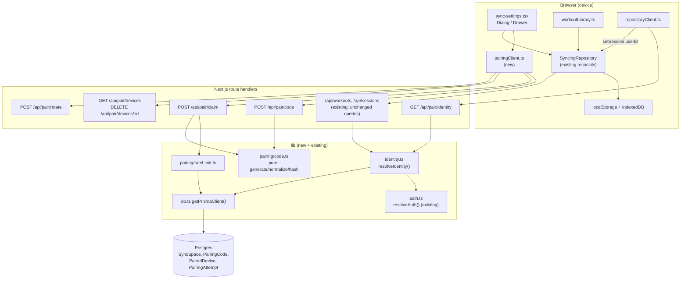
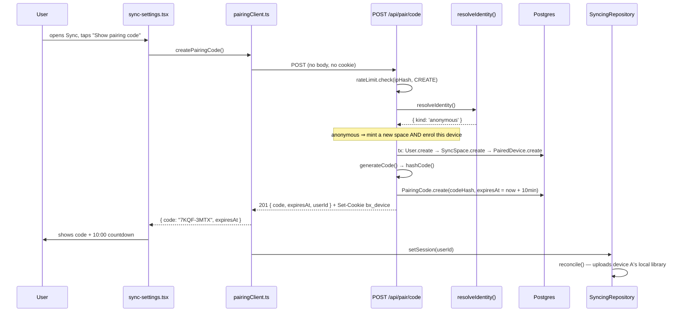
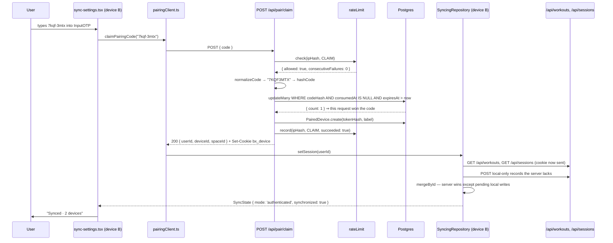
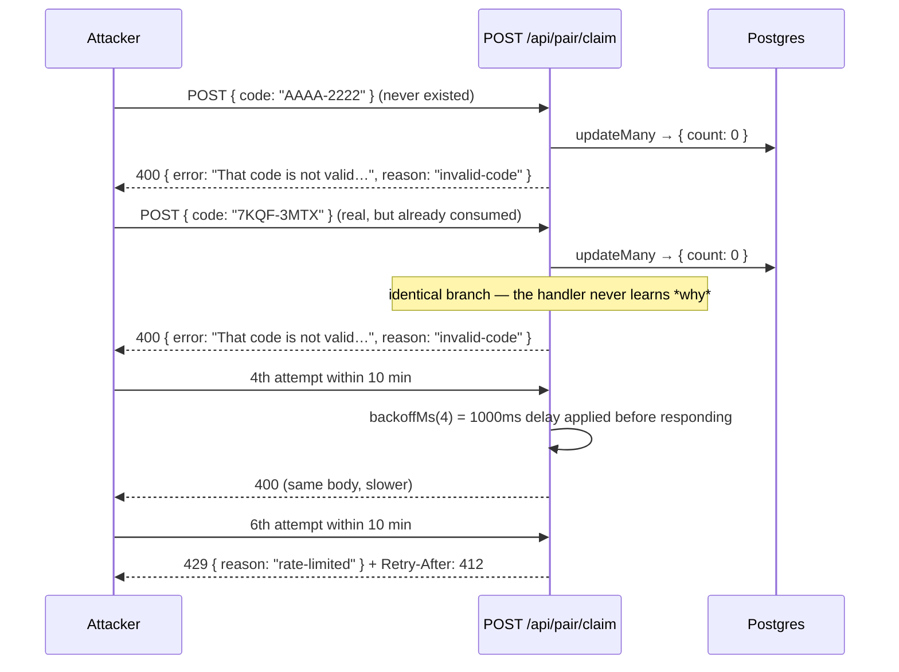

# Design Document: Device Pairing Sync

## Overview

Today a workout saved on a phone cannot travel to a computer unless the user signs in with an OAuth provider — and no provider is configured, so in practice every device is an island. `SyncingRepository` in `lib/data/workoutRepository.ts` already contains a complete two-way reconcile engine; it is simply never given an identity to sync against. This feature supplies that identity without an account, a password, an email address, or an OAuth provider.

The flow is: device A asks the server for a short **pairing code** and shows it with a countdown. The user types that code on device B. Device B exchanges the code for an opaque **device token**, delivered as an `httpOnly` cookie. Both devices now resolve to the same **sync space**, and the existing reconcile merges their data in both directions and keeps it merged.

The hard design constraint is **zero additional configuration**. Postgres is already wired on Railway via `DATABASE_URL`, and `railway.json` runs `npm run migrate:deploy` as its `preDeployCommand`, so a new migration self-applies. Everything else in this design is chosen so that no new environment variable is ever required: the device credential is an opaque random token verified by database lookup rather than a signed JWT (a JWT would need a signing secret), and rate-limit state lives in Postgres rather than Redis. The feature adds **zero** environment variables.

Three existing invariants are preserved without exception. The production build must keep succeeding with **no** `DATABASE_URL` — local-only mode is a supported state, not a degraded one — so every new module reaches the database only through the existing lazy `getPrismaClient()` and handles `null`. OAuth is **not** removed; it becomes a second identity source feeding the same column, with a documented precedence rule. And the 311 existing tests keep passing, because the changes to existing files are deliberately confined to import swaps and additive fields.

## Out of Scope

Documented here so the boundary is explicit, not designed below:

- **Native iOS Dynamic Island integration.** Requires a native companion app; unrelated to sync.
- **The Next.js major-version upgrade.** This feature targets the current Next 14.2 App Router and must not depend on the upgrade landing.
- **Email/password accounts.** Explicitly rejected by the user in favour of pairing; adding a password store would reintroduce the credential-management burden this feature exists to avoid.
- **End-to-end encryption of synced data.** Noted as **possible future hardening**: workouts and history are stored server-side in plaintext, so a database compromise exposes them. E2EE would require deriving a key from the pairing code and keeping it client-side, which breaks the "server merges records by id" model that the existing reconcile depends on, and makes a lost device an unrecoverable data loss. Out of scope for this iteration; revisit if the data ever becomes more sensitive than round counts and timestamps.

## Threat Model Statement: Capability, Not Authentication

This must be stated plainly before the mechanics, because it shapes every parameter chosen below.

A pairing code is a **bearer capability**, not an authentication factor. It proves nothing about *who* is holding it. Anyone who obtains the code while it is live — by reading it over the user's shoulder, from a screen share, from a photo of the screen — can join the sync space and will then see and be able to modify the user's workouts and history. There is no second factor and no identity to check the code against.

This is accepted deliberately, for reasons specific to this application:

- **The protected asset is low-sensitivity.** The data is boxing round counts, rest durations, workout names, and session timestamps. It is not financial, medical, or authentication data. It grants no access to anything else — there is no account to take over, no password to reset, no payment method, and no personal identifier stored anywhere in the sync space.
- **The exposure window is tiny.** A code lives for 10 minutes and is destroyed on first use. Someone must be looking at the screen during those minutes.
- **The alternative was worse in practice.** Requiring OAuth for a personal timer meant, empirically, that nobody signed in and the feature went unused — a security control that causes the feature to be abandoned protects nothing.

The mitigations that follow (high entropy, short TTL, single use, rate limiting, revocation, uniform failure responses) are aimed squarely at the threat this model *can* address: a **remote attacker guessing codes**. They make blind guessing infeasible. They do not, and cannot, defend against an attacker who can see the screen. That residual risk is the honest cost of removing accounts, and revocation (unlink / rotate) is the user's remedy if it is ever realised.

## Architecture



The load-bearing idea is the narrow waist at `resolveIdentity()`. Both identity sources — an OAuth session and a device-token cookie — collapse into a single `userId` string before any data route sees them. `/api/workouts` and `/api/sessions` therefore change by exactly one import line each; their queries, their ownership checks, and their status codes are untouched.

## Identity Model: The Foreign-Key Constraint

The brief suggested storing the sync-space id directly in the existing nullable `Workout.userId` / `WorkoutSession.userId`. Inspecting the committed migration shows why that cannot be done as stated. `prisma/migrations/20250915000000_init/migration.sql` lines 113 and 116:

```sql
ALTER TABLE "Workout" ADD CONSTRAINT "Workout_userId_fkey"
  FOREIGN KEY ("userId") REFERENCES "User"("id") ON DELETE CASCADE ON UPDATE CASCADE;
ALTER TABLE "WorkoutSession" ADD CONSTRAINT "WorkoutSession_userId_fkey"
  FOREIGN KEY ("userId") REFERENCES "User"("id") ON DELETE CASCADE ON UPDATE CASCADE;
```

`userId` is nullable, but any **non-null** value must exist in `User(id)`. Writing an arbitrary sync-space id there fails with a foreign-key violation (Postgres `23503`).

### Decision: each sync space owns a shadow `User` row

A `SyncSpace` is created together with a `User` row in one transaction, and **the value written into `Workout.userId` is that `User.id`.** `SyncSpace.userId` is a `@unique` foreign key to it, so space and user are 1:1.

Rejected alternative — **drop the foreign key** and treat `userId` as a bare string. It is a smaller migration, but it discards `ON DELETE CASCADE`, which is precisely the mechanism that makes "delete my sync space and everything in it" a single-row delete. Deletion would become hand-rolled `deleteMany` calls that must be kept in sync with every future table, and referential integrity would rest on application code forever. Not worth the saving.

The shadow-user approach earns several things at once:

- **`Workout` and `WorkoutSession` are not modified at all** — no schema change, no new index, no data migration. The existing `@@index([userId])` and `@@index([userId, endedAt])` serve pairing queries exactly as they serve OAuth ones.
- **The four existing data routes keep their query bodies verbatim**, including the ownership check in `POST /api/workouts` that returns 404 for another identity's id.
- **Cascade delete is free.** Deleting the `User` row removes the `SyncSpace`, every `PairedDevice`, every `PairingCode`, and every workout and session — one statement, correct by construction.
- **next-auth never sees shadow users.** A shadow user has no `Account` and no `Session` row, so `getServerSession` cannot return it and no provider can be linked to it accidentally. `User.email` is `String? @unique`, and Postgres permits unlimited `NULL`s in a unique index, so many shadow users coexist without collision.
- **There is a clean future upgrade path.** Attaching an OAuth `Account` to a shadow `User` promotes a sync space into a real account with all its data intact — no record migration.

### The naming tension

`userId` now holds one of two things: a real OAuth user's id, or a sync space's shadow user id. The column name is therefore slightly wrong.

**Recommendation: do not rename it.** A rename means a migration that rewrites two tables plus their indexes, and edits to `prismaMappers.ts`, `apiSchemas.ts`, both DTOs, all four route handlers, `SyncState.userId`, `setSession(userId)`, and the tests covering them — a wide, purely cosmetic diff across a suite of 311 passing tests, with no behavioural gain. The existing doc comment already reads `/// null => a record synced without an account`, which is close to the truth.

Instead, make the widened meaning explicit in the type system and the comments, at near-zero cost:

```ts
// lib/identity.ts
/**
 * The value stored in `Workout.userId` / `WorkoutSession.userId`.
 *
 * Always a `User.id`, but the row behind it is one of two kinds: a real OAuth user, or the
 * shadow user a `SyncSpace` owns. Callers scoping a query must not care which.
 */
export type IdentityId = string
```

and update the two Prisma doc comments to read `/// The owning identity: an OAuth user, or a sync space's shadow user. null => local-only.` A doc-comment change alone does not alter the generated SQL, so it costs no migration.

## Data Models

### New Prisma models

Appended to `prisma/schema.prisma`:

```prisma
/// An anonymous, account-free identity shared by every device paired into it.
///
/// 1:1 with a shadow `User` row, whose id is the value stored in `Workout.userId` and
/// `WorkoutSession.userId`. That indirection exists because those columns carry a foreign
/// key to `User`, so an identity must *be* a User to own records.
model SyncSpace {
  id        String   @id @default(cuid())
  /// The shadow user this space owns. Deleting it cascades away the space and all its data.
  userId    String   @unique
  createdAt DateTime @default(now())
  /// Bumped on rotation, so the UI can show "rotated 2 days ago".
  rotatedAt DateTime?

  user    User           @relation(fields: [userId], references: [id], onDelete: Cascade)
  codes   PairingCode[]
  devices PairedDevice[]
}

/// A short-lived, single-use capability to join a `SyncSpace`.
///
/// Only the SHA-256 hash is stored: a database leak must not yield live codes, and the
/// server never needs the plaintext again after handing it to the creating device.
model PairingCode {
  id          String   @id @default(cuid())
  syncSpaceId String
  /// SHA-256 of the normalized code, hex. Unique so a claim is one indexed lookup.
  codeHash    String   @unique
  expiresAt   DateTime
  /// Set the instant the code is claimed. Non-null => spent, and it can never be replayed.
  consumedAt  DateTime?
  createdAt   DateTime @default(now())

  syncSpace SyncSpace @relation(fields: [syncSpaceId], references: [id], onDelete: Cascade)

  /// Drives the expiry sweep.
  @@index([expiresAt])
  @@index([syncSpaceId])
}

/// One browser holding a device token for a `SyncSpace`.
model PairedDevice {
  id          String   @id @default(cuid())
  syncSpaceId String
  /// SHA-256 of the 32-byte token, hex. The raw token exists only in the cookie.
  tokenHash   String   @unique
  /// Coarse, user-facing label derived from the User-Agent ("Chrome on macOS").
  /// Deliberately coarse: no full UA string, no IP address, no fingerprint is retained.
  label       String
  createdAt   DateTime @default(now())
  /// Throttled to at most one write per hour to avoid a write on every API request.
  lastSeenAt  DateTime @default(now())

  syncSpace SyncSpace @relation(fields: [syncSpaceId], references: [id], onDelete: Cascade)

  @@index([syncSpaceId])
}

/// A rate-limit ledger row: one per claim or code-creation attempt.
///
/// Postgres-backed rather than Redis-backed *specifically* to hold the zero-new-env-var
/// goal. Rows are swept after 24h, so the table stays small.
model PairingAttempt {
  id        String            @id @default(cuid())
  /// Truncated SHA-256 of the client IP. See "IP handling" for the honest limits of this.
  ipHash    String
  kind      PairingAttemptKind
  /// false for a rejected claim. Counted for rate limiting regardless of *why* it failed.
  succeeded Boolean            @default(false)
  createdAt DateTime           @default(now())

  /// The window query: attempts for this ip since T.
  @@index([ipHash, createdAt])
  /// The sweep.
  @@index([createdAt])
}

enum PairingAttemptKind {
  CREATE
  CLAIM
}
```

And on the existing `User` model, one additive back-relation (no column, no SQL change to the table):

```prisma
model User {
  // ... existing fields unchanged ...
  syncSpace SyncSpace?
}
```

Migration directory: `prisma/migrations/20250917000000_device_pairing_sync/migration.sql`, generated with

```bash
npx prisma migrate dev --name device_pairing_sync --create-only
```

`--create-only` so the SQL can be reviewed and committed without needing a live database in the sandbox. Railway applies it automatically on deploy via the existing `preDeployCommand`. The migration is purely additive — four `CREATE TABLE`s, one `CREATE TYPE`, and their indexes — so it cannot fail against existing data and needs no backfill.

### Validation rules

- `PairingCode.expiresAt` is always `createdAt + 10 minutes`; the TTL is a server-side constant and is never accepted from a request body.
- `PairingCode.consumedAt` transitions `null → timestamp` exactly once, enforced by a conditional update, not by a read-then-write.
- `PairedDevice.tokenHash` and `PairingCode.codeHash` are always 64 lowercase hex characters.
- `PairedDevice.label` is at most 64 characters, drawn from a fixed allow-list of browser/OS names plus `'Unknown device'`; never raw User-Agent text, so it cannot become a stored-XSS or PII vector.
- A `SyncSpace` holds at most 10 `PairedDevice` rows and at most 3 unconsumed, unexpired `PairingCode` rows. Both caps bound the damage from a runaway client and keep the live-code count — which the brute-force math depends on — small.


## Security Design

### 1. Code alphabet and keyspace

**Alphabet — 31 characters:**

```
23456789ABCDEFGHJKMNPQRSTUVWXYZ
```

Derived from Crockford Base32 by removing every glyph pair a human confuses when copying a code off one screen onto another: `0`/`O`, `1`/`I`/`L`. Digits `0` and `1` are dropped, and letters `I`, `L`, `O` are dropped, leaving 8 digits + 23 letters = **31 symbols**.

31 is not a power of two, which matters for uniformity: taking `randomByte % 31` biases the first 8 symbols, because 256 is not a multiple of 31. The generator therefore uses **rejection sampling** — draw a byte, discard it if it lands in the ragged tail, retry. The expected number of discarded bytes is under 3% per symbol, so the cost is irrelevant, and the output is exactly uniform.

The 32-symbol alternative — re-admitting `L` to allow direct 5-bit slicing — was rejected. Saving four lines of rejection-sampling code is not worth reintroducing the single most common transcription error in a code the user reads aloud or types from another screen. Human accuracy is the scarcer resource here.

On input, `normalizeCode` maps the excluded glyphs to their intended symbols before hashing (`O`→`0` is impossible since `0` is not in the alphabet, so the mapping runs the other way): input is upper-cased, `O` is folded to nothing meaningful and rejected, and `I`/`L` are folded to... see `lib/pairing/code.ts` below for the exact table. The practical effect is that a user who types `l` where the screen showed `1` still fails cleanly rather than silently joining the wrong space — folding is applied only where it is unambiguous.

**Length — 8 characters,** displayed grouped as `XXXX-XXXX` for readability. The dash is presentational and stripped on input.

**Keyspace:**

```
31^8 = 852,891,037,441  ≈ 8.53 × 10^11  ≈ 2^39.6
```

**Why 8 and not 6 or 10.** At 6 characters the keyspace is `31^6 ≈ 8.9 × 10^8` (2^29.7) — only ~887 million, which combined with any rate-limit misconfiguration is uncomfortably close to guessable, and it leaves no margin if the global cap is ever raised. At 10 characters the keyspace is `31^10 ≈ 8.2 × 10^14`, far beyond what the TTL and rate limit already achieve, at the cost of a code that is materially more annoying to type on a phone. Eight characters sits at the point where the rate limit, not the keyspace, is the binding constraint — which is the correct place for it, because the rate limit is the control we can tighten without asking more of the user.

### 2. Time to live

**TTL = 10 minutes**, a server-side constant (`PAIRING_CODE_TTL_MS = 10 * 60 * 1000`).

The floor is set by the actual task: unlock the second device, open the app, navigate to Sync, and type eight characters. Two minutes is enough for a practised user and cruel for someone who has to go and find their phone; 10 minutes covers the realistic worst case — the phone is in another room and on charge — without a second attempt. The ceiling is set by the exposure window: the code is readable on device A's screen for as long as it is valid, so every extra minute is extra shoulder-surfing surface and extra attacker budget. Ten minutes is also short enough that "wait for it to expire" is a viable user response to having shown the code to the wrong person, which keeps the mitigation story simple.

Expiry is enforced **in the claim query's `WHERE` clause**, not by a background job — a swept row is a housekeeping matter, never a security dependency. A separate best-effort sweep (`deleteMany` where `expiresAt < now - 24h`) runs opportunistically on code creation, at most once per hour per process, purely to keep the table small.

### 3. Single use

A code is consumed atomically by a **conditional update**, never by read-then-write:

```ts
const { count } = await db.pairingCode.updateMany({
  where: { codeHash, consumedAt: null, expiresAt: { gt: new Date() } },
  data: { consumedAt: new Date() },
})
// count === 1 -> this request won the code. count === 0 -> absent, expired, or already spent.
```

`updateMany` compiles to a single `UPDATE ... WHERE ... AND "consumedAt" IS NULL`, and Postgres row-level locking guarantees that exactly one of any number of concurrent requests sees `count === 1`. Two devices racing on the same code cannot both join. This is the mechanism, and it is why the replay window is genuinely zero rather than merely small — there is no interval between the check and the write for a second request to slip into.

### 4. Rate limiting and brute-force resistance

Enforced on `POST /api/pair/claim`, counting **every** attempt regardless of outcome or failure reason:

| Scope | Limit | Window | On breach |
| --- | --- | --- | --- |
| Per IP | 5 attempts | 10 minutes (rolling) | `429` + `Retry-After` |
| Per IP | 20 attempts | 24 hours (rolling) | `429` + `Retry-After` |
| Global | 60 attempts | 1 minute (rolling) | `429` + `Retry-After` |

Backoff is applied on top of the per-IP window: after 3 consecutive failures from one IP, each subsequent attempt within the window is delayed by `min(2^(n-3) * 500ms, 4000ms)` before its response is returned. This is cheap for a legitimate user who mistyped once and expensive for a script, and it is applied *before* the response is written, so it cannot be sidestepped by abandoning the connection.

`POST /api/pair/code` is also limited — **10 per IP per hour** — so an attacker cannot inflate the number of live codes to improve their guessing odds. Together with the per-space cap of 3 live codes, this keeps the live-code count in the math below firmly bounded.

**The math.**

Let `K = 31^8 = 8.53 × 10^11` be the keyspace and `L` the number of codes live at any instant. A single blind guess hits a live code with probability `L / K`.

Assume `L = 100` — absurdly generous for a personal boxing timer, where the realistic value is 0 or 1, and reachable only if ~34 spaces each hold their maximum 3 live codes simultaneously:

```
P(one guess hits) = 100 / 8.53e11 = 1.17 × 10^-10
```

Within a single 10-minute TTL window the **global** cap allows `60 × 10 = 600` attempts:

```
P(any hit in one TTL window) ≈ 600 × 1.17e-10 = 7.0 × 10^-8   ≈ 1 in 14 million
```

Sustained at the global cap for a full year — `60 × 60 × 24 × 365 = 31,536,000` attempts — against a realistic single live code:

```
Expected hits/year = 31,536,000 / 8.53e11 = 3.7 × 10^-5   ≈ 1 success per 27,000 years
```

Even at the pathological `L = 100`, that is `3.7 × 10^-3` per year — one expected success per **270 years**, while saturating the global limit continuously for the entire period, which would be trivially visible in request logs.

From a **single IP**, capped at 20 attempts per 24 hours, reaching one expected success against one live code requires `8.53e11 / 20 ≈ 4.3 × 10^10` IP-days. Distributing the attack defeats the per-IP limit but runs straight into the global cap, which is the backstop the year-long figure above already accounts for.

The conclusion: **the keyspace alone is not what makes this safe — the global rate limit is.** 2^39.6 would fall to an unthrottled attacker in hours. TTL, single-use consumption, and the global cap are load-bearing, and any future change that raises the global limit must be re-checked against this arithmetic.

**IP handling.** `ipHash` is a truncated SHA-256 of the client IP taken from `x-forwarded-for` (Railway's proxy sets it). Being honest about what this does and does not achieve: an unkeyed hash of an IPv4 address is **reversible by brute force** — the entire space is 2^32 and enumerable in seconds — so it is obfuscation against casual inspection, not anonymisation. It is used anyway because the alternative, an HMAC, needs a secret, which would break the zero-configuration goal that is the whole point of this design. The mitigation that actually matters is retention: `PairingAttempt` rows are swept after 24 hours, so there is no durable log of who connected from where. Spoofable `x-forwarded-for` is likewise acknowledged — a determined attacker can rotate the header — which is exactly why the **global** limit exists and why it, not the per-IP limit, carries the security argument.

### 5. The device credential

**An opaque 32-byte random token, verified by database lookup.** Not a JWT.

```ts
const raw = crypto.randomBytes(32).toString('base64url')   // 256 bits, 43 chars
const tokenHash = crypto.createHash('sha256').update(raw).digest('hex')
```

This choice is what delivers the zero-configuration goal. A signed JWT would require a signing secret — a new environment variable, which must be generated, set on Railway, kept out of git, and rotated. An opaque token needs none: its authority comes from being unguessable and present in the database, and it is verified by a single indexed lookup on `tokenHash`. It is also **immediately revocable**, which a stateless JWT is not — deleting the row ends the session on the next request, with no denylist to maintain.

**Hashed at rest.** Only `tokenHash` is stored; the raw token exists solely in the cookie. A database leak therefore yields no usable credentials.

**SHA-256, not bcrypt.** Deliberate, and worth stating because the instinct runs the other way. bcrypt's slow key derivation exists to protect *low-entropy human-chosen* secrets from offline dictionary attack. This token is 256 bits of uniform CSPRNG output, so there is no dictionary and no offline attack to slow down — guessing the preimage of the hash is as hard as guessing the token, which is infeasible regardless of hash speed. Meanwhile bcrypt would add ~100ms to **every single API request**, since the token is verified on each one. A single fast unkeyed hash is the correct and standard construction for high-entropy bearer tokens, and it permits a `@unique` index for O(log n) lookup, which a per-row bcrypt comparison could not.

`bcryptjs` and `jsonwebtoken` are already in `package.json`; this design uses **neither**, relying only on Node's built-in `crypto`. No new dependency is added.

**Cookie attributes**, set explicitly on every issue:

```ts
response.cookies.set('bx_device', raw, {
  httpOnly: true,                                  // unreadable from JS: blunts XSS token theft
  secure: process.env.NODE_ENV === 'production',   // HTTPS-only in prod; permits http://localhost in dev
  sameSite: 'lax',                                 // blocks cross-site POST CSRF, survives top-level navigation
  path: '/',                                       // needed by /api/workouts and /api/sessions alike
  maxAge: 60 * 60 * 24 * 400,                      // 400 days, the Chrome cap; pairing should not expire in a drawer
})
```

`SameSite=Lax` rather than `Strict`: `Strict` would drop the cookie when the user arrives from an external link or the installed PWA shortcut, silently un-pairing a device from the user's point of view. `Lax` still withholds the cookie from cross-site subrequests, which is the CSRF case that matters. Because all mutating endpoints are `POST`/`DELETE` with `content-type: application/json` — which cross-origin HTML forms cannot produce without a CORS preflight — `Lax` is sufficient here and no separate CSRF token is required.

### 6. Revocation

Three levels, all available from the Sync surface:

1. **Unlink another device** — `DELETE /api/pair/devices/:id` deletes that `PairedDevice` row. The revoked device's next request resolves anonymous, its client calls `setSession(null)`, and it drops back to local-only mode with its local copy of the data intact (nothing is deleted from the device).
2. **Unlink this device** — the same endpoint targeting the caller's own device id, which additionally clears the `bx_device` cookie via `response.cookies.delete('bx_device')`.
3. **Rotate the sync space** — `POST /api/pair/rotate` mints a brand-new shadow `User` + `SyncSpace`, re-points the caller's records to it, and drops every old device, in one transaction:

```ts
await db.$transaction(async (tx) => {
  const user  = await tx.user.create({ data: {} })
  const space = await tx.syncSpace.create({
    data: { userId: user.id, rotatedAt: new Date() },
  })
  await tx.workout.updateMany({ where: { userId: oldUserId }, data: { userId: user.id } })
  await tx.workoutSession.updateMany({ where: { userId: oldUserId }, data: { userId: user.id } })
  await tx.pairedDevice.deleteMany({ where: { syncSpaceId: oldSpaceId } })   // all old devices out
  await tx.pairingCode.deleteMany({ where: { syncSpaceId: oldSpaceId } })    // all live codes dead
  return { user, space }
})
// then: enrol the calling device into the new space and re-issue its cookie
```

Rotation is the answer to "I showed the code to the wrong person". It is presented behind an `AlertDialog` because it signs out every other device, and it is the only destructive action in the surface. Record volumes for a personal timer are in the hundreds, so two `updateMany`s are trivially fast; both are indexed on `userId`.

A fourth level, **delete everything**, is a single `db.user.delete({ where: { id: userId } })` — the FK cascade removes the space, devices, codes, workouts, and sessions. Available but not surfaced in v1 UI, since local data is untouched and rotation covers the realistic need.

### 7. Enumeration and timing resistance

A claim failure returns **one indistinguishable response** for all three causes — code never existed, code expired, code already consumed:

```
400 { "error": "That code is not valid. Ask for a new one.", "reason": "invalid-code" }
```

Identical status, identical body, identical headers. Nothing in the response distinguishes the causes, so an attacker cannot use the endpoint as an oracle to learn that a code *did* exist.

This is structurally guaranteed rather than merely intended, because the single-use `updateMany` above **collapses all three cases into `count === 0`**. The handler has no branch on the reason and cannot leak one, since it never learns the reason in the first place. There is no code path where "expired" and "absent" are separate values.

Timing is flattened by construction as well: every claim performs the same work — normalize, SHA-256, one indexed `updateMany` — before answering. There is no early return ahead of the database call, not even for a malformed code: a code failing the alphabet or length check is hashed and queried anyway (against a hash that cannot match) so that syntactic and semantic failures take the same path. Rate-limit counting is likewise blind to the reason, so probing an existing-but-spent code costs exactly as much budget as probing a random string.

The only endpoint that reveals anything about a space's existence is `POST /api/pair/claim` on **success**, which is the intended function.


## Components and Interfaces

### Component 1: `lib/pairing/code.ts` — pure code primitives

**Purpose**: Generate, normalize, and hash pairing codes. Zero I/O, zero imports beyond `node:crypto` — which makes it directly property-testable with `fast-check` and keeps it safe to import in a build with no `DATABASE_URL`.

```ts
/** The 31 unambiguous symbols. Excludes 0, 1, I, L, O. */
export const PAIRING_ALPHABET = '23456789ABCDEFGHJKMNPQRSTUVWXYZ'
export const PAIRING_CODE_LENGTH = 8
export const PAIRING_CODE_TTL_MS = 10 * 60 * 1000

/** A uniformly random code. Rejection-sampled, so no symbol is favoured. */
export function generateCode(randomBytes?: (n: number) => Buffer): string

/**
 * Canonicalizes user input for hashing: strips whitespace/dashes, upper-cases, and folds
 * the confusable glyphs a user may type where the screen showed a different symbol.
 * Returns null when the result is not a syntactically valid code.
 */
export function normalizeCode(input: string): string | null

/** SHA-256 hex of a normalized code. */
export function hashCode(normalized: string): string

/** Presentational grouping only: "ABCD-2345". Never hashed in this form. */
export function formatCode(code: string): string

/** True when `now` is at or past `expiresAt`. */
export function isExpired(expiresAt: Date, now: Date): boolean
```

**Responsibilities**
- Uniform generation over the 31-symbol alphabet via rejection sampling.
- Deterministic normalization, so `normalizeCode` is idempotent and case/format-insensitive.
- Hashing, so no caller ever holds a plaintext code alongside a database handle.

**Glyph folding table** used by `normalizeCode`, applied after upper-casing:

| Typed | Folded to | Why |
| --- | --- | --- |
| `O` | `0` → then rejected | `0` is not in the alphabet, so this is an unambiguous typo, not a guess to rescue |
| `I`, `L` | `1` → then rejected | likewise |
| `-`, space | removed | presentational grouping |

Folding deliberately does **not** guess: an excluded glyph maps to an excluded symbol and the code is rejected. Silently "correcting" `O` to `Q` could join the user to a stranger's space, which is far worse than asking them to retype.

### Component 2: `lib/pairing/rateLimit.ts` — Postgres-backed limiter

**Purpose**: Count and cap claim/create attempts without Redis and without new configuration.

```ts
export interface RateLimitRule { readonly max: number; readonly windowMs: number }
export interface RateLimitVerdict {
  readonly allowed: boolean
  /** Seconds until the window frees a slot. Sent as `Retry-After`. */
  readonly retryAfterSeconds: number
  /** Consecutive recent failures from this ip, for the backoff delay. */
  readonly consecutiveFailures: number
}

export const CLAIM_RULES: readonly RateLimitRule[]   // 5/10min, 20/24h per ip
export const CLAIM_GLOBAL_RULE: RateLimitRule        // 60/1min
export const CREATE_RULES: readonly RateLimitRule[]  // 10/1h per ip

/** Pure decision function — the property-tested core. No I/O. */
export function evaluate(
  attemptTimestamps: readonly number[],
  rules: readonly RateLimitRule[],
  now: number
): RateLimitVerdict

/** Backoff delay in ms for the nth consecutive failure. */
export function backoffMs(consecutiveFailures: number): number

/** The I/O shell: reads the ledger, calls `evaluate`, records the attempt. */
export function createRateLimiter(db: PrismaLike): {
  check(ipHash: string, kind: PairingAttemptKind): Promise<RateLimitVerdict>
  record(ipHash: string, kind: PairingAttemptKind, succeeded: boolean): Promise<void>
  sweep(): Promise<void>
}
```

The split matters: `evaluate` and `backoffMs` are pure over a list of timestamps, so every rate-limit property below is testable with `fast-check` and no database at all.

### Component 3: `lib/identity.ts` — the narrow waist

**Purpose**: Collapse OAuth sessions and device cookies into one `userId`, so data routes need no knowledge of pairing.

```ts
export const DEVICE_COOKIE_NAME = 'bx_device'
export type IdentityId = string
export type IdentitySource = 'oauth' | 'paired'

/**
 * Intentionally kind-compatible with `AuthResolution` in `lib/auth.ts`: the three `kind`
 * values are identical, so the existing data routes swap one import and nothing else.
 * `source` is additive and ignored by callers that do not care.
 */
export type IdentityResolution =
  | { kind: 'anonymous' }
  | { kind: 'authenticated'; userId: IdentityId; source: IdentitySource; deviceId?: string }
  | { kind: 'database-error'; error: unknown }

export async function resolveIdentity(): Promise<IdentityResolution>

/** Creates a shadow user + space + first device, returning the raw token to cookie. */
export async function createSyncSpaceWithDevice(
  db: PrismaLike, label: string
): Promise<{ userId: IdentityId; spaceId: string; deviceId: string; rawToken: string }>

/** Enrols a device into an existing space. Returns the raw token to cookie. */
export async function enrolDevice(
  db: PrismaLike, spaceId: string, label: string
): Promise<{ deviceId: string; rawToken: string }>

/** Fixed allow-list mapping of a User-Agent to a coarse label. Never stores raw UA. */
export function deviceLabelFrom(userAgent: string | null): string
```

**Precedence: OAuth wins over the device cookie.**

```ts
export async function resolveIdentity(): Promise<IdentityResolution> {
  // 1. OAuth first. Returns 'anonymous' cheaply when accounts are disabled (no provider),
  //    so this costs nothing in the common configuration.
  const auth = await resolveAuth()
  if (auth.kind === 'database-error') return auth
  if (auth.kind === 'authenticated') {
    return { kind: 'authenticated', userId: auth.userId, source: 'oauth' }
  }

  // 2. Device cookie second.
  const raw = cookies().get(DEVICE_COOKIE_NAME)?.value
  if (!raw) return { kind: 'anonymous' }

  const db = getPrismaClient()
  if (!db) return { kind: 'anonymous' }   // no DB: local-only is a supported state, not an error

  try {
    const device = await db.pairedDevice.findUnique({
      where: { tokenHash: sha256(raw) },
      select: { id: true, lastSeenAt: true, syncSpace: { select: { userId: true } } },
    })
    if (!device) return { kind: 'anonymous' }   // revoked or forged: silently anonymous
    void touchLastSeen(db, device)              // throttled, fire-and-forget, never blocks
    return {
      kind: 'authenticated',
      userId: device.syncSpace.userId,
      source: 'paired',
      deviceId: device.id,
    }
  } catch (error) {
    return { kind: 'database-error', error }    // 503, never 401 — do not fake a sign-out
  }
}
```

**Why OAuth takes precedence.** It is the stronger credential — a verified third-party identity, revocable at the provider, tied to a real account — whereas a device token is an anonymous bearer capability. A user who has taken the deliberate step of signing in expects to see their account's data; silently preferring a pairing cookie would show them the wrong library with no explanation. The rule is also stable: OAuth presence is an explicit user action, so precedence never flips spontaneously.

**The consequence, documented:** a device that is both paired and signed in reads its OAuth data, and its sync-space data becomes invisible on that device (it is not deleted, and reappears if the user signs out). Merging the two identities is **out of scope for v1**; the Sync surface detects the situation and states it plainly — *"You're signed in, so your account's workouts are shown. This device is also paired to a sync space; sign out to use it."* — rather than silently picking one. A future "merge into my account" action is a natural extension, since promoting a shadow user by attaching an `Account` row is already the designed upgrade path.

**Why `lastSeenAt` is throttled.** Writing it on every request would add a write to every `GET /api/workouts`. `touchLastSeen` skips the write unless the stored value is more than an hour old, so the common case is read-only.

### Component 4: API routes

All new routes live under `app/api/pair/`, carry `export const dynamic = 'force-dynamic'` (they read cookies), and reuse the existing response vocabulary in `lib/data/apiResponses.ts` — `badRequest`, `databaseUnavailable`, `errorResponse` — extended with one new helper:

```ts
/** 429 — rate limited (new). `Retry-After` in seconds, per RFC 9110. */
export function tooManyRequests(retryAfterSeconds: number): NextResponse {
  return NextResponse.json(
    { error: 'Too many attempts. Try again shortly.', reason: 'rate-limited', retryAfterSeconds },
    { status: 429, headers: { 'Retry-After': String(retryAfterSeconds) } }
  )
}
```

#### `GET /api/pair/identity`

Who am I, and is sync even possible here?

**Request**: none (reads the `bx_device` cookie).

**Response `200`** — always, including for anonymous callers:

```jsonc
{
  "kind": "anonymous",          // | "paired" | "oauth"
  "userId": null,               // string when kind != "anonymous"
  "deviceId": null,             // string when kind == "paired"
  "syncAvailable": false        // false when DATABASE_URL is unset or the DB is unreachable
}
```

**Deliberate, documented deviation from the 503 convention.** Every other route answers `503` when the database is absent. This one answers `200` with `syncAvailable: false`, because it is a **capability-discovery** endpoint, not a data endpoint. The client must distinguish three states that a bare `503` conflates: *sync is not configured on this deployment* (hide the whole Sync surface's pairing controls and explain why), *sync is available and you are not paired* (offer to pair), and *sync is available but momentarily unreachable* (offer retry). Collapsing the first two into `503` would make the UI show a scary error on a deployment that is working exactly as designed in local-only mode. It also keeps the existing `if (!response.ok) return` guard in `repositoryClient.ts` correct by construction. The response carries no secret and no side effect, so answering `200` leaks nothing.

**Status codes**: `200` always; `500` only on an unexpected non-connectivity fault.

#### `POST /api/pair/code`

Device A asks for a code to show.

**Request body**: none.

**Zod schema**: none needed (no body). The route validates only the rate limit and the caller's state.

**Behaviour — this route also enrols the creating device.** This is essential and easy to miss. If device A is anonymous local-only, creating a code creates a *new* sync space, and device A must join it too — otherwise device B claims the code, joins an empty space, and device A's existing workouts are never uploaded. So:

- Caller already has an identity (`paired` or `oauth`) → create a code for the **existing** space. For an `oauth` caller with no `SyncSpace`, one is created and bound to their *real* `User` row (no shadow user needed — their `User.id` is already the identity), so pairing extends an account rather than forking it.
- Caller is anonymous → `createSyncSpaceWithDevice()` mints shadow user + space + this device, and the response sets the `bx_device` cookie. Device A is now paired to its own new space, and its next `setSession(userId)` uploads its local library.

**Response `201`**:

```jsonc
{
  "code": "7KQF-3MTX",         // formatted for display; the ONLY time the server emits it
  "expiresAt": 1758041400000,  // epoch ms
  "ttlMs": 600000,
  "userId": "clx…",            // so the client can call setSession() immediately
  "syncAvailable": true
}
```

Plus `Set-Cookie: bx_device=…` when the caller was anonymous.

**Status codes**: `201` created · `429` rate limited (10/IP/hour) · `409` when the space already holds 3 live codes · `503` no DB or unreachable · `500` unexpected.

#### `POST /api/pair/claim`

Device B redeems a code.

**Request body**:

```jsonc
{ "code": "7kqf-3mtx" }        // any casing, dashes and spaces tolerated
```

**Zod schema**:

```ts
export const claimRequestSchema = z.object({
  code: z
    .string({ required_error: 'code is required', invalid_type_error: 'code must be a string' })
    .trim()
    .min(1, 'code is required')
    .max(32, 'code must be 32 characters or fewer'),   // generous: absorbs dashes/spaces
})
```

Note what the schema deliberately does **not** do: it does not enforce the alphabet or the exact length. Those checks live past the rate limiter, and a syntactically invalid code is hashed and queried anyway, so that a malformed code and a wrong-but-well-formed code produce the same status, the same body, and the same timing. A zod-level alphabet check would create exactly the enumeration oracle §7 exists to prevent — it would answer `400 {fields:{code:…}}` instantly for a malformed code while a well-formed miss took a database round trip.

**Response `200`**:

```jsonc
{ "userId": "clx…", "deviceId": "cly…", "spaceId": "clz…" }
```

Plus `Set-Cookie: bx_device=…`.

**Failure `400`** — the single uniform response from §7:

```jsonc
{ "error": "That code is not valid. Ask for a new one.", "reason": "invalid-code" }
```

**Status codes**: `200` paired · `400` invalid/expired/consumed (indistinguishable) **and** malformed body · `409` when the target space already holds 10 devices · `429` rate limited · `503` no DB or unreachable · `500` unexpected.

**Handler order is security-relevant** and must be implemented exactly:

1. Resolve `ipHash`; `limiter.check(ipHash, 'CLAIM')` → `429` on breach. **Before** any code processing, so a limited attacker learns nothing.
2. Parse body with zod. On failure, fall through to the *same* generic `400` as an invalid code — not a field-named `400`.
3. `normalizeCode` → on `null`, substitute a hash that cannot match, and continue (do not return early).
4. `apply backoff delay` if `consecutiveFailures >= 3`.
5. Atomic `updateMany` consumption (§3).
6. `limiter.record(ipHash, 'CLAIM', succeeded)` — always, both branches.
7. On `count === 0` → generic `400`. On `count === 1` → `enrolDevice`, set cookie, `200`.

#### `GET /api/pair/devices`

**Response `200`**:

```jsonc
{
  "devices": [
    { "id": "cly…", "label": "Chrome on macOS", "createdAt": 1757950000000,
      "lastSeenAt": 1758041000000, "isCurrent": true }
  ],
  "spaceId": "clz…",
  "rotatedAt": null
}
```

**Status codes**: `200` · `401` anonymous (via the existing `unauthorized()`) · `503` no DB · `500`.

#### `DELETE /api/pair/devices/[id]`

Unlink one device. Scoped to the caller's own space, so one space cannot revoke another's device.

**Response `200`**: `{ "id": "cly…", "wasCurrent": true }`. When `wasCurrent`, the response also clears the cookie.

**Status codes**: `200` · `401` anonymous · `404` when the id is absent **or belongs to another space** — the same 404-for-not-yours pattern the existing `POST /api/workouts` already uses, so ownership is never leaked · `503` · `500`.

#### `POST /api/pair/rotate`

**Request body**: none. **Response `200`**: `{ "userId": "newId", "spaceId": "newSpaceId", "revokedDevices": 3 }`, plus a fresh `bx_device` cookie for the caller.

**Status codes**: `200` · `401` anonymous · `429` (reuses `CREATE_RULES`, since rotation mints identities) · `503` · `500`.

### Component 5: Changes to existing files

The blast radius is intentionally tiny.

| File | Change |
| --- | --- |
| `app/api/workouts/route.ts` | `import { resolveAuth } from '@/lib/auth'` → `import { resolveIdentity as resolveAuth } from '@/lib/identity'`. Nothing else — the `kind` values and `userId` field are identical. |
| `app/api/workouts/[id]/route.ts` | same one-line import swap |
| `app/api/sessions/route.ts` | same one-line import swap |
| `lib/auth.ts` | **unchanged.** `resolveAuth()` remains the next-auth path and is called by `resolveIdentity()`. |
| `lib/data/apiResponses.ts` | add `tooManyRequests()` |
| `lib/data/repositoryClient.ts` | probe `/api/pair/identity` instead of `/api/auth/session` |
| `lib/data/workoutRepository.ts` | add optional `source?: IdentitySource` to `SyncState`. Additive only — the reconcile is **not** touched. |
| `app/_components/boxing-app.tsx` | add the Sync trigger + Dialog/Drawer pair beside the existing Sounds one |
| `prisma/schema.prisma` | four new models, one enum, one back-relation on `User`, two doc-comment edits |

Using an aliased import (`resolveIdentity as resolveAuth`) keeps the three route diffs to a single line each and leaves their bodies byte-identical, which is the cheapest possible way to keep 311 tests green.


## Sequence Diagrams

### Flow 1: Device A generates a code (from local-only)



### Flow 2: Device B claims the code and the libraries merge



### Flow 3: A rejected claim leaks nothing



## Key Functions with Formal Specifications

### `generateCode(randomBytes?): string`

```ts
export function generateCode(randomBytes: (n: number) => Buffer = crypto.randomBytes): string
```

**Preconditions**
- `randomBytes(n)` returns exactly `n` cryptographically random bytes.

**Postconditions**
- Return value has length exactly `PAIRING_CODE_LENGTH` (8).
- Every character is a member of `PAIRING_ALPHABET`; in particular none of `0`, `1`, `I`, `L`, `O` appears.
- The distribution over the `31^8` possible codes is uniform (guaranteed by rejection sampling, not by modulo).
- No side effects; no logging of the returned value.

**Loop invariants** — for the fill loop over output positions `i`:
- `out.length === i` at the top of each iteration.
- Every character already in `out` is a member of `PAIRING_ALPHABET`.
- Only bytes with value `< 248` (the largest multiple of 31 not exceeding 256, i.e. `31 × 8`) are consumed; bytes in `[248, 255]` are discarded and never map to a symbol. This is the condition that makes the output uniform.

### `normalizeCode(input): string | null`

```ts
export function normalizeCode(input: string): string | null
```

**Preconditions**
- `input` is a string (may be empty, mixed case, dash- or space-separated, or arbitrary garbage).

**Postconditions**
- Returns a string of length 8 whose every character is in `PAIRING_ALPHABET`, or `null`.
- **Idempotent**: `normalizeCode(normalizeCode(x)) === normalizeCode(x)` for every `x` where the inner call is non-null.
- **Format-insensitive**: for any valid code `c` and any interleaving of dashes/spaces and any casing `v` of `c`, `normalizeCode(v) === c`.
- Never throws, for any input including the empty string and lone separators.
- Does not "repair" an excluded glyph into a valid symbol — an input containing `O`, `I`, or `L` yields `null`.

**Loop invariants** — for the scan over input characters:
- The accumulator holds only characters in `PAIRING_ALPHABET`.
- The accumulator's length never exceeds 8; a 9th accepted symbol short-circuits to `null`.

### `evaluate(attemptTimestamps, rules, now): RateLimitVerdict`

```ts
export function evaluate(
  attemptTimestamps: readonly number[],
  rules: readonly RateLimitRule[],
  now: number
): RateLimitVerdict
```

**Preconditions**
- `attemptTimestamps` are epoch-ms values, each `<= now`. Order is not assumed.
- Every `rule.max >= 1` and `rule.windowMs > 0`.

**Postconditions**
- `allowed === true` if and only if, for **every** rule, `|{ t : now - t < rule.windowMs }| < rule.max`.
- When `allowed === false`, `retryAfterSeconds >= 1` and equals the ceiling in seconds of the time until the oldest in-window attempt of the binding rule falls out of its window.
- When `allowed === true`, `retryAfterSeconds === 0`.
- **Monotone in attempts**: adding a timestamp can only ever flip `allowed` from `true` to `false`, never the reverse, holding `now` fixed.
- Pure: no I/O, no clock read (`now` is injected), no mutation of `attemptTimestamps`.

**Loop invariants** — over the rules:
- `allowed` is the conjunction of the verdicts of all rules examined so far.
- `retryAfterSeconds` is the maximum over all breached rules examined so far.

### `consumePairingCode(db, rawInput, now): ConsumeOutcome`

```ts
type ConsumeOutcome = { ok: true; spaceId: string } | { ok: false }
```

**Preconditions**
- `db` is a live client (caller has already handled `getPrismaClient() === null` with a 503).

**Postconditions**
- `ok === true` for **at most one** invocation across all time for a given code, no matter how many run concurrently.
- When `ok === true`, that code's `consumedAt` is non-null and `expiresAt > now` held at the moment of consumption.
- When `ok === false`, the outcome value is **identical** whether the code was absent, expired, or already consumed — the return type is structurally incapable of expressing the difference.
- Exactly one database statement is issued on the success path and on every failure path alike.
- No side effect on any other code or space.

**Loop invariants**: none (no loop; atomicity comes from a single conditional `UPDATE`).

### `resolveIdentity(): Promise<IdentityResolution>`

**Preconditions**
- Called from a request scope where `next/headers`' `cookies()` is available (guaranteed by `dynamic = 'force-dynamic'`).

**Postconditions**
- Returns `{ kind: 'authenticated', source: 'oauth' }` whenever an OAuth session resolves, **regardless** of whether a device cookie is also present.
- Returns `{ kind: 'authenticated', source: 'paired' }` only when no OAuth session exists **and** the cookie's SHA-256 matches a live `PairedDevice`.
- Returns `{ kind: 'anonymous' }` when there is no identity, when `DATABASE_URL` is unset, or when the cookie is forged/revoked — never an error for these cases.
- Returns `{ kind: 'database-error' }` **only** for connectivity faults, so callers answer `503` and never a spurious `401` that a client would misread as a sign-out.
- Never returns a `userId` for a `PairedDevice` whose row has been deleted (revocation is effective on the next request).

## Algorithmic Pseudocode

### Uniform code generation

```pascal
ALGORITHM generateCode(randomBytes)
INPUT:  randomBytes — a CSPRNG byte source
OUTPUT: code — a string of PAIRING_CODE_LENGTH symbols from PAIRING_ALPHABET

CONST radix ← 31                      // |PAIRING_ALPHABET|
CONST limit ← 248                     // 31 * 8, the largest multiple of radix <= 256

BEGIN
  out ← ""

  WHILE length(out) < PAIRING_CODE_LENGTH DO
    ASSERT allCharsIn(out, PAIRING_ALPHABET)
    ASSERT length(out) < PAIRING_CODE_LENGTH

    // Draw a whole block at once; blocks are cheap and this bounds the syscall count.
    block ← randomBytes(PAIRING_CODE_LENGTH)

    FOR each byte b IN block DO
      IF length(out) = PAIRING_CODE_LENGTH THEN
        BREAK
      END IF

      // Rejection sampling: bytes in [248, 255] would bias the first 8 symbols
      // under `b MOD 31`, so they are discarded rather than folded.
      IF b < limit THEN
        out ← out + PAIRING_ALPHABET[b MOD radix]
      END IF
    END FOR
  END WHILE

  ASSERT length(out) = PAIRING_CODE_LENGTH
  ASSERT allCharsIn(out, PAIRING_ALPHABET)
  RETURN out
END
```

**Preconditions**: `randomBytes` is a CSPRNG. **Postconditions**: uniform over `31^8`; alphabet and length invariants hold. **Loop invariants**: as asserted at the top of the `WHILE` — `out` is always a valid prefix, and only unbiased bytes are consumed. **Termination**: each `WHILE` pass appends at least one symbol with probability `1 - (8/256)^8`, so termination is almost sure and the expected pass count is ~1.

### Claim handling, in security-relevant order

```pascal
ALGORITHM handleClaim(request)
INPUT:  request — an HTTP request carrying { code }
OUTPUT: an HTTP response

BEGIN
  ipHash ← truncatedSha256(clientIp(request))

  // ---- Step 1: rate limit BEFORE any code processing. -----------------------
  // A limited caller must learn nothing about codes, so this precedes everything.
  verdict ← limiter.check(ipHash, CLAIM)
  IF NOT verdict.allowed THEN
    RETURN tooManyRequests(verdict.retryAfterSeconds)        // 429
  END IF

  db ← getPrismaClient()
  IF db = NULL THEN
    RETURN databaseUnavailable("not-configured")             // 503
  END IF

  // ---- Step 2: parse. A malformed body takes the SAME exit as a bad code. ---
  parsed ← claimRequestSchema.safeParse(readJsonBody(request))
  IF NOT parsed.success THEN
    rawCode ← ""            // fall through; do NOT return a field-named 400 here
  ELSE
    rawCode ← parsed.data.code
  END IF

  // ---- Step 3: normalize. A null result does NOT short-circuit. -------------
  normalized ← normalizeCode(rawCode)
  IF normalized = NULL THEN
    // A hash that cannot match any row, so malformed and wrong-but-well-formed
    // codes traverse an identical path and take identical time.
    codeHash ← UNMATCHABLE_HASH
  ELSE
    codeHash ← hashCode(normalized)
  END IF

  // ---- Step 4: backoff for repeat offenders. -------------------------------
  IF verdict.consecutiveFailures >= 3 THEN
    SLEEP backoffMs(verdict.consecutiveFailures)             // capped at 4000ms
  END IF

  TRY
    // ---- Step 5: atomic single-use consumption. ---------------------------
    // One statement. Absent / expired / already-consumed all yield count = 0,
    // so the handler is structurally unable to tell them apart.
    count, spaceId ← db.consumeCode(codeHash, now())

    IF count = 0 THEN
      limiter.record(ipHash, CLAIM, succeeded ← false)
      RETURN invalidCode()                                   // 400, uniform body
    END IF

    ASSERT count = 1        // Postgres row locking guarantees at most one winner

    // ---- Step 6: enrol this device. --------------------------------------
    deviceCount ← db.countDevices(spaceId)
    IF deviceCount >= MAX_DEVICES_PER_SPACE THEN
      limiter.record(ipHash, CLAIM, succeeded ← false)
      RETURN conflict("device-limit")                         // 409
    END IF

    label ← deviceLabelFrom(request.header("user-agent"))
    device, rawToken ← enrolDevice(db, spaceId, label)
    userId ← db.spaceUserId(spaceId)

    limiter.record(ipHash, CLAIM, succeeded ← true)

    response ← json({ userId, deviceId: device.id, spaceId }, 200)
    response.setCookie(DEVICE_COOKIE_NAME, rawToken, SECURE_COOKIE_OPTIONS)
    RETURN response

  CATCH error
    // Never a 401 here: a DB fault must not look like "you were signed out".
    RETURN errorResponse(error)                              // 503 or 500
  END TRY
END
```

**Preconditions**: none on caller state — anonymous callers are the normal case.
**Postconditions**: at most one device is ever enrolled per code; the response body for any failure is byte-identical across absent/expired/consumed/malformed; every attempt is counted exactly once.
**Loop invariants**: none (no loop).

### Atomic consumption

```pascal
ALGORITHM consumeCode(db, codeHash, now)
INPUT:  codeHash — SHA-256 hex; now — current time
OUTPUT: (count, spaceId)

BEGIN
  // Compiles to a single UPDATE ... WHERE. Row-level locking means that among any
  // number of concurrent callers, exactly one observes count = 1.
  rows ← db.UPDATE PairingCode
            SET consumedAt = now
            WHERE codeHash = codeHash
              AND consumedAt IS NULL
              AND expiresAt > now
            RETURNING syncSpaceId

  IF isEmpty(rows) THEN
    RETURN (0, NULL)
  END IF

  ASSERT length(rows) = 1        // codeHash is UNIQUE
  RETURN (1, rows[0].syncSpaceId)
END
```

**Preconditions**: `codeHash` is 64 hex chars (or the unmatchable sentinel). **Postconditions**: idempotent under repetition — a second call with the same arguments always returns `(0, NULL)`. **Loop invariants**: none.


## Client Wiring

### `lib/data/repositoryClient.ts` — one probe, both identity sources

The existing probe hits `/api/auth/session`, which only ever knows about OAuth. It is repointed at `/api/pair/identity`, which knows about both. The surrounding structure — fire-and-forget, tolerant of every failure, local-only on any doubt — is preserved exactly.

```ts
/** Reads the identity (OAuth or paired) from the pairing API, tolerating every failure. */
async function probeSession(instance: SyncingRepository): Promise<void> {
  if (typeof window === 'undefined' || typeof fetch !== 'function') return
  try {
    const response = await fetch('/api/pair/identity', { headers: { accept: 'application/json' } })
    if (!response.ok) return
    const body = (await response.json()) as {
      kind?: string
      userId?: unknown
      syncAvailable?: unknown
    } | null

    // syncAvailable === false means this deployment has no DATABASE_URL. That is a
    // supported mode, not a failure: stay local and let the UI say so.
    if (body?.syncAvailable === false) {
      setSyncAvailability(false)
      return
    }
    setSyncAvailability(true)

    const userId = body?.userId
    if (typeof userId === 'string' && userId.length > 0) {
      // The existing reconcile does all the work: pushes local-only records the server
      // lacks, pulls records this device has never seen, merges both directions.
      await instance.setSession(userId)
    }
  } catch {
    // Offline, or a non-JSON answer: stay in Local_Only_Mode.
  }
}
```

Two small additions alongside it, so the Sync UI can react without re-fetching:

```ts
/** Whether this deployment can sync at all (DATABASE_URL present). null until probed. */
export function getSyncAvailability(): boolean | null
export function subscribeSyncAvailability(fn: (available: boolean) => void): () => void

/** Re-runs the probe after a pair/unlink/rotate, so identity is re-read immediately. */
export function refreshIdentity(): Promise<void>
```

`refreshIdentity()` resets the memoised `sessionProbe` and re-runs it, reusing the existing singleton discipline.

### `lib/data/pairingClient.ts` (new) — the typed fetch wrapper

```ts
export interface PairingCodeResult { code: string; expiresAt: number; ttlMs: number; userId: string }
export interface ClaimResult { userId: string; deviceId: string; spaceId: string }
export interface PairedDeviceInfo {
  id: string; label: string; createdAt: number; lastSeenAt: number; isCurrent: boolean
}

export class PairingRateLimitedError extends Error { readonly retryAfterSeconds: number }
export class PairingInvalidCodeError extends Error {}
export class PairingUnavailableError extends Error {}   // 503 / offline
export class PairingLimitError extends Error {}         // 409 device or code cap

export async function createPairingCode(): Promise<PairingCodeResult>
export async function claimPairingCode(code: string): Promise<ClaimResult>
export async function listPairedDevices(): Promise<{ devices: PairedDeviceInfo[]; spaceId: string }>
export async function unlinkDevice(id: string): Promise<{ wasCurrent: boolean }>
export async function rotateSyncSpace(): Promise<{ userId: string; revokedDevices: number }>
```

The error taxonomy mirrors the one already in `workoutRepository.ts` (`RemoteUnavailableError` and friends), so the UI's failure handling reads the same way as the rest of the app. All requests use `credentials: 'same-origin'` so the `bx_device` cookie travels.

### What happens to existing local-only data at pair time

Nothing is lost, and no new merge logic is written — this is the whole reason the design plugs into `setSession()` rather than around it.

After either device obtains an identity, `SyncingRepository.setSession(userId)` runs the existing `reconcile(userId)`, which already:

1. reads the device's local workouts (localStorage) and history (IndexedDB);
2. fetches the server's collections;
3. replays any offline deletions **before** merging, so deleted workouts are not resurrected;
4. pushes every local record the server lacks — for device A's fresh space this is its entire library;
5. pulls every server record the device lacks — for device B this is device A's library, the phone→computer fix;
6. merges by id with `mergeById`, server winning except for records pending from a local write;
7. writes the merged result back with `replaceWorkouts` / `replaceSessions` and re-sorts history newest-first.

Because both `Workout` and `WorkoutSession` are keyed by **client-generated ids** and `POST /api/workouts` is an upsert on that id, the merge is idempotent: pairing the same two devices twice, or re-running the probe, converges to the same union rather than duplicating records. Two devices that independently created workouts keep both sets. Two devices that happen to hold the *same* id keep the server's copy, unless the local one is pending.

One consequence worth stating: because the union is taken, a device that had 5 local workouts joining a space with 12 ends up with 17, and pushes its 5 into the shared space. That is the intended behaviour of "merge", but it is not reversible from the UI, so the Sync surface names it before the user commits — *"Pairing merges this device's workouts and history into the shared space."*

### `SyncState` extension

```ts
export interface SyncState {
  mode: 'local-only' | 'authenticated'
  userId: string | null
  synchronized: boolean
  pendingCount: number
  lastError: string | null
  /** NEW, optional: which identity source is active. Undefined in local-only mode. */
  source?: 'oauth' | 'paired'
}
```

Additive and optional, so no existing test or consumer breaks. `mode` is deliberately **not** given a third variant: introducing `'paired'` there would be a breaking change to a union that `getState()`, the tests, and any UI switch already depend on, for no gain — `source` carries the distinction.

## Example Usage

```ts
// ── Device A: show a code ────────────────────────────────────────────────────
import { createPairingCode } from '@/lib/data/pairingClient'
import { getWorkoutRepository, refreshIdentity } from '@/lib/data/repositoryClient'

const { code, expiresAt, userId } = await createPairingCode()
// code === "7KQF-3MTX"; the cookie is already set if this device was anonymous.
await getWorkoutRepository().setSession(userId)   // uploads device A's local library

// ── Device B: claim it ───────────────────────────────────────────────────────
import { claimPairingCode, PairingInvalidCodeError, PairingRateLimitedError } from '@/lib/data/pairingClient'

try {
  const { userId } = await claimPairingCode('7kqf 3mtx')   // casing/spacing tolerated
  await getWorkoutRepository().setSession(userId)          // existing reconcile merges both ways
} catch (error) {
  if (error instanceof PairingRateLimitedError) {
    show(`Too many tries. Wait ${error.retryAfterSeconds}s.`)
  } else if (error instanceof PairingInvalidCodeError) {
    show('That code is not valid. Ask for a new one.')     // never says which reason
  } else {
    show('Sync is unavailable. Your data stays on this device.')
  }
}

// ── Either device: observe sync status ───────────────────────────────────────
const repo = getWorkoutRepository()
const unsubscribe = repo.subscribe((state) => {
  // state.mode === 'authenticated', state.source === 'paired', state.synchronized === true
  render(state)
})

// ── Revoke ───────────────────────────────────────────────────────────────────
import { listPairedDevices, unlinkDevice } from '@/lib/data/pairingClient'

const { devices } = await listPairedDevices()
const other = devices.find((d) => !d.isCurrent)
if (other) {
  await unlinkDevice(other.id)
  await refreshIdentity()
}
```

## UI Design

### Placement: a header Dialog/Drawer, not a fourth tab

**Recommendation: mirror the Sounds pattern in the header of `app/_components/boxing-app.tsx`** — a `Dialog` at ≥640px, a bottom-sheet `Drawer` below it, exactly as `soundSettingsOpen` already does via `useIsMobileViewport()`.

Rejected: a fourth tab. The `TabsList` is `flex w-full` with three triggers already at `min-h-[44px]` and `text-xs` on mobile; a fourth would push each trigger under the comfortable thumb width on a 360px viewport, and the icon+label pairs would start truncating. More importantly the tabs are *workout surfaces* — Timer, Builder, History are places you do the activity — whereas sync is a device setting, which is precisely the category Sounds already occupies in the header. Following the established pattern also means reusing the `isMobile ? Drawer : Dialog` structure verbatim, including the property that **only one of the two is mounted at a time**, which `app/_components/accessibility.test.tsx` relies on to assert no duplicated accessible names.

```tsx
const syncTrigger = (
  <Button variant="ghost" size="sm" className="gap-2 min-h-[44px]" aria-label="Sync devices">
    <RefreshCw className="w-4 h-4" aria-hidden="true" />
    <span className="hidden sm:inline text-xs">Sync</span>
    {!synchronized && (
      <span
        className="w-1.5 h-1.5 rounded-full bg-primary"
        aria-hidden="true"          /* status is announced by the panel, not this dot */
      />
    )}
  </Button>
)
```

### `app/_components/sync-settings.tsx` — panel structure

Five sections, in this order, matching the order a user needs them:

**1. Status** — read from `SyncState` via `repository.subscribe()`:

| `SyncState` | Copy | Visual |
| --- | --- | --- |
| `syncAvailable === false` | "Sync isn't set up on this server. Your data stays on this device." | muted `Alert` |
| `mode: 'local-only'` | "Not synced. This device keeps its own workouts and history." | `Badge variant="outline"` |
| `authenticated`, `synchronized` | "Synced · {n} devices" | `Badge` with `bg-primary/10 text-primary` |
| `authenticated`, `!synchronized` | "{pendingCount} changes waiting to sync" + Retry button → `retryPending()` | `Badge variant="outline"` |
| `source: 'oauth'` + device cookie | "You're signed in, so your account's workouts are shown. This device is also paired; sign out to use the sync space." | muted `Alert` |

**2. Link another device** — a button, then on success the code:

```tsx
<div className="rounded-lg border border-border bg-muted/40 p-4 text-center">
  <p className="text-xs text-muted-foreground">Enter this code on your other device</p>
  <p className="mt-2 font-mono text-3xl font-semibold tracking-[0.2em] tabular-nums">
    {formatCode(code)}
  </p>
  <p
    className="mt-2 text-xs text-muted-foreground tabular-nums"
    role="timer"
    aria-live="off"      /* per-second updates must not spam a screen reader */
  >
    Expires in {mmss(remainingMs)}
  </p>
  {/* A single polite announcement at expiry, instead of 600 of them. */}
  <p className="sr-only" aria-live="polite">
    {remainingMs <= 0 ? 'Pairing code expired. Generate a new one.' : ''}
  </p>
  <Button variant="outline" size="sm" className="mt-3 min-h-[44px]" onClick={copy}>
    {copied ? 'Copied' : 'Copy code'}
  </Button>
</div>
```

The countdown uses `role="timer"` with `aria-live="off"`, plus one `sr-only` polite region that fires only at expiry. A naive `aria-live="polite"` on a ticking second counter produces ~600 announcements per code and makes the panel unusable with a screen reader. On expiry the code is replaced by a "Generate a new code" button; the client does not need the server to tell it the code died, since it holds `expiresAt`.

**3. Enter a code** — `InputOTP` from `components/ui/input-otp.tsx` (`input-otp@1.2.4` is already a dependency):

```tsx
<InputOTP
  maxLength={8}
  value={entered}
  onChange={setEntered}
  pattern="[23456789ABCDEFGHJKMNPQRSTVWXYZabcdefghjkmnpqrstvwxyz]*"
  onComplete={handleClaim}          /* submit on the 8th character */
  aria-label="Pairing code from your other device"
  containerClassName="justify-center"
>
  <InputOTPGroup>{[0, 1, 2, 3].map((i) => <InputOTPSlot key={i} index={i} />)}</InputOTPGroup>
  <InputOTPSeparator />
  <InputOTPGroup>{[4, 5, 6, 7].map((i) => <InputOTPSlot key={i} index={i} />)}</InputOTPGroup>
</InputOTP>
```

`InputOTP` is the right control here: it gives 8 discrete slots grouped `4 + 4` to match the displayed `XXXX-XXXX`, handles paste across slots, and triggers a numeric-friendly mobile keyboard. Input is upper-cased on change for display, but the server normalizes independently — client-side normalization is a convenience and is never trusted. Failure copy is rendered adjacent to the input with `role="alert"` and repeats the single uniform server message; the client must not invent a more specific reason it does not have.

**4. Paired devices** — a `Card`-less list, each row `min-h-[44px]`:

```
Chrome on macOS      This device      [Unlink]
Safari on iOS        2 hours ago      [Unlink]
```

`lastSeenAt` is rendered with `date-fns`' `formatDistanceToNow` (already a dependency). The unlink button carries `aria-label={`Unlink ${label}`}` so its accessible name is unique per row — otherwise a screen reader hears "Unlink" four times with no way to tell them apart. Unlinking the current device goes through `AlertDialog` first, since it stops sync on the device the user is holding.

**5. Rotate sync space** — a destructive action behind `AlertDialog`, styled with `variant="destructive"` (which resolves through `--destructive`, not a literal red):

> **Rotate sync space?** This unlinks every device, including this one's old code, and gives you a new sync space. Your workouts and history move with you. Other devices will stop syncing and keep their own copy.

### Token-only styling

No new colour is introduced and no literal Tailwind palette class is used. `app/theme-tokens.test.ts` asserts zero `red-500`/`red-600` in the timer view; this design keeps the whole Sync surface on tokens regardless, so the same assertion can be extended to it:

| Need | Token class |
| --- | --- |
| Emphasis / synced state | `text-primary`, `bg-primary/10` |
| Destructive (rotate, unlink) | `variant="destructive"` → `--destructive` |
| Secondary text | `text-muted-foreground` |
| Surfaces | `bg-muted/40`, `bg-background`, `border-border` |
| Focus ring | `focus-visible:ring-2 focus-visible:ring-ring focus-visible:ring-offset-2` |

Mobile and motion rules follow the existing conventions: every interactive element is `min-h-[44px]`, the `Drawer` is `max-h-[85vh]` with `overflow-y-auto`, and any transition carries `motion-reduce:transition-none` with animated affordances gated on the existing `lib/ui/motion.ts` / `lib/ui/useMediaQuery.ts` helpers so `prefers-reduced-motion` is respected. The countdown is text, not an animated ring, which sidesteps the reduced-motion question entirely.

## Error Handling

### Scenario 1: No `DATABASE_URL` (local-only deployment)

**Condition**: `getPrismaClient()` returns `null`.
**Response**: mutation routes answer `503` via the existing `databaseUnavailable('not-configured')`; `GET /api/pair/identity` answers `200 { syncAvailable: false }`.
**Recovery**: the Sync panel replaces its pairing controls with a single muted explanation. The timer, builder, and history keep working from browser storage. **This is a supported state and must never render as an error.**

### Scenario 2: Database configured but unreachable

**Condition**: Prisma throws a `P10xx` / `PrismaClientInitializationError`, detected by the existing `isDatabaseUnreachable()`.
**Response**: `503` with `reason: 'unreachable'`. `resolveIdentity()` returns `database-error`, never `anonymous`.
**Recovery**: `RemoteWorkoutRepository` already maps `503` to `RemoteUnavailableError`, so writes are marked pending and retried on the next success. Critically, a DB fault must **not** produce a `401`, because `mirror()` responds to `RemoteUnauthorizedError` by calling `setSession(null)` — a spurious `401` would silently un-pair a working device.

### Scenario 3: Offline device attempts to pair

**Condition**: `fetch` rejects.
**Response**: `pairingClient` throws `PairingUnavailableError`.
**Recovery**: inline message — *"You're offline. Pairing needs a connection, but everything else keeps working."* No retry queue: pairing is a deliberate, interactive act, and silently pairing later would surprise the user. Contrast with data writes, which **are** queued.

### Scenario 4: Code expires while displayed

**Condition**: client-side `remainingMs <= 0`.
**Response**: no request is made; the code is replaced with "Generate a new code".
**Recovery**: one tap. The stale row is swept later; expiry is enforced server-side in the `WHERE` clause regardless of what the client believes.

### Scenario 5: Rate limited

**Condition**: `429`.
**Response**: `PairingRateLimitedError` carrying `retryAfterSeconds` from the header.
**Recovery**: the claim button is disabled with a live countdown — *"Too many tries. Try again in 3:12."* The message never reveals which limit (per-IP vs global) was hit.

### Scenario 6: Revoked device keeps making requests

**Condition**: cookie present, `PairedDevice` row deleted.
**Response**: `resolveIdentity()` → `anonymous` → data routes `401`.
**Recovery**: `mirror()` sees `RemoteUnauthorizedError` and calls `setSession(null)`, dropping to local-only with all local data intact. The Sync panel then shows "Not synced". Correct and already-implemented behaviour — revocation needs no new client code.

### Scenario 7: Two devices claim the same code concurrently

**Condition**: a race on one `codeHash`.
**Response**: the atomic `updateMany` gives exactly one winner; the loser gets the standard uniform `400`.
**Recovery**: the loser generates a new code. No partial state is possible — a device is enrolled only on the winning path.

### Scenario 8: Malformed / hostile claim body

**Condition**: non-JSON, missing `code`, wrong type, or a 10,000-character string.
**Response**: uniform `400` `invalid-code` — deliberately *not* the field-named `400` the workouts API returns, because naming the field would distinguish malformed input from a wrong code and reopen the enumeration oracle. The zod `max(32)` bound caps work before hashing.
**Recovery**: retype. The attempt is counted against the rate limit like any other.


## Migration and Backward Compatibility

**Existing local-only users lose nothing.** No client storage key changes: `loadPresets`/`savePresets` keep the same localStorage layout, the IndexedDB session store is untouched, and `PENDING_STORAGE_KEY` is unchanged. A user who never opens the Sync panel sees a new header button and no behavioural difference at all. Pairing is opt-in and, when taken, *adds* the device's data to a space rather than replacing it.

**Existing OAuth users are unaffected.** `lib/auth.ts` is not modified. `resolveAuth()` is still the next-auth path, still called first by `resolveIdentity()`, and still wins. A signed-in user's `Workout.userId` rows already point at their real `User.id`, which is exactly what `resolveIdentity()` returns for them. If a provider is configured later, sign-in works as before.

**The database migration is purely additive** — four `CREATE TABLE`s, one `CREATE TYPE`, their indexes, and no `ALTER` to `Workout`, `WorkoutSession`, or `User`. There is no backfill, no column rewrite, and no possibility of failing against existing rows. It applies automatically on Railway through the existing `preDeployCommand`.

**The build still succeeds with no `DATABASE_URL`.** `npm run build` runs `prisma generate && next build`; `prisma generate` needs only `schema.prisma`, not a reachable database. Every new module reaches Postgres exclusively through `getPrismaClient()` and handles `null`, and no new module constructs a `PrismaClient` at import time. `lib/pairing/code.ts` imports only `node:crypto`.

**Rollback**: deleting the four tables restores the prior state exactly, because no existing table or row is modified. A deployed client whose cookie no longer resolves degrades to `anonymous` → local-only, which is a supported state.

## Correctness Properties

*A property is a characteristic or behavior that should hold true across all valid executions of a system — essentially, a formal statement about what the system should do. Properties serve as the bridge between human-readable specifications and machine-verifiable correctness guarantees.*

> Requirement references are added in the requirements phase of this workflow, once `requirements.md` exists and each acceptance criterion has an identifier to cite.

### Property 1: Generated codes obey the alphabet and length

*For any* sequence of random bytes supplied to `generateCode`, the returned code has length exactly 8 and every character is a member of `PAIRING_ALPHABET`; in particular no returned code ever contains `0`, `1`, `I`, `L`, or `O`.

**Validates: Requirements TBD**

### Property 2: Code generation is uniform over the keyspace

*For any* large sample of codes generated from a uniform byte source, the observed frequency of each of the 31 symbols at each of the 8 positions is within statistical tolerance of `1/31`, and no byte value in `[248, 255]` ever contributes a symbol. (Tests the rejection-sampling bound that makes the keyspace math in §1 valid; asserted as a bound on maximum positional deviation, not an exact equality.)

**Validates: Requirements TBD**

### Property 3: Distinct codes collide only at the expected rate

*For any* set of `n` independently generated codes with `n` well below the birthday bound of `31^8`, all `n` codes are distinct.

**Validates: Requirements TBD**

### Property 4: Normalization is idempotent and format-insensitive

*For any* valid code `c`, and *for any* variation of `c` produced by changing letter case and inserting dashes or spaces at arbitrary positions, `normalizeCode` returns exactly `c`; and *for any* input `x` where `normalizeCode(x)` is non-null, `normalizeCode(normalizeCode(x)) === normalizeCode(x)`.

**Validates: Requirements TBD**

### Property 5: Normalization never repairs an excluded glyph

*For any* string containing at least one of `O`, `I`, or `L`, `normalizeCode` returns `null` rather than mapping the glyph onto a valid symbol. (Guards against silently joining the wrong sync space.)

**Validates: Requirements TBD**

### Property 6: Normalization is total

*For any* string whatsoever — empty, whitespace-only, thousands of characters, arbitrary Unicode — `normalizeCode` returns either a valid 8-character code or `null`, and never throws.

**Validates: Requirements TBD**

### Property 7: Expiry is a monotone step function of time

*For any* `expiresAt` and *for any* pair of times `t1 <= t2`, if `isExpired(expiresAt, t1)` is true then `isExpired(expiresAt, t2)` is true; and `isExpired(expiresAt, t)` is true exactly when `t >= expiresAt`. A code, once expired, is never valid again.

**Validates: Requirements TBD**

### Property 8: A code is consumable at most once

*For any* code and *for any* sequence of claim attempts against it — including attempts interleaved arbitrarily and issued concurrently — at most one attempt succeeds, and every subsequent attempt yields the failure outcome.

**Validates: Requirements TBD**

### Property 9: Claim failures are indistinguishable

*For any* failing claim, the HTTP status, response body, and response headers are byte-identical regardless of whether the code was absent, expired, already consumed, or syntactically malformed.

**Validates: Requirements TBD**

### Property 10: Rate-limit accounting never exceeds its budget

*For any* sequence of attempt timestamps and *for any* rule set, the number of attempts `evaluate` reports as allowed within any window of length `rule.windowMs` never exceeds `rule.max`; and adding an attempt can only ever change the verdict from allowed to denied, never the reverse, for a fixed `now`.

**Validates: Requirements TBD**

### Property 11: Rate-limit capacity recovers after the window

*For any* rule and *for any* set of attempts all older than `rule.windowMs` relative to `now`, `evaluate` reports allowed with `retryAfterSeconds === 0`. Denial is always temporary.

**Validates: Requirements TBD**

### Property 12: Retry-After is a correct lower bound

*For any* denied verdict, waiting `retryAfterSeconds` and re-evaluating with no new attempts yields an allowed verdict. The value never under-promises.

**Validates: Requirements TBD**

### Property 13: Backoff is monotone and bounded

*For any* consecutive-failure count `n`, `backoffMs(n)` is non-decreasing in `n` and never exceeds 4000ms, so backoff can neither be escaped by persistence nor become a self-inflicted denial of service.

**Validates: Requirements TBD**

### Property 14: Pairing merges to the union, idempotently

*For any* two devices holding local workout sets `A` and `B` with client-generated ids, after pairing and reconcile both devices hold exactly `A ∪ B` keyed by id; and running the reconcile any number of additional times leaves both devices unchanged.

**Validates: Requirements TBD**

### Property 15: Sync spaces are isolated

*For any* two distinct sync spaces and *for any* record written while scoped to the first, a read scoped to the second never returns that record — and an unpaired device's records are never visible to any space.

**Validates: Requirements TBD**

### Property 16: OAuth takes precedence deterministically

*For any* combination of OAuth session presence and device-cookie presence, `resolveIdentity` returns `source: 'oauth'` whenever an OAuth session resolves, `source: 'paired'` only when there is no OAuth session and the cookie matches a live device, and `anonymous` otherwise. The result is a pure function of those two inputs.

**Validates: Requirements TBD**

### Property 17: A database fault never resolves as anonymous

*For any* connectivity error raised while resolving identity, `resolveIdentity` returns `kind: 'database-error'` and never `kind: 'anonymous'`, so no data route can answer `401` for a database outage.

**Validates: Requirements TBD**

### Property 18: Revocation is immediately effective

*For any* device token, once its `PairedDevice` row is deleted, every subsequent `resolveIdentity` carrying that token returns `anonymous`.

**Validates: Requirements TBD**

### Property 19: Token hashing is deterministic and one-way in storage

*For any* generated device token, the stored hash is 64 lowercase hex characters, is a deterministic function of the token, and the raw token appears in no persisted row.

**Validates: Requirements TBD**

### Property 20: Issued cookies always carry their security attributes

*For any* response that issues a device token, the `Set-Cookie` header has `HttpOnly`, `SameSite=Lax`, `Path=/`, and — whenever `NODE_ENV === 'production'` — `Secure`.

**Validates: Requirements TBD**

### Property 21: Rotation preserves records and revokes devices

*For any* sync space with records `R` and devices `D`, after rotation the caller's new space holds exactly `R`, every device in `D` is revoked, and every previously live code for the old space is dead.

**Validates: Requirements TBD**

### Property 22: Code formatting round-trips

*For any* valid code `c`, `normalizeCode(formatCode(c)) === c`. The displayed grouping never changes the code's meaning.

**Validates: Requirements TBD**

## Testing Strategy

The suite must keep passing with **no live database**, matching the existing 311 tests (`vitest --run`, with `fast-check` and `jsdom` configured in `vitest.config.ts` / `vitest.setup.ts`).

### Unit testing approach

Example-based tests for concrete behaviour: each route's status-code matrix (`200`/`400`/`401`/`409`/`429`/`503`), the exact `Set-Cookie` attribute string, the `deviceLabelFrom` allow-list mapping, `mmss` countdown formatting, and the specific boundary cases property tests should not be relied on to hit — a code claimed at exactly `expiresAt`, a claim arriving at exactly the 5th and 6th attempt in a window, and a space at exactly 10 devices.

Kept deliberately lean, per the existing suite's balance: broad input coverage is the property tests' job.

### Property-based testing approach

**Library**: `fast-check` (already a dev dependency, already used across `lib/timer/` and `lib/data/`).
**Configuration**: minimum 100 runs per property (`fc.assert(..., { numRuns: 100 })`), tagged `Feature: device-pairing-sync, Property {n}: {text}`.

Properties 1–7, 10–13, and 22 test **pure functions** in `lib/pairing/code.ts` and `lib/pairing/rateLimit.ts` with no test double at all — this is why those modules were split from their I/O shells. Properties 8, 9, 14–21 run against the mock Prisma client below.

Generators worth stating explicitly:
- a valid-code generator built from `fc.stringOf(fc.constantFrom(...PAIRING_ALPHABET), { minLength: 8, maxLength: 8 })`;
- a "format noise" generator that inserts dashes/spaces and randomises case, for Property 4;
- a hostile-string generator (`fc.string()`, `fc.fullUnicodeString()`, empty, very long) for Property 6;
- a timestamp-sequence generator (`fc.array(fc.integer())` mapped into a window around a fixed `now`) for Properties 10–12 — `now` is always injected, never read from the clock;
- workout-set generators reusing the existing shapes from `lib/data/workoutRepository.test.ts` for Property 14.

### Mocking Prisma — no live database

The established pattern in this repo is to mock `@/lib/db`, so the same approach extends:

```ts
vi.mock('@/lib/db', () => ({
  databaseConfigured: () => true,
  getPrismaClient: () => fakeDb,
}))
```

`fakeDb` is a hand-rolled in-memory store implementing only the methods these routes call — `user.create`, `syncSpace.create/findUnique`, `pairingCode.create/updateMany/deleteMany/count`, `pairedDevice.create/findUnique/findMany/delete/deleteMany/count`, `pairingAttempt.create/findMany/deleteMany`, `workout.updateMany`, `workoutSession.updateMany`, and `$transaction(fn)` executed immediately against the same store.

Two behaviours the fake must model faithfully, or the tests will pass while production breaks:

1. **`updateMany` must honour the `WHERE` predicate atomically** — it decrements a real guard so that Property 8 (single use) genuinely exercises the concurrency contract. A fake that ignores `consumedAt: null` would make Property 8 vacuous.
2. **Unique constraints on `codeHash` / `tokenHash` must throw** the way Postgres does (`P2002`), so duplicate-insert paths are covered.

The `null` branch is tested separately with `getPrismaClient: () => null` to assert every route answers `503` and that `GET /api/pair/identity` answers `200 { syncAvailable: false }`.

For **Property 15 (isolation)**, the fake is seeded with two spaces and the route handlers are driven with each space's cookie, asserting that neither read ever returns the other's rows — this catches a missing `where: { userId }` clause, which is the single most likely way this feature could leak data.

### Component testing approach

`@testing-library/react`, following `sound-settings.test.tsx` and `accessibility.test.tsx`:

- the code is rendered with a formatted grouping and a countdown that decreases across fake timers (`vi.useFakeTimers()`);
- the countdown region carries `role="timer"` and `aria-live="off"`, and exactly one polite announcement appears at expiry;
- an invalid claim renders the uniform message in a `role="alert"` region;
- each unlink button has a **unique** accessible name (`Unlink Chrome on macOS`);
- only one of Dialog/Drawer is mounted at a given viewport, extending the existing no-duplicate-accessible-name assertion;
- every interactive element satisfies the `min-h-[44px]` convention;
- extend `app/theme-tokens.test.ts` to assert zero literal palette classes (`red-500`, `red-600`) in `sync-settings.tsx`.

### Integration testing approach

Not applicable in CI, since there is no database. The end-to-end pair-and-merge path is covered at the seam instead: `SyncingRepository` driven against the mock Prisma-backed route handlers, asserting the union outcome of Property 14. A live-database smoke check remains a manual post-deploy step and is deliberately **not** a coding task.

## Performance Considerations

- **Identity resolution adds one indexed lookup per API request** on `PairedDevice.tokenHash` (`@unique`, so a B-tree hit). For the OAuth path it adds nothing, since `resolveAuth()` runs first and short-circuits.
- **`lastSeenAt` is throttled to at most one write per device per hour**, so the common request is read-only. Without this, every `GET /api/workouts` would incur a write.
- **Rate-limit checks cost one indexed range scan** on `@@index([ipHash, createdAt])`. The table is swept beyond 24 hours, so it stays small — at the global cap of 60/min it tops out around 86k rows.
- **The sweep is opportunistic**, running at most once per hour per process on code creation, so no scheduler or cron configuration is introduced.
- **Rotation issues two `updateMany`s** over `userId`-indexed rows. Personal-scale volumes (hundreds of records) make this negligible.
- **Reconcile cost is unchanged** — this feature supplies an identity, it does not alter the sync engine.

## Security Considerations Summary

Consolidating the decisions argued in the Security Design section:

| Concern | Mitigation |
| --- | --- |
| Code guessing | 31-symbol alphabet, 8 chars → `2^39.6`; global 60/min cap is the binding control |
| Exposure window | 10-minute TTL, enforced in the query's `WHERE`, not by a sweeper |
| Replay | Atomic conditional `UPDATE`; zero-width race window |
| Brute force | Per-IP 5/10min and 20/24h, global 60/min, exponential backoff past 3 failures |
| Enumeration | One uniform `400`; the handler structurally cannot learn the failure reason |
| Timing leak | Identical work on every path; no early return, even for malformed input |
| Credential theft via XSS | `httpOnly` cookie |
| Credential theft in transit | `Secure` in production |
| CSRF | `SameSite=Lax` + JSON-only mutating endpoints |
| Credential leak at rest | SHA-256 hashes stored; raw token only in the cookie |
| Lost/compromised device | Unlink per device, or rotate the whole space |
| Cross-space data leak | Every query scoped by `userId`; 404-not-yours on device unlink; Property 15 |
| PII retention | Coarse allow-listed device labels; IP hashes swept at 24h |
| **Shoulder-surfing the code** | **Not mitigated.** Accepted; see the threat-model statement |
| **Data at rest readable by the operator** | **Not mitigated.** E2EE is out of scope, noted as future hardening |

## Dependencies

**No new dependencies.** Everything required is already present:

| Need | Source |
| --- | --- |
| Random bytes, SHA-256 | Node built-in `node:crypto` |
| Request validation | `zod@3.23.8` |
| Cookie read/write | `next/headers`, `NextResponse.cookies` (Next 14.2) |
| Database access | `@prisma/client@6.7.0` via the existing `getPrismaClient()` |
| 8-slot code entry | `input-otp@1.2.4` via `components/ui/input-otp.tsx` |
| Dialog / Drawer / Button / Badge / Alert / AlertDialog | existing `components/ui/` |
| Relative timestamps | `date-fns@3.6.0` |
| Property tests | `fast-check` (dev) |

Notably **unused**: `jsonwebtoken` and `bcryptjs`, both already installed. Avoiding the former is what keeps the environment-variable count at zero; avoiding the latter is a deliberate performance decision argued in §5.

**Environment variables added: none.**
