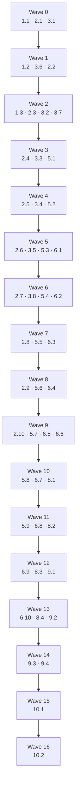

# Implementation Plan: Device Pairing Sync

## Overview

This plan implements the account-free device pairing described in `design.md` in eight stages, each
independently verifiable before the next begins. The ordering is deliberate: the data model lands
first, then the two **pure** modules (`code.ts`, `rateLimit.ts`) that carry most of the security
argument and are property-testable with no test double at all, then the identity narrow waist, then
the routes that compose them, then the client wiring, and finally the UI. Nothing in stages 1–4
depends on a route existing, and nothing in stages 1–6 depends on a React component existing.

The blast radius on existing code is intentionally tiny: three one-line aliased imports in the
existing data routes, one added helper in `lib/data/apiResponses.ts`, one repointed probe in
`lib/data/repositoryClient.ts`, one optional field on `SyncState`, and one header trigger in
`boxing-app.tsx`. `lib/auth.ts` and the reconcile engine are **not** modified — this feature supplies
an identity, not new merge logic.

All 22 correctness properties from the design get one optional (`*`) property-test sub-task, placed
beside the module it covers. Every test runs against a mocked `@/lib/db` — there is no live database
in this environment and none is required. The 311 existing tests must stay green throughout.

## Tasks

- [ ] 1. Stage 1 — Prisma data model and additive migration

  - [ ] 1.1 Add the pairing models to `prisma/schema.prisma`
    - Add `SyncSpace` (with `userId String @unique`, `createdAt`, nullable `rotatedAt`, and the
      `codes`/`devices` relations), `PairingCode` (`codeHash String @unique`, `expiresAt`, nullable
      `consumedAt`, `@@index([expiresAt])`, `@@index([syncSpaceId])`), `PairedDevice`
      (`tokenHash String @unique`, `label`, `createdAt`, `lastSeenAt`, `@@index([syncSpaceId])`), and
      `PairingAttempt` (`ipHash`, `kind`, `succeeded`, `createdAt`, `@@index([ipHash, createdAt])`,
      `@@index([createdAt])`)
    - Add the `PairingAttemptKind` enum with values `CREATE` and `CLAIM`
    - Add the single `syncSpace SyncSpace?` back-relation field to the existing `User` model — a
      relation field only, so it emits no column and no SQL against `User`
    - Set `onDelete: Cascade` on `SyncSpace.user`, `PairingCode.syncSpace`, and
      `PairedDevice.syncSpace` so deleting a shadow user cascades the whole identity away
    - Leave `Workout` and `WorkoutSession` untouched apart from doc comments
    - _Requirements: 16.1, 16.2, 16.3, 16.5, 16.6, 16.9_

  - [ ] 1.2 Generate and commit the additive migration offline
    - There is no `DATABASE_URL` in this environment, so generate the SQL without connecting:
      `npx prisma migrate diff --from-migrations prisma/migrations --to-schema-datamodel prisma/schema.prisma --shadow-database-url … --script`
      is unavailable without a shadow DB, so use the migration-history-free equivalent — diff **from
      the current committed schema state, not from empty** — and write the result to
      `prisma/migrations/20250917000000_device_pairing_sync/migration.sql`
    - An `init` migration already exists at `prisma/migrations/20250915000000_init/`. Diffing from
      empty would emit `CREATE TABLE` for `Workout`, `WorkoutSession`, `User`, `Account`, and
      `Session`, which would fail on deploy. Verify by inspection that the committed SQL contains
      exactly four `CREATE TABLE`s, one `CREATE TYPE`, their `CREATE INDEX`/unique-index statements,
      and their foreign keys — and **zero** `ALTER TABLE` against an existing table
    - Run `npx prisma generate` (works offline, needs only the schema) so `@prisma/client` types for
      the four new models exist for every later stage's typecheck
    - Leave `prisma/migrations/migration_lock.toml` unchanged; add no new npm script — the existing
      `migrate:deploy` applies it
    - _Requirements: 16.7, 16.8, 13.8_

  - [ ]* 1.3 Write deterministic schema and migration assertions
    - Read `prisma/schema.prisma` and the new `migration.sql` as text and assert: the four models and
      the enum are present; `codeHash` and `tokenHash` each carry a unique constraint; the migration
      contains no `ALTER TABLE "Workout"` and no `ALTER TABLE "WorkoutSession"`; the `User` table gets
      no SQL; the cascade clauses are present
    - These are file-content assertions, not property tests — see the Notes on why
    - _Requirements: 16.1, 16.2, 16.7, 16.9, 16.11_

- [ ] 2. Stage 2 — `lib/pairing/code.ts`, the pure code primitives

  - [ ] 2.1 Implement the code module
    - Export `PAIRING_ALPHABET = '23456789ABCDEFGHJKMNPQRSTUVWXYZ'`, `PAIRING_CODE_LENGTH = 8`, and
      `PAIRING_CODE_TTL_MS = 10 * 60 * 1000`
    - `generateCode(randomBytes?)`: rejection sampling — draw a byte, discard it when the value is
      `>= 248` (the largest multiple of 31 not exceeding 256), otherwise take `byte % 31`; the byte
      source is an injected parameter defaulting to `node:crypto`'s `randomBytes`
    - `normalizeCode(input)`: strip dashes and whitespace, upper-case, apply the design's folding
      table (`O` → `0`, `I`/`L` → `1`, both of which are outside the alphabet and therefore reject),
      and return the value only when it is exactly 8 characters all in the alphabet — otherwise `null`
    - `hashCode(normalized)`: SHA-256 hex, 64 lowercase characters
    - `formatCode(code)`: `XXXX-XXXX`, presentational only
    - `isExpired(expiresAt, now)`: true exactly when `now >= expiresAt`
    - Import `node:crypto` and nothing else, so the module is safe to load in a build with no database
    - _Requirements: 1.1, 1.2, 1.3, 1.4, 1.9, 1.12, 1.14, 2.1, 2.2, 13.10_

  - [ ]* 2.2 Write property test for code alphabet and length
    - **Property 1: Generated codes obey the alphabet and length**
    - **Validates: Requirements 1.2, 1.3**

  - [ ]* 2.3 Write property test for generation uniformity
    - **Property 2: Code generation is uniform over the keyspace**
    - Assert a bound on maximum positional deviation from `1/31`, not exact equality, and assert that
      no byte in `[248, 255]` contributes a symbol
    - **Validates: Requirements 1.4, 1.5**

  - [ ]* 2.4 Write property test for code distinctness
    - **Property 3: Distinct codes collide only at the expected rate**
    - **Validates: Requirements 1.6**

  - [ ]* 2.5 Write property test for normalization idempotence and format-insensitivity
    - **Property 4: Normalization is idempotent and format-insensitive**
    - Use the "format noise" generator that randomises case and inserts dashes/spaces at arbitrary
      positions
    - **Validates: Requirements 1.10, 1.11**

  - [ ]* 2.6 Write property test for excluded-glyph rejection
    - **Property 5: Normalization never repairs an excluded glyph**
    - **Validates: Requirements 1.12**

  - [ ]* 2.7 Write property test for normalization totality
    - **Property 6: Normalization is total**
    - Generators: `fc.string()`, `fc.fullUnicodeString()`, the empty string, lone separators, and a
      10,000-character string; assert no throw
    - **Validates: Requirements 1.13**

  - [ ]* 2.8 Write property test for expiry monotonicity
    - **Property 7: Expiry is a monotone step function of time**
    - **Validates: Requirements 2.3, 2.4**

  - [ ]* 2.9 Write property test for format round-trip
    - **Property 22: Code formatting round-trips**
    - **Validates: Requirements 1.15**

  - [ ]* 2.10 Write unit tests for the code module's boundary cases
    - `hashCode` output is 64 lowercase hex characters and deterministic; `formatCode` grouping is
      exactly four-dash-four; `isExpired` at exactly `expiresAt`; the TTL constant equals 600000
    - _Requirements: 1.7, 1.14, 2.1, 2.2_

- [ ] 3. Stage 3 — `lib/pairing/rateLimit.ts`, the Postgres-backed limiter

  - [ ] 3.1 Implement the pure decision core
    - Export `RateLimitRule` and `RateLimitVerdict`, plus `CLAIM_RULES` (5 per 10 minutes and 20 per
      24 hours, per address), `CLAIM_GLOBAL_RULE` (60 per 1 minute), and `CREATE_RULES` (10 per 1
      hour, per address)
    - `evaluate(attemptTimestamps, rules, now)`: allowed exactly when, for every rule, the count of
      attempts inside that rule's window is strictly less than the rule's max; on denial return
      `retryAfterSeconds` of at least 1, computed as whole seconds until the binding rule's oldest
      in-window attempt leaves the window; read no clock — `now` is injected
    - `backoffMs(consecutiveFailures)`: `min(2^(n-3) * 500, 4000)` for `n >= 3`, otherwise 0
    - Keep both functions free of I/O and of any Prisma import, so every rate-limit property is
      testable with no database
    - _Requirements: 4.1, 4.2, 4.3, 4.4, 4.7, 4.8, 4.10, 4.12, 4.16_

  - [ ]* 3.2 Write property test for rate-limit budget accounting
    - **Property 10: Rate-limit accounting never exceeds its budget**
    - Use the timestamp-sequence generator mapped into a window around a fixed injected `now`
    - **Validates: Requirements 4.1, 4.2, 4.3, 4.7, 4.9**

  - [ ]* 3.3 Write property test for window recovery
    - **Property 11: Rate-limit capacity recovers after the window**
    - **Validates: Requirements 4.10**

  - [ ]* 3.4 Write property test for the Retry-After lower bound
    - **Property 12: Retry-After is a correct lower bound**
    - **Validates: Requirements 4.8**

  - [ ]* 3.5 Write property test for backoff monotonicity and bound
    - **Property 13: Backoff is monotone and bounded**
    - **Validates: Requirements 4.12**

  - [ ] 3.6 Implement the `createRateLimiter(db)` I/O shell
    - `check(ipHash, kind)` reads the in-window `PairingAttempt` rows for the address and the global
      window, calls `evaluate` for each applicable rule set, and returns the binding verdict along
      with `consecutiveFailures`
    - `record(ipHash, kind, succeeded)` writes exactly one ledger row per processed attempt
    - `sweep()` deletes rows older than 24 hours, invoked opportunistically at most once per hour per
      process — module-level timestamp guard, no scheduler and no cron
    - Derive `ipHash` as a truncated SHA-256 of the client address read from `x-forwarded-for`
    - Reach the database only through the injected client and handle a `null` client by treating the
      request as unavailable rather than unlimited
    - _Requirements: 4.13, 4.14, 4.17, 4.18, 15.3, 15.4, 15.7, 13.9_

  - [ ]* 3.7 Build the shared in-memory Prisma fake used by every later test stage
    - A hand-rolled store implementing only the methods the routes call: `user.create`,
      `syncSpace.create/findUnique`, `pairingCode.create/updateMany/deleteMany/count`,
      `pairedDevice.create/findUnique/findMany/delete/deleteMany/count`,
      `pairingAttempt.create/findMany/deleteMany`, `workout.updateMany`,
      `workoutSession.updateMany`, and `$transaction(fn)` executed immediately against the same store
    - **Two behaviours must be modelled faithfully or specific properties go vacuous.** First,
      `updateMany` must honour its `WHERE` predicate atomically, so that exactly one of any number of
      concurrent claims sees `count === 1` — a fake that ignores `consumedAt: null` makes Property 8
      pass while production breaks. Second, reads and writes must be scoped by `userId` /
      `syncSpaceId` exactly as Postgres would, or Property 15 (isolation) proves nothing
    - Unique constraints on `codeHash` and `tokenHash` must throw a `P2002`-shaped error
    - Provide a `getPrismaClient: () => null` variant for the absent-database branch
    - _Requirements: 13.11, 16.11_

  - [ ]* 3.8 Write unit tests for the limiter shell against the fake
    - Exactly one ledger row per processed attempt on both the success and every failure path; the
      attempt is counted identically regardless of failure reason; the sweep deletes only rows older
      than 24 hours and runs at most once per hour per process; a claim arriving at exactly the 5th
      and then the 6th attempt in a window
    - _Requirements: 4.13, 4.14, 15.3, 15.4_

- [ ] 4. Checkpoint — the security-critical pure core
  - Ensure all tests pass, ask the user if questions arise.
  - The keyspace arithmetic in the design depends on the rejection-sampling bound and on the rate
    limits being exactly as specified; confirm both before building anything on top of them.

- [ ] 5. Stage 4 — `lib/identity.ts`, the narrow waist

  - [ ] 5.1 Implement `resolveIdentity()` and `deviceLabelFrom()`
    - Export `DEVICE_COOKIE_NAME = 'bx_device'` and the `IdentityResolution` union, whose three `kind`
      values are identical to `AuthResolution` in `lib/auth.ts` so callers need no other change
    - Call the existing `resolveAuth()` first: propagate `database-error`; on `authenticated` return
      `source: 'oauth'` regardless of any device cookie; leave `lib/auth.ts` unmodified
    - Otherwise read the device cookie, and when absent — or when `getPrismaClient()` returns `null` —
      return `anonymous`, because local-only is a supported state and not an error
    - Verify the cookie with one indexed `findUnique` on `tokenHash`; a missing row returns
      `anonymous` (revoked or forged); a thrown connectivity fault returns `database-error` so callers
      answer `503` and never a spurious `401`
    - `touchLastSeen` writes `lastSeenAt` at most once per hour per device, fire-and-forget, never
      blocking and never failing the request
    - `deviceLabelFrom(userAgent)` maps to a fixed allow-list of browser/OS names plus
      `'Unknown device'`, at most 64 characters, never storing raw User-Agent text
    - _Requirements: 7.1, 7.2, 7.3, 7.4, 7.5, 7.6, 7.8, 7.9, 7.10, 6.7, 6.10, 15.5, 15.6, 13.9_

  - [ ] 5.2 Implement the device-token issuer and shared cookie options
    - `createSyncSpaceWithDevice(db, label)` creates shadow `User` + `SyncSpace` + first
      `PairedDevice` in one transaction and returns the raw token for the cookie
    - `enrolDevice(db, spaceId, label)` enrols into an existing space and returns the raw token
    - Tokens are 32 bytes from `crypto.randomBytes` encoded base64url; only the SHA-256 hex digest is
      persisted, and the raw token is confined to the `Set-Cookie` header
    - Export one shared cookie-options object: name `bx_device`, `httpOnly` true, `sameSite` `lax`,
      `path` `/`, `maxAge` 34,560,000, and `secure` true only while `NODE_ENV === 'production'`
    - Use `node:crypto` alone — neither `jsonwebtoken` nor `bcryptjs`, both of which are installed and
      deliberately unused
    - _Requirements: 6.1, 6.2, 6.3, 6.4, 6.5, 6.6, 6.8, 6.9, 16.4_

  - [ ] 5.3 Adopt the resolver in the three existing data routes
    - In `app/api/workouts/route.ts`, `app/api/workouts/[id]/route.ts`, and
      `app/api/sessions/route.ts`, replace `import { resolveAuth } from '@/lib/auth'` with
      `import { resolveIdentity as resolveAuth } from '@/lib/identity'`
    - One line per file. Handler bodies, queries, ownership checks, and status codes stay
      byte-identical, which is what keeps the existing route tests green
    - _Requirements: 7.7, 14.1, 14.3, 14.4, 14.5, 13.4_

  - [ ]* 5.4 Write property test for OAuth precedence
    - **Property 16: OAuth takes precedence deterministically**
    - Drive all four combinations of OAuth-session presence and device-cookie presence
    - **Validates: Requirements 7.2, 7.3, 7.4**

  - [ ]* 5.5 Write property test for database-fault resolution
    - **Property 17: A database fault never resolves as anonymous**
    - **Validates: Requirements 7.6, 13.4**

  - [ ]* 5.6 Write property test for revocation effectiveness
    - **Property 18: Revocation is immediately effective**
    - **Validates: Requirements 10.6, 14.5**

  - [ ]* 5.7 Write property test for token hashing
    - **Property 19: Token hashing is deterministic and one-way in storage**
    - Assert the raw token appears in no row of the fake's store
    - **Validates: Requirements 6.2, 6.3**

  - [ ]* 5.8 Write property test for issued-cookie security attributes
    - **Property 20: Issued cookies always carry their security attributes**
    - Complement it with a deterministic assertion on the exact `Set-Cookie` attribute string in both
      `NODE_ENV` states
    - **Validates: Requirements 6.5, 6.6**

  - [ ]* 5.9 Write unit tests for the device label allow-list and `lastSeenAt` throttling
    - Every mapped User-Agent yields an allow-listed label of at most 64 characters; an unrecognised
      agent yields `Unknown device`; a second resolution within the hour issues no write; a failed
      `lastSeenAt` write still completes the request
    - _Requirements: 15.5, 15.6, 7.10_

- [ ] 6. Stage 5 — the pairing API routes

  - [ ] 6.1 Add `tooManyRequests()` and implement `GET /api/pair/identity`
    - Add `tooManyRequests(retryAfterSeconds)` to `lib/data/apiResponses.ts`: status `429`, body
      `{ error, reason: 'rate-limited', retryAfterSeconds }`, and a `Retry-After` header in whole
      seconds
    - The identity route answers `200` always, with `{ kind, userId, deviceId, syncAvailable }`;
      when `DATABASE_URL` is unset it answers `200 { kind: 'anonymous', userId: null, deviceId: null,
      syncAvailable: false }` — the one deliberate deviation from the `503` convention, because the
      client must distinguish "not configured" from "momentarily unreachable"
    - `export const dynamic = 'force-dynamic'`, since the route reads cookies
    - _Requirements: 13.2, 4.6, 11.7, 11.8_

  - [ ] 6.2 Implement `POST /api/pair/code`
    - Apply `CREATE_RULES` (10 per address per hour) before any other work
    - An anonymous caller gets `createSyncSpaceWithDevice()` in one transaction plus the device cookie
      on the response, so the creating device joins its own new space and its local library uploads
    - A caller that already resolves to a space creates the code within it; an `oauth` caller with no
      space gets a space bound to their real `User` row rather than a fork
    - Reject with `409` when the space already holds 3 live codes; persist only the SHA-256 digest;
      emit the plaintext code solely in the `201` body, alongside `expiresAt` as epoch milliseconds,
      `ttlMs`, `userId`, and `syncAvailable`
    - Derive the TTL from `PAIRING_CODE_TTL_MS` alone, never from the request
    - Run the expired-code sweep opportunistically here, at most once per hour per process
    - Answer `503` via `databaseUnavailable('not-configured')` when the client is `null`, and
      `503 reason: 'unreachable'` on a connectivity fault
    - _Requirements: 1.7, 1.8, 1.16, 2.1, 2.2, 2.5, 2.7, 4.4, 8.1, 8.2, 8.3, 8.4, 8.5, 13.1, 13.3_

  - [ ] 6.3 Implement `POST /api/pair/claim` in the exact security-relevant order
    - 1) resolve `ipHash` and check the limit → `429` before any code processing; 2) parse with the
      zod schema (`code` a trimmed string of 1–32 characters, no alphabet or length check) and on
      failure fall through to the *same* generic `400`, never a field-named error; 3) `normalizeCode`,
      substituting a sentinel hash that cannot match on `null` and continuing without an early
      return; 4) apply `backoffMs` when consecutive failures reach 3, before the response is written;
      5) one atomic conditional `updateMany` matching `codeHash`, `consumedAt: null`, and
      `expiresAt > now`; 6) record the attempt on both branches; 7) `count === 0` → the single uniform
      `400 { error: 'That code is not valid. Ask for a new one.', reason: 'invalid-code' }`,
      `count === 1` → `enrolDevice`, set the cookie, `200 { userId, deviceId, spaceId }`
    - Issue no read of the code row ahead of the conditional update, so the handler never holds a
      value distinguishing absent from expired from consumed
    - Reject with `409 reason: 'device-limit'` when the target space already holds 10 devices, and
      record that attempt as failed
    - _Requirements: 2.3, 2.6, 3.1, 3.2, 3.3, 3.4, 3.5, 3.6, 4.6, 4.11, 4.15, 5.1, 5.2, 5.3, 5.4, 5.5, 5.6, 5.7, 9.1, 9.2, 15.2, 15.8, 13.1, 13.3_

  - [ ]* 6.4 Write property test for single-use consumption
    - **Property 8: A code is consumable at most once**
    - Depends on the fake's atomic `updateMany` guard from task 3.7 — without it this property is
      vacuous
    - **Validates: Requirements 3.1, 3.2, 3.3**

  - [ ]* 6.5 Write property test for indistinguishable claim failures
    - **Property 9: Claim failures are indistinguishable**
    - Compare status, serialized body, and header set byte-for-byte across absent, expired, consumed,
      and malformed-body claims
    - **Validates: Requirements 5.1, 5.2, 5.3**

  - [ ] 6.6 Implement `GET /api/pair/devices` and `DELETE /api/pair/devices/[id]`
    - The list answers `200 { devices: [{ id, label, createdAt, lastSeenAt, isCurrent }], spaceId,
      rotatedAt }`, scoped to the caller's own space, and `401` via the existing `unauthorized()` for
      an anonymous caller
    - The unlink deletes the row and answers `200 { id, wasCurrent }`; when `wasCurrent` it also
      clears the device cookie; an absent id and an id belonging to another space both answer `404`
      with an identical body, so ownership is never disclosed
    - _Requirements: 10.1, 10.2, 10.3, 10.4, 10.5, 14.6, 13.1, 13.3_

  - [ ] 6.7 Implement `POST /api/pair/rotate`
    - Apply `CREATE_RULES`, since rotation mints an identity
    - In one transaction: create a new shadow `User` and `SyncSpace` with `rotatedAt` set, re-point
      every `Workout` and `WorkoutSession` of the old identity to the new `userId`, delete every
      `PairedDevice` of the old space, and delete every `PairingCode` of the old space
    - Then enrol the calling browser into the new space, issue a fresh cookie, and answer
      `200 { userId, spaceId, revokedDevices }`; answer `401` for an anonymous caller
    - _Requirements: 4.5, 10.8, 10.9, 10.10, 10.11, 10.12, 10.13, 10.14_

  - [ ]* 6.8 Write property test for rotation
    - **Property 21: Rotation preserves records and revokes devices**
    - **Validates: Requirements 10.9, 10.10, 10.11**

  - [ ]* 6.9 Write property test for sync-space isolation
    - **Property 15: Sync spaces are isolated**
    - Seed the fake with two spaces and drive the data routes and the devices endpoint with each
      space's cookie; assert neither read ever returns the other's rows. This catches a missing
      `where: { userId }` clause, which is the single most likely way this feature could leak data —
      it depends on the fake's per-`userId` scoping from task 3.7 being faithful
    - **Validates: Requirements 14.1, 14.2, 14.6**

  - [ ]* 6.10 Write route-handler integration tests with mocked Prisma and mocked identity
    - Status-code matrix per route: `200`/`201`/`400`/`401`/`404`/`409`/`429`/`503`
    - With `getPrismaClient: () => null`, every pairing route answers `503` while
      `GET /api/pair/identity` answers `200 { syncAvailable: false }`
    - Boundary cases the property tests should not be relied on to hit: a code claimed at exactly
      `expiresAt`, a space at exactly 10 devices, a space at exactly 3 live codes, and a claim
      admitted again after a device is unlinked from a full space
    - _Requirements: 13.1, 13.2, 13.3, 15.2, 15.8, 1.16, 10.2, 10.14_

- [ ] 7. Checkpoint — the pairing endpoints
  - Ensure all tests pass, ask the user if questions arise.
  - Confirm specifically that the claim handler has no early return ahead of the database call, that
    no failure path carries a reason the uniform response could leak, and that the three existing data
    routes still produce their original status codes.

- [ ] 8. Stage 6 — client wiring

  - [ ] 8.1 Implement `lib/data/pairingClient.ts`
    - `createPairingCode`, `claimPairingCode`, `listPairedDevices`, `unlinkDevice`,
      `rotateSyncSpace`, all with `credentials: 'same-origin'` so the device cookie travels
    - Error taxonomy mirroring `workoutRepository.ts`: `PairingRateLimitedError` carrying
      `retryAfterSeconds` from the `429` response, `PairingInvalidCodeError` for `400`,
      `PairingUnavailableError` for `503` and for a rejected `fetch`, `PairingLimitError` for `409`
    - Leave a failed attempt unqueued — pairing is a deliberate interactive act
    - _Requirements: 4.19, 9.3, 13.5, 13.6_

  - [ ] 8.2 Repoint the identity probe and extend `SyncState`
    - In `lib/data/repositoryClient.ts`, probe `/api/pair/identity` instead of `/api/auth/session`,
      preserving the existing fire-and-forget, tolerate-everything, local-only-on-doubt structure
    - `syncAvailable === false` records sync as unavailable and stays local-only; a non-empty `userId`
      calls the existing `SyncingRepository.setSession(userId)`; a failed or non-JSON response stays
      local-only
    - Add `getSyncAvailability()`, `subscribeSyncAvailability(fn)`, and `refreshIdentity()`, which
      resets the memoised probe and re-runs it after a pair, unlink, or rotate
    - In `lib/data/workoutRepository.ts`, add the optional `source?: 'oauth' | 'paired'` field to
      `SyncState`. Additive only — `mode` keeps exactly its two values and the reconcile is untouched
    - _Requirements: 8.6, 10.7, 11.1, 11.2, 11.3, 11.4, 11.7, 11.8, 11.9, 11.10, 11.11, 9.8_

  - [ ]* 8.3 Write property test for the pair-and-merge seam
    - **Property 14: Pairing merges to the union, idempotently**
    - Drive `SyncingRepository` against the mocked-Prisma-backed route handlers with local sets `A`
      and `B`, reusing the workout-set generators from `lib/data/workoutRepository.test.ts`; assert
      both sides converge on `A ∪ B` keyed by client-generated id and that further reconciles change
      nothing
    - **Validates: Requirements 9.4, 9.5**

  - [ ]* 8.4 Write unit tests for the pairing client and the identity probe
    - Each status maps to its declared error class; `retryAfterSeconds` is read from the header; a
      rejected `fetch` yields `PairingUnavailableError` and queues nothing; the probe stays local-only
      on a non-JSON body and on `syncAvailable: false`
    - _Requirements: 4.19, 13.5, 13.6, 11.8, 11.11_

- [ ] 9. Stage 7 — the Sync surface

  - [ ] 9.1 Implement `app/_components/sync-settings.tsx`
    - Five sections in order: status, generate a code, enter a code, paired devices, rotate the sync
      space
    - Status derives every value from the `SyncState` received through `subscribe()`, shows
      `pendingCount` with a control calling the existing `retryPending()`, and states the
      OAuth-plus-cookie case plainly
    - The live code renders in `XXXX-XXXX` with a countdown computed from the held `expiresAt` and no
      request; the countdown region carries `role="timer"` and `aria-live="off"`, with one `sr-only`
      polite region that announces only at expiry, after which the code is replaced by a
      generate-a-new-one control
    - Code entry is an 8-slot `InputOTP` grouped four and four, upper-cased for display only,
      submitting on the eighth character; a failure renders the server's single uniform message in a
      `role="alert"` region and adds no more specific reason
    - The device list shows each label with `lastSeenAt` as a relative time and an unlink control whose
      accessible name includes that label; unlinking the current device and rotating both go through
      `AlertDialog`, the rotate copy stating that every device is unlinked and that the caller's
      workouts and history move to the new space
    - Before submission, state that pairing merges this device's workouts and history into the shared
      space
    - When sync is unavailable, replace the pairing controls with a single muted explanation
    - Token-only styling: no literal Tailwind palette class anywhere; every interactive element
      `min-h-[44px]`; focus through the existing `--ring` focus-visible convention; transitions carry
      `motion-reduce:transition-none` and gate on the existing `lib/ui/motion.ts` helpers
    - _Requirements: 12.4, 12.5, 12.6, 12.7, 12.8, 12.9, 12.10, 12.11, 12.12, 12.13, 12.14, 12.15, 12.16, 12.17, 12.19, 12.20, 5.8, 9.9, 11.5, 11.6, 13.5_

  - [ ] 9.2 Host the Sync surface from `app/_components/boxing-app.tsx`
    - Add a Sync trigger in the header beside the existing Sounds trigger, opening a `Dialog` at
      viewport widths of 640 pixels and above and a bottom-sheet `Drawer` below, following the
      `soundSettingsOpen` / `useIsMobileViewport()` pattern verbatim
    - Mount exactly one of the two at any width, so no accessible name is duplicated; constrain the
      Drawer to `max-h-[85vh]` with `overflow-y-auto`
    - Keep exactly the three existing tabs
    - _Requirements: 12.1, 12.2, 12.3, 12.18_

  - [ ]* 9.3 Write component tests for the Sync surface
    - Stub `matchMedia` per test — `vitest.setup.ts` already stubs `IntersectionObserver` and
      `ResizeObserver` but not `matchMedia`; use the `selectTab()` helper from `boxing-app.test.tsx`
      when driving Radix Tabs, which switch on `mousedown` rather than `click`
    - Assert: the countdown decreases across `vi.useFakeTimers()`; the timer region carries
      `role="timer"` and `aria-live="off"`; exactly one polite announcement at expiry; the uniform
      failure message renders in a `role="alert"` region; each unlink button has a unique accessible
      name; only one of Dialog/Drawer is mounted at a given viewport; every interactive element
      satisfies the 44-pixel convention; the unavailable state renders one muted explanation
    - _Requirements: 12.2, 12.5, 12.6, 12.7, 12.10, 12.11, 12.14, 12.18, 12.19_

  - [ ]* 9.4 Extend `app/theme-tokens.test.ts` to cover the Sync surface
    - Assert zero literal palette classes — including `red-500` and `red-600` — in
      `sync-settings.tsx`, matching the existing zero-literal assertion for the timer view
    - A deterministic file-content assertion, not a property test
    - _Requirements: 12.15_

- [ ] 10. Stage 8 — final verification

  - [ ] 10.1 Run the full suite and both TypeScript projects
    - `npx vitest --run` — the 311 existing tests plus everything added must pass, with no live
      database and no `DATABASE_URL`
    - `npm run typecheck`, which runs the application project and `tsconfig.test.json`. New test files
      are already covered by the test project; do **not** re-add them to `tsconfig.json`, which now
      excludes `vitest.config.ts`, `vitest.setup.ts`, `**/*.test.ts`, and `**/*.test.tsx`
    - _Requirements: 13.11, 13.12_

  - [ ] 10.2 Verify the production build, including the condition that recently broke production
    - `npm run build` (`prisma generate && next build`) must succeed with **no** `DATABASE_URL`
    - Then repeat the build with devDependencies unavailable — temporarily move `node_modules/@vitejs`
      aside and restore it afterwards — to confirm no devDependency has leaked into the build's
      type-check through a newly added file
    - Confirm no new module constructs a Prisma client at import time and that every one reaches the
      database only through the lazy `getPrismaClient()` with a `null` branch
    - _Requirements: 13.8, 13.9, 16.10, 16.11_

- [ ] 11. Final checkpoint
  - Ensure all tests pass, ask the user if questions arise.
  - Confirm the feature added zero environment variables, zero dependencies, and zero changes to
    existing client storage keys.

## Notes

- Tasks marked `*` are optional and can be skipped for a faster MVP; every top-level task is
  required. Task 3.7 (the Prisma fake) is optional because only tests consume it — skipping it
  necessarily skips the property tests that depend on it.
- **Test type reasoning.** Property tests carry the behaviour that varies meaningfully with input:
  code generation and normalization, rate-limit accounting over arbitrary timestamp sequences, and
  the merge/isolation/rotation outcomes over arbitrary record sets. Three things are asserted
  **deterministically instead**, because they do not vary with input and 100 iterations would find
  nothing a single assertion would not: the Prisma schema and migration file contents (tasks 1.3,
  9.4 style file assertions), the exact `Set-Cookie` attribute set (task 5.8's companion assertion),
  and the build and configuration checks (task 10.2). Route behaviour is covered by handler-level
  integration tests with a mocked Prisma client and mocked identity (task 6.10) rather than by
  property tests, since the status matrix is a finite enumeration.
- **The Prisma fake is load-bearing.** Properties 8 and 15 are only meaningful if the fake models the
  atomic conditional update's exactly-one-winner semantics and per-`userId` scoping faithfully. A
  permissive fake makes both properties pass while production leaks data or double-consumes a code.
  This is called out in tasks 3.7, 6.4, and 6.9.
- **No live database, and no `DATABASE_URL`.** The migration is generated offline and committed;
  `npx prisma generate` works offline and must be run so the new model types exist. The existing
  `20250915000000_init` migration means the new SQL must be diffed **from the current committed
  schema state, not from empty**, or it will try to recreate `Workout`, `WorkoutSession`, and the
  auth tables. It must contain no `ALTER` against an existing table.
- **The real database path gets its first live exercise on deploy.** Everything here is verified
  against an in-memory fake, so the atomic-update concurrency contract, the unique-constraint
  behaviour, and the two rotation `updateMany`s are exercised against real Postgres for the first
  time in production. The migration auto-applies through the existing `preDeployCommand` in
  `railway.json` (`npm run migrate:deploy`). A live smoke check is a manual post-deploy step and is
  deliberately not a coding task.
- **The build must keep succeeding with no `DATABASE_URL`** — local-only is a supported state, not a
  fault. Every new module reaches the database only through the lazy `getPrismaClient()` and handles
  `null`. `lib/pairing/code.ts` imports `node:crypto` alone.
- **npm only.** No `yarn`, no `yarn.lock`, and no new dependencies: `node:crypto`, `zod`,
  `date-fns`, and `@prisma/client` cover everything. `jsonwebtoken` and `bcryptjs` are installed and
  deliberately unused — avoiding the former is what keeps the environment-variable count at zero.
- **Existing suite constraints.** 311 tests currently pass and must keep passing.
  `app/theme-tokens.test.ts` asserts zero `red-500`/`red-600` in the timer view, so all new UI is
  token-only. Radix Tabs switch on `mousedown`, not `click` — use the `selectTab()` helper in
  `app/_components/boxing-app.test.tsx`. `vitest.setup.ts` already stubs `IntersectionObserver` and
  `ResizeObserver`; `matchMedia` must be stubbed per test.
- **A pairing code is a bearer capability, not an authentication factor.** It proves nothing about who
  holds it, and anyone who reads it off the screen within its 10-minute TTL can join the sync space.
  This is accepted deliberately. The mitigations implemented above — entropy, TTL, single use, rate
  limiting, uniform failures — address a remote guessing attacker; unlink and rotate (task 6.6, 6.7)
  are the user's remedy if the shoulder-surfing risk is realised.
- **Out of scope, with no tasks written for them:** native iOS Dynamic Island integration, the Next.js
  major-version upgrade, email-and-password accounts, and end-to-end encryption of synced data.
  Also deferred: merging a paired sync space into an OAuth account, and a user-facing "delete
  everything" action.

## Task Dependency Graph



```json
{
  "waves": [
    {
      "wave": 0,
      "tasks": ["1.1", "2.1", "3.1"],
      "description": "Foundations in three independent files: the Prisma models, the pure code primitives, and the pure rate-limit decision core."
    },
    {
      "wave": 1,
      "tasks": ["1.2", "3.6", "2.2"],
      "description": "Offline additive migration plus prisma generate; the limiter I/O shell (same file as 3.1, so it follows it); the first code property test."
    },
    {
      "wave": 2,
      "tasks": ["1.3", "2.3", "3.2", "3.7"],
      "description": "Deterministic schema and migration assertions, uniformity property, budget-accounting property, and the shared in-memory Prisma fake every later test stage depends on."
    },
    {
      "wave": 3,
      "tasks": ["2.4", "3.3", "5.1"],
      "description": "Distinctness and window-recovery properties; resolveIdentity and the device-label allow-list."
    },
    {
      "wave": 4,
      "tasks": ["2.5", "3.4", "5.2"],
      "description": "Normalization idempotence and Retry-After properties; the device-token issuer and shared cookie options (same file as 5.1)."
    },
    {
      "wave": 5,
      "tasks": ["2.6", "3.5", "5.3", "6.1"],
      "description": "Excluded-glyph and backoff properties; the three one-line data-route import swaps; tooManyRequests plus the identity endpoint."
    },
    {
      "wave": 6,
      "tasks": ["2.7", "3.8", "5.4", "6.2"],
      "description": "Totality property, limiter shell unit tests, OAuth-precedence property, and the code-creation endpoint."
    },
    {
      "wave": 7,
      "tasks": ["2.8", "5.5", "6.3"],
      "description": "Expiry-monotonicity and database-fault properties; the claim endpoint in its exact security-relevant order."
    },
    {
      "wave": 8,
      "tasks": ["2.9", "5.6", "6.4"],
      "description": "Format round-trip and revocation properties; the single-use consumption property against the fake's atomic guard."
    },
    {
      "wave": 9,
      "tasks": ["2.10", "5.7", "6.5", "6.6"],
      "description": "Code-module boundary tests, token-hashing property, indistinguishable-failure property, and the devices list plus unlink routes."
    },
    {
      "wave": 10,
      "tasks": ["5.8", "6.7", "8.1"],
      "description": "Cookie-attribute property, the rotation endpoint, and the typed pairing client."
    },
    {
      "wave": 11,
      "tasks": ["5.9", "6.8", "8.2"],
      "description": "Device-label and lastSeenAt unit tests, the rotation property, and the repointed identity probe plus the additive SyncState.source field."
    },
    {
      "wave": 12,
      "tasks": ["6.9", "8.3", "9.1"],
      "description": "Isolation property across two seeded spaces, the pair-and-merge seam property, and the Sync settings panel."
    },
    {
      "wave": 13,
      "tasks": ["6.10", "8.4", "9.2"],
      "description": "Route status matrices with mocked Prisma and identity, pairing-client unit tests, and hosting the panel from the app shell."
    },
    {
      "wave": 14,
      "tasks": ["9.3", "9.4"],
      "description": "Component and accessibility tests for the Sync surface, and the token-only assertion extended to sync-settings.tsx."
    },
    {
      "wave": 15,
      "tasks": ["10.1"],
      "description": "Full suite with no live database, plus both TypeScript projects."
    },
    {
      "wave": 16,
      "tasks": ["10.2"],
      "description": "Production build with no DATABASE_URL, repeated with devDependencies unavailable to catch a devDependency leak into the build's type-check."
    }
  ]
}
```
