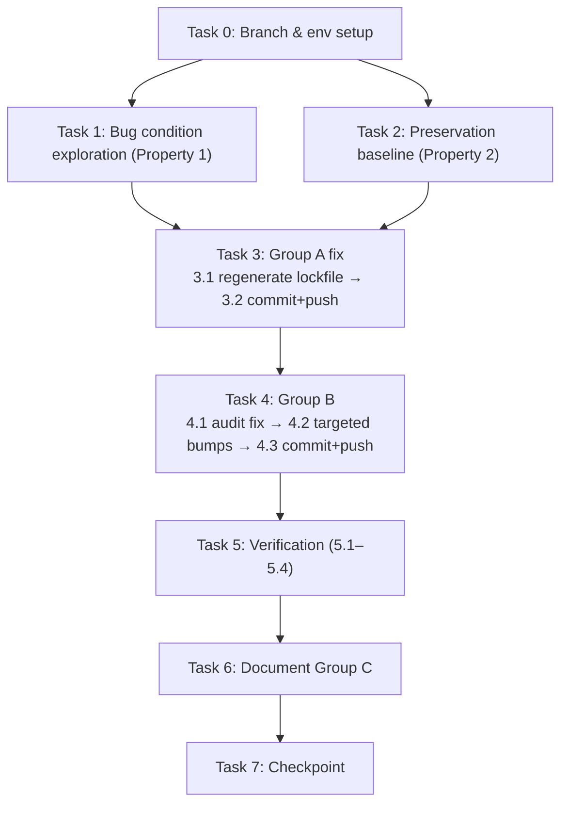

# Implementation Plan

## Overview

This is a **dependency/lockfile remediation** to unblock the Railway deploy — no application source code changes. Work proceeds in ordered groups: **Group A** first regenerates the npm lockfile to `next@14.2.35` (clearing the HIGH Next.js advisory that gates the deploy), then **Group B** applies safe compatible/minor bumps, then verification confirms the bug is fixed with no regressions, and finally **Group C** deferred follow-ups are documented (documentation only). Each meaningful change is committed and pushed per step so Railway re-scans and the deployment updates.

## Task Dependency Graph



**Ordering constraints:**
- Task 0 (branch/env setup) must complete before anything else.
- Tasks 1 and 2 both depend on Task 0 and must precede Task 3.
- **Group A (Task 3) must complete and be pushed BEFORE Group B (Task 4) is started** — Group A unblocks the deploy first.
- Within Task 3: 3.1 (regenerate lockfile) → 3.2 (commit + push).
- Within Task 4: 4.1 (audit fix) → 4.2 (targeted bumps) → 4.3 (commit + push).
- Task 5 (verification 5.1–5.4) follows Group B, then Task 6 (document Group C), then Task 7 (checkpoint).

```json
{
  "waves": [
    { "wave": 1, "tasks": ["0"], "description": "Branch and environment setup" },
    { "wave": 2, "tasks": ["1", "2"], "description": "Pre-fix bug-condition exploration and preservation baseline (depend on Task 0)" },
    { "wave": 3, "tasks": ["3"], "description": "Group A: regenerate lockfile to next 14.2.35, commit + push first to unblock deploy" },
    { "wave": 4, "tasks": ["4"], "description": "Group B: safe compatible/minor bumps, commit + push" },
    { "wave": 5, "tasks": ["5"], "description": "Verification (5.1-5.4)" },
    { "wave": 6, "tasks": ["6"], "description": "Document deferred Group C follow-ups" },
    { "wave": 7, "tasks": ["7"], "description": "Checkpoint" }
  ]
}
```

## Tasks

This is a **dependency/lockfile remediation** — no application source code changes. Tasks are ordered so the deploy-unblocking **Group A** fix is committed and pushed FIRST (so Railway re-scans and the deploy unblocks), then **Group B** safe fixes, then verification, then Group C documentation.

**Environment prerequisite:** `npm install` / `npm audit` require network access to the npm registry. Confirm connectivity before starting (see Task 0).

**Commit strategy (per user directive):** Commit and push after every meaningful change so the Railway deployment updates. Group A is committed/pushed before Group B is even started.

---

- [ ] 0. Set up branch and confirm environment
  - Confirm working in the repo at `/projects/sandbox/boxing-rounds-timer` (current branch is `master`, the default).
  - Per branch policy, create a dedicated branch for the fix rather than committing to `master`: `git checkout -b fix/next-lockfile-cve`.
  - **IMPORTANT:** The user wants Railway to pick up changes — confirm which branch Railway deploys from. If Railway deploys from `master` (or a branch other than `fix/next-lockfile-cve`), align the commit/push target with the branch Railway actually scans (open a PR into `master` and/or push to the deploy branch as appropriate). Confirm this approach with the user before pushing if ambiguous.
  - Confirm npm registry connectivity: `npm ping` (or `npm view next version`) succeeds. Group A/B cannot proceed without registry access.
  - Capture the pre-fix baseline for later diffing: ensure `package-lock.json` is committed/clean so `git diff package-lock.json` is meaningful after the fix.
  - _Requirements: 1.1, 1.2_

- [ ] 1. Write bug condition exploration test (BEFORE the fix)
  - **Property 1: Bug Condition** - Stale Next.js Lockfile Pin
  - **CRITICAL**: This check MUST FAIL on the unfixed lockfile — failure confirms the bug exists. **DO NOT attempt to fix the code when it fails.**
  - **NOTE**: This check encodes the expected post-fix behavior; it will validate the fix when it passes after Group A + Group B.
  - **GOAL**: Surface counterexamples that demonstrate the bug exists in the scanned `package-lock.json`.
  - **Scoped PBT Approach**: This is a deterministic bug — scope the property to the concrete failing lockfile state (current `package-lock.json`).
  - Bug-condition check (from `isBugCondition` in design): `resolvedVersion(lockfile, "next") < 14.2.35` OR any `@next/*` subpackage `< 14.2.35` OR any Group B advisory present.
  - Concrete commands to run on UNFIXED code:
    - `grep -c "14.2.28" package-lock.json` → expect `32` (bug present; post-fix expectation is `0`).
    - Inspect `node_modules/next` / lockfile `next` entry → resolves `14.2.28`, carries `"deprecated"` security note (expected `14.2.35`).
    - `npm audit` → reports `next@14.2.28` HIGH plus Group B advisories (`next-auth`, `lodash`, `react-use`, `csv`, `webpack`).
    - Edge/trap check: confirm `npm audit` suggests `next@16` / `maplibre-gl@6` (majors) — verifying `--force` would be destructive and must be avoided.
  - **EXPECTED OUTCOME**: Checks FAIL (this is correct — it proves the bug exists).
  - Document counterexamples found (e.g., "`next` resolves `14.2.28`; Railway reports HIGH `next@14.2.28`; manifest already says `14.2.35` → stale lockfile confirmed").
  - Mark complete when the check is written, run, and the failure is documented.
  - _Requirements: 1.1, 1.2, 1.3, 1.4, 1.5_

- [ ] 2. Write preservation property checks (BEFORE the fix)
  - **Property 2: Preservation** - Non-Targeted Resolution & Runtime Behavior Unchanged
  - **IMPORTANT**: Follow observation-first methodology — record real pre-fix state, not assumed state.
  - Observe behavior on the UNFIXED lockfile for non-bug-condition inputs (every dep NOT in the targeted Group A/B set or its compatible transitives):
    - Snapshot the pre-fix resolved tree: `git show HEAD:package-lock.json` is the baseline; alternatively record `npm ls --all` output.
    - Record `package.json` dependency ranges (baseline), including the `@next/swc-*` dev pins at `13.5.1`.
  - Write property-based preservation checks capturing observed patterns (from Preservation Requirements in design):
    - For all deps NOT in `targetedSet` (`next` ∪ `@next/*` ∪ `{next-auth, lodash, react-use, csv, webpack}` ∪ Group B transitives): resolved version is byte-identical before/after → will be verified via `git diff package-lock.json`.
    - For all deps: `major(after) <= major(before)` unless a compatible-bump target (no-major-upgrade invariant).
    - Group C set (`maplibre-gl`, `plotly.js`, `react-plotly.js`, `@typescript-eslint/*`) versions unchanged (deferral invariant).
    - `@next/swc-wasm-nodejs@13.5.1` and `@next/swc-win32-x64-msvc@^13.5.1` dev pins unchanged.
  - **EXPECTED OUTCOME**: The baseline is captured and preservation checks are defined against it (they trivially "pass" on unfixed code since nothing has changed yet).
  - Mark complete when the baseline snapshot is captured and preservation checks are defined.
  - _Requirements: 3.1, 3.2, 3.3, 3.4, 3.5, 3.6, 3.7, 2.5, 2.8_

- [ ] 3. Group A — Regenerate the npm lockfile to next 14.2.35 (PRIMARY, unblocks deploy)

  - [ ] 3.1 Regenerate `package-lock.json` with npm
    - Run `npm install` in `/projects/sandbox/boxing-rounds-timer` to reconcile the lockfile to the manifest (`package.json` already declares `next: 14.2.35`).
    - If a fully explicit form is preferred (equivalent, forces the range): `npm install next@^14.2.35`.
    - This moves `node_modules/next`, `@next/env`, and all `@next/swc-*` runtime subpackage entries from `14.2.28` → `14.2.35`; the stale `"deprecated"` note on `next` disappears; NO `next@16` entry appears.
    - **Perform the fix with `npm`, NOT yarn** — Railway scans `package-lock.json`; yarn would ignore it. Do NOT introduce a `yarn.lock`. `.yarnrc.yml` may remain as-is.
    - Do NOT touch `devDependencies` `@next/swc-wasm-nodejs@13.5.1` / `@next/swc-win32-x64-msvc@^13.5.1` — leave them exactly as-is.
    - Verify Group A immediately: `grep -c "14.2.28" package-lock.json` → `0`; `npm ls next` → `next@14.2.35` (14.2.x line, not 16).
    - _Bug_Condition: isBugCondition(X) where resolvedVersion(X,"next") < 14.2.35 or any @next/* < 14.2.35_
    - _Expected_Behavior: expectedBehavior(result) — next and all @next/* resolve >= 14.2.35 on the 14.2.x line; HIGH gate passes_
    - _Preservation: no unrelated dependency drift; @next/swc-* dev pins at 13.5.1 unchanged (Preservation Requirements from design)_
    - _Requirements: 2.1, 2.2, 2.3_

  - [ ] 3.2 Commit and push Group A FIRST so Railway re-scans and the deploy unblocks
    - Stage only the changed lockfile: `git add package-lock.json` (and `package.json` only if it changed, which it should not for Group A).
    - Commit: `git commit -m "fix: regenerate package-lock.json to next 14.2.35 (CVE-2025-55184, CVE-2025-67779)"`.
    - Push to the branch Railway deploys from (per Task 0): `git push -u origin fix/next-lockfile-cve` (or the confirmed deploy branch).
    - **This commit alone unblocks the deploy** — confirm Railway re-scans and no longer reports the HIGH `next@14.2.28` advisory.
    - _Requirements: 2.1, 2.3_

- [ ] 4. Group B — Safe compatible / minor bumps (NO --force)

  - [ ] 4.1 Apply compatible + transitive fixes automatically
    - Run `npm audit fix` (**NO `--force`**) — applies only semver-compatible updates, including transitives (`brace-expansion`, `browserslist`, `fast-uri`, `fast-xml-builder`, `fast-xml-parser`, `js-yaml`, `nanoid`, `esbuild`, `baseline-browser-mapping`, `@aws-sdk/xml-builder`, `postcss-selector-parser`, `uuid`).
    - **EXPLICITLY DO NOT run `npm audit fix --force`** — it would pull `next@16`, `maplibre-gl@6`, `plotly.js@4` and other breaking majors. This command must never be run.
    - _Bug_Condition: groupBAdvisory — a Group B package carries an advisory resolvable by a non-breaking bump_
    - _Expected_Behavior: Group B advisories resolved via compatible/minor bumps; no major upgrade introduced_
    - _Preservation: transitive updates stay semver-compatible; no unrelated drift_
    - _Requirements: 2.4, 2.5_

  - [ ] 4.2 Apply targeted direct minor bumps
    - Run `npm install next-auth@^4.24.15 lodash@^4.18.1 react-use@^17.6.1 csv@^6.6.3 webpack@^5.111.0` (updates `package.json` ranges + lockfile).
    - (Install the patched `4.x` lodash that clears the `_.template` advisory while staying on the `4.x` major.)
    - Verify: `next-auth >= 4.24.15`, `lodash >= 4.18.1`, `react-use >= 17.6.1`, `csv >= 6.6.3`, `webpack >= 5.111.0`.
    - These packages are unused at runtime (`lodash`, `react-use`, `csv`) or type-only (`next-auth`), so bumps affect only the resolved lockfile tree, not app logic.
    - _Bug_Condition: groupBAdvisory for direct deps below their patched line_
    - _Expected_Behavior: Group B direct deps at patched minor versions; runtime behavior identical_
    - _Preservation: no major-version increase; runtime app behavior unchanged (Requirement 3.6)_
    - _Requirements: 2.4, 2.5, 3.6_

  - [ ] 4.3 Commit and push Group B
    - Stage the changed files: `git add package-lock.json package.json`.
    - Commit: `git commit -m "fix(deps): patch next-auth/lodash/react-use/csv/webpack advisories (compatible bumps)"`.
    - Push so Railway re-scans the updated lockfile: `git push`.
    - _Requirements: 2.4, 2.6_

- [ ] 5. Verify the fix — bug condition checks now pass

  - [ ] 5.1 Verify bug condition exploration check now passes (Group A)
    - **Property 1: Expected Behavior** - Next.js Resolves to Patched 14.2.35
    - **IMPORTANT**: Re-run the SAME checks from Task 1 — do NOT write new ones.
    - `grep -c "14.2.28" package-lock.json` → `0`.
    - `npm ls next` → `next@14.2.35` (14.2.x line; confirm NO `next@16`).
    - `npm audit --json` → assert no HIGH `next` advisory (Railway HIGH gate would pass).
    - **EXPECTED OUTCOME**: Checks PASS (confirms Group A bug is fixed).
    - _Requirements: 2.1, 2.2, 2.3_

  - [ ] 5.2 Verify Group B advisories resolved
    - `npm audit` → Group A + Group B advisories gone; only documented Group C items remain (`maplibre-gl`, `plotly.js`, `@typescript-eslint/*`, `next@16` suggestion).
    - Confirm Group B resolved versions: `next-auth >= 4.24.15`, `lodash >= 4.18.1`, `react-use >= 17.6.1`, `csv >= 6.6.3`, `webpack >= 5.111.0`.
    - _Requirements: 2.4, 2.6_

  - [ ] 5.3 Verify preservation checks still pass (no regressions)
    - **Property 2: Preservation** - Non-Targeted Resolution & Runtime Behavior Unchanged
    - **IMPORTANT**: Re-run the SAME checks from Task 2 — do NOT write new ones.
    - `git diff package-lock.json` → only `next` / `@next/*` / Group B + their compatible transitives changed; every other resolved `version` identical.
    - Compare `package.json` ranges before/after → no major-version increase for any dep; `next` still `14.2.35` (14.2.x).
    - Confirm `@next/swc-wasm-nodejs@13.5.1` and `@next/swc-win32-x64-msvc@^13.5.1` unchanged in `package.json` and lockfile.
    - Confirm Group C versions unchanged.
    - **EXPECTED OUTCOME**: Checks PASS (confirms no regressions).
    - _Requirements: 3.1, 3.2, 3.3, 3.4, 3.5, 3.6, 3.7, 2.5_

  - [ ] 5.4 Verify build and deploy-gate simulation
    - Clean install check: `npm install` runs cleanly with no errors and requires no further lockfile modification.
    - `npm run build` (next build) succeeds — matches pre-fix build behavior.
    - Deploy-gate simulation: `npm audit --json` shows no HIGH Next.js advisory → Railway HIGH gate would pass.
    - _Requirements: 2.7, 3.2_

- [ ] 6. Document deferred Group C follow-ups (DOCUMENTATION ONLY — do NOT fix)
  - **DO NOT** upgrade or fix Group C. Record follow-ups only.
  - Document in the follow-up notes (e.g., a `FOLLOW_UPS.md` or the PR description):
    - `maplibre-gl`, `plotly.js`, `react-plotly.js` have zero source imports → RECOMMEND **removing** the unused dependencies rather than major-upgrading (`maplibre-gl@6` / `plotly.js@4`).
    - If confirmed unused, also consider removing `react-use`, `lodash`, `csv`, `@aws-sdk/*`, `@azure/storage-blob`.
    - `@typescript-eslint/*` majors are dev/lint-only, low urgency.
    - `next@16` migration is explicitly out of scope; `14.2.35` is the correct target.
  - _Requirements: 2.8, 3.4_

- [ ] 7. Checkpoint — Ensure all checks pass
  - Confirm Task 5 checks all pass: `grep -c 14.2.28 package-lock.json` = 0, `npm ls next` = 14.2.35, `npm audit` clean of Group A/B (only Group C remains), `npm run build` succeeds, `git diff` scope confined to targeted entries.
  - Confirm Group A and Group B commits are pushed to the branch Railway deploys from and Railway's deploy is unblocked.
  - Open a PR into `master` from `fix/next-lockfile-cve` if not already, referencing the Group C follow-ups.
  - Ensure all checks pass; ask the user if questions arise.

## Notes

- **npm-only:** This project uses npm (`package-lock.json` is what Railway scans). Do NOT introduce or rely on a `yarn.lock`; perform all lockfile changes with `npm`. `.yarnrc.yml` may remain as-is.
- **Network/registry prerequisite:** `npm install` / `npm audit` require network access to the npm registry. Confirm connectivity (`npm ping` or `npm view next version`) before starting Group A/B — neither group can proceed without registry access.
- **Never run `npm audit fix --force`:** The `--force` variant pulls breaking majors (`next@16`, `maplibre-gl@6`, `plotly.js@4`, etc.). Only the plain `npm audit fix` (semver-compatible) is permitted. `--force` must never be run.
- **Next.js stays on 14.2.x:** The correct target is `next@14.2.35` (14.2.x line). Do NOT migrate to `next@16`; the `next@16` audit suggestion is explicitly out of scope.
- **Group C is documentation-only:** Deferred follow-ups (`maplibre-gl`, `plotly.js`, `react-plotly.js`, `@typescript-eslint/*`) are recorded as follow-ups only — do NOT upgrade or fix them in this remediation.
