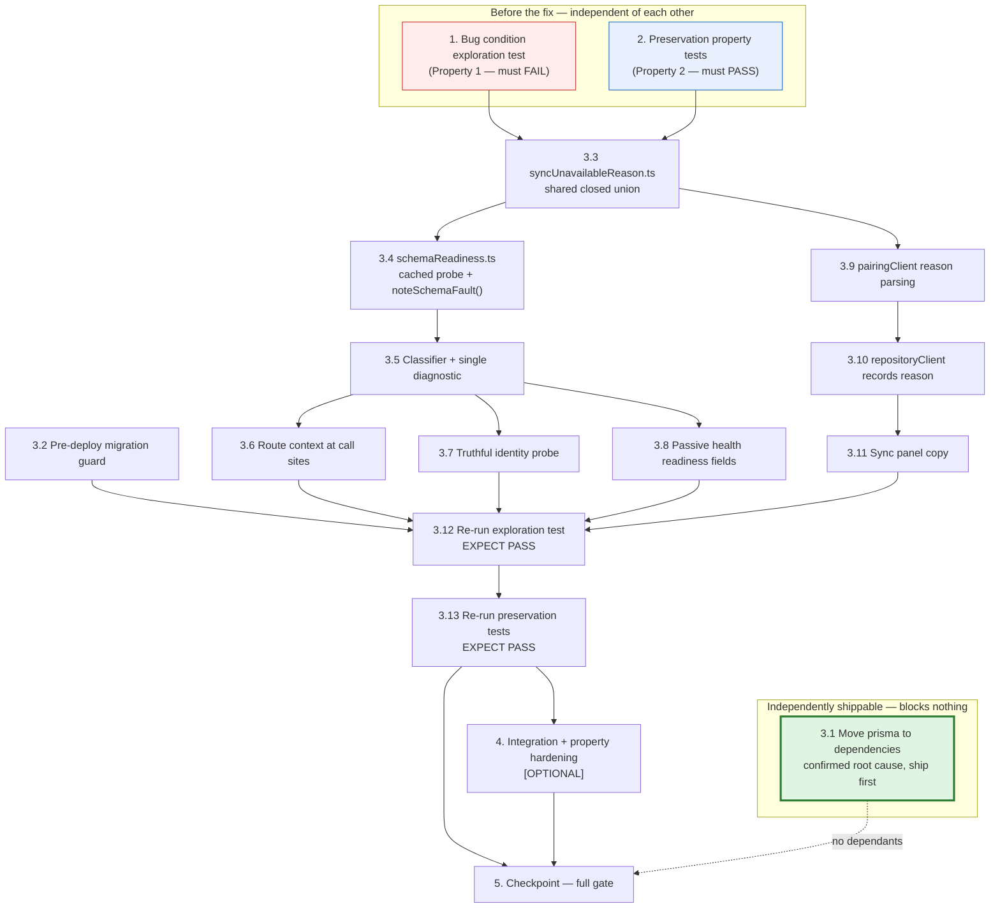

# Implementation Plan

## Overview

This plan fixes pairing routes returning `500 {"error":"Unexpected server error"}` when the pairing
schema is missing from a database that is configured and reachable. The work has four movements:

1. **Make the migration apply, robustly** — a pre-deploy guard that resolves the Prisma CLI,
   handles the P3005 baseline case, verifies with `migrate status`, and fails the release loudly.
2. **Classify the fault** — `P2021`/`P2022` become a third category alongside unreachable and
   unknown, answering `503 {reason:'schema-not-migrated'}` with exactly one redacted diagnostic.
3. **Attribute it honestly to the user** — the client stops folding this `503` into `unreachable`,
   and the Sync panel says the *server* is not ready, that it is not the user's fault, and that
   local data is safe.
4. **Make the probes truthful** — `/api/pair/identity` and `/api/health` stop advertising sync
   readiness they have not verified.

The "Before you start" preamble below carries the operational detail and must be read in full.

## Before you start

**Root cause 2 is CONFIRMED, not hypothesised.** Hiding `node_modules/prisma` (simulating
Railway's devDependency-pruned runtime image) and running the pre-deploy command reproduces the
production failure exactly:

```
> prisma migrate deploy
sh: line 1: prisma: command not found
--- exit: 127 ---
```

`prisma` is in `devDependencies`; only `@prisma/client` is in `dependencies`. The build succeeds
because Nixpacks installs devDependencies to build, but `preDeployCommand` runs *afterward* in the
pruned runtime image. A Railway screenshot of the Pre-deploy step failing on `migrate:deploy`
corroborates this and was never resolved. Consequently **task 3.1 alone is very likely sufficient
to make pairing work on the next deploy**, and it is sequenced first among the implementation
sub-tasks and made independently shippable. The design's root cause 1 (P3005 baselining) drops to
defensive handling — still required by 2.9, since it may surface once the CLI can actually run.

**Node version gotcha — read this or you will misread a pre-existing failure as your own
regression.** The suite passes **only under Node 22**. Under the Node 20 pinned by `.nvmrc` and
`engines`, 29 of 34 files fail to collect with
`TypeError: webidl.util.markAsUncloneable is not a function`, thrown from the undici bundled inside
jsdom. **This is pre-existing and out of scope — there is no task to fix it, and do not add one.**

**Verification gate — every task must leave all four commands green:**

```
export NVM_DIR="$HOME/.nvm"; . "$NVM_DIR/nvm.sh"    # npm/node are NOT on the default PATH
npm run typecheck                                    # must stay clean (both tsconfig projects)
npm test                                             # 519 tests / 34 files is the FLOOR; new tests raise it
mv node_modules/@vitejs /tmp/_v; env -u DATABASE_URL npm run build; mv /tmp/_v node_modules/@vitejs
```

The build must be verified with devDependencies effectively absent, exactly as shown, because that
is how Railway installs — and that is precisely the class of failure that caused this bug.

**Branch and commit policy.** `master` is the default branch and the repo auto-deploys from it on
every push, so **do not commit directly to `master`**. Create a branch for this spec and fix work,
commit after each meaningful change (each sub-task below is a commit-sized unit), and open a PR for
review.

**Ordering note.** The design's four movements are ordered by importance; the sub-tasks below are
ordered by *dependency*, which differs in one place: `lib/pairing/schemaReadiness.ts` (movement 4)
is built before the classifier (movement 2) because `errorResponse` calls its `noteSchemaFault()`.
`lib/data/syncUnavailableReason.ts` precedes all classifier, client and panel work, since both
server and client import that union.

**Test infrastructure constraint.** There is no live Postgres in the sandbox or in CI. The bug
condition is reachable *only* through the in-memory fake at
`lib/pairing/__fixtures__/prismaFake.ts`. If the fake is not faithful, every test below is
worthless — see the fidelity rules in task 1.

---

## Tasks

- [ ] 1. Write bug condition exploration test **[REQUIRED]**
  - **Property 1: Bug Condition** - Missing pairing schema yields a classified fault, self-reports, and is attributed honestly
  - **CRITICAL**: This test MUST FAIL on unfixed code - failure confirms the bug exists
  - **DO NOT attempt to fix the test or the code when it fails**
  - **NOTE**: This test encodes the expected behavior - it will validate the fix when it passes after implementation
  - **GOAL**: Surface counterexamples that demonstrate the bug exists, and confirm or refute the root-cause analysis
  - **Scoped PBT Approach**: The bug is deterministic given the deployment state, so scope the property to the concrete failing configuration — `databaseConfigured = TRUE`, `databaseReachable = TRUE`, `pairingSchemaPresent = FALSE` — and generate across the request dimension (route, IP, submitted code) within it
  - Covers design Correctness Properties 1 (classified `503`), 2 (self-reporting), and 3 (honest copy); design Property 4 is task 2
  - **First, extend the fake (additive) so the bug condition is reachable at all** — per the design's fake-fidelity section:
    - Add `missingRelations?: readonly FakeRelationName[]` to `PrismaFakeOptions`, and a `missingPairingSchema()` helper returning a fake with all four pairing relations absent
    - The thrown value is a `FakePrismaError` with `name === 'PrismaClientKnownRequestError'`, `code === 'P2021'`, `meta.table === 'public.<Relation>'`, message *"The table `public.<Relation>` does not exist in the current database."*; extend `FakePrismaError` to carry `meta.table`/`meta.modelName` alongside its existing `meta.target`
    - **Every** delegate method throws — `findUnique`, `findFirst`, `findMany`, `count`, `create`, `update`, `updateMany`, `upsert`, `delete`, `deleteMany` — and so does a call inside `$transaction`
    - **The throw must happen BEFORE any `where` evaluation**, so a missing relation cannot behave like an empty one — that failure mode would make Property 1 pass against unfixed code
    - Add one unit test recording the assumed Prisma error shape explicitly, so a future Prisma upgrade that changes it fails visibly here rather than silently in production
  - Point the existing `vi.mock('@/lib/db', …)` harness in `app/api/pair/pair-routes.test.ts` at `missingPairingSchema()` and observe the unfixed routes
  - Test that `POST /api/pair/code` under the bug condition answers `503` with `reason: 'schema-not-migrated'` and a body containing no pairing code, device token or connection string (from Bug Condition + Property 1 in design)
  - Test that `POST /api/pair/claim` answers the same `503`, revealing nothing about the submitted code
  - Test that exactly one `console.error` diagnostic is emitted, naming the route, the Prisma code and the operator remedy, and containing no code, token, connection string, IP or `ipHash` (Property 2)
  - Test that `GET /api/pair/identity` answers `200` with `syncAvailable: false` and `reason: 'schema-not-migrated'`, and that `GET /api/health` answers `200` with `pairingSchemaReady: false` (Property 2)
  - Test that the Sync panel copy differs from both the not-configured and unreachable copy and states server-not-ready plus local-data-safe (Property 3)
  - **Edge case**: `missingRelations: ['PairingAttempt']` alone must reproduce the failure, confirming the limiter's ledger read is the first touch — and that fixing only the pairing tables' own handlers would not have been enough
  - Run test on UNFIXED code
  - **EXPECTED OUTCOME**: Test FAILS (this is correct - it proves the bug exists)
  - Document counterexamples found: `500 {"error":"Unexpected server error"}` instead of `503`; `P2021` escaping `isDatabaseUnreachable` into `serverError()`; zero `console.error` calls; `syncAvailable: true`; `mode: 'sync-capable'` with no readiness field; *"Sync is unavailable right now…"* copy
  - **Note the analysis limit honestly**: these counterexamples confirm the *application-level* root cause exactly, but cannot discriminate among the four *deployment-level* causes — which is why task 3.2 is robust across all four
  - Mark task complete when test is written, run, and failure is documented
  - _Requirements: 1.1, 1.2, 1.3, 1.4, 1.5, 1.6, 1.7, 1.8, 2.1, 2.2, 2.3, 2.4, 2.5, 2.6, 2.7, 2.8, 2.10_

- [ ] 2. Write preservation property tests (BEFORE implementing fix) **[REQUIRED]**
  - **Property 2: Preservation** - The three non-buggy deployment states do not move
  - **IMPORTANT**: Follow observation-first methodology — record what the UNFIXED code actually does, not what you assume it does
  - **Honest limitation to record**: the unfixed function `F` is not available at runtime once the fix lands, so `handlePairing_original` is represented by expectations recorded now, plus the 519 existing tests, which already pin this behaviour in detail. The existing suite is the primary preservation oracle; the recorded table covers what it does not assert explicitly
  - Observe on UNFIXED code, using `absentDatabaseModule()`, the existing `unreachableDatabase()` helper, and `createPrismaFake()`:
    - **No database configured**: every pairing route answers `503 {reason:'not-configured'}`; identity answers `200` with the exact local-only body; the panel renders `sync-unavailable` with `UNAVAILABLE_COPY` (3.2)
    - **Configured but unreachable**: `503 {reason:'unreachable'}`; identity returns `{...localOnly, reason:'unreachable'}`; `resolveIdentity()` returns `database-error`, never `anonymous`; the client classifies it retryable (3.3)
    - **Healthy and migrated**: `POST /api/pair/code` answers `201`, plaintext code emitted exactly once, only the SHA-256 digest persisted, TTL from `PAIRING_CODE_TTL_MS` alone, calling device enrolled, cookie set for a previously anonymous caller (3.4)
    - **Claim rejections**: one uniform `400` for absent/expired/consumed/malformed — the new reason must never become a new oracle about code state (3.5)
    - **Rate limiting**: same caps and windows, limit checked before any code processing, `Retry-After` in whole seconds, one ledger row per processed attempt, fail-closed with no client (3.6)
    - **`/api/health`**: `200`, with `status`/`database`/`accounts`/`mode`/`timestamp` byte-identical, and `getPrismaClient` **not called** (3.8)
    - **Data routes**: `/api/workouts` and `/api/sessions` keep their `200`/`400`/`401`/`503` taxonomy (3.10)
  - Write property-based tests with `fast-check` (already a devDependency) capturing observed behaviour across arbitrary pairing requests crossed with the three non-buggy database states, asserting status and body equal the recorded pre-fix expectations (design Property 4)
  - Property-based testing generates many test cases for stronger guarantees than hand-written cases, and catches edge cases they miss
  - Record that the only permitted deviation is the one `bugfix.md` already exempts: `/api/health` gains additive readiness fields while its status and its independence from the database are preserved
  - Run tests on UNFIXED code
  - **EXPECTED OUTCOME**: Tests PASS (this confirms baseline behavior to preserve)
  - Mark task complete when tests are written, run, and passing on unfixed code
  - _Requirements: 3.2, 3.3, 3.4, 3.5, 3.6, 3.7, 3.8, 3.10, 3.11, 3.12_

- [ ] 3. Fix for pairing routes returning 500 when the pairing schema is missing

  - [ ] 3.1 Move `prisma` from `devDependencies` to `dependencies` **[REQUIRED — highest value, independently shippable]**
    - **This is the confirmed root cause and is very likely sufficient on its own.** Ship and validate it before doing anything else
    - Move `prisma` (`6.7.0`) from `devDependencies` to `dependencies`; `@prisma/client` is already a dependency
    - Leave `migrate:deploy` as literally `prisma migrate deploy` — `deployment-config.test.ts:105` pins that exact string and must keep passing unmodified
    - Add a `deployment-config.test.ts` assertion that `prisma` is in `dependencies`, so the pruned-runtime failure cannot silently return
    - Verify with the devDependency-free build command in the gate, and confirm the CLI resolves when `node_modules/prisma` would be pruned
    - Adds no environment variable (3.9)
    - Commit and open the PR at this point so the fix can be deployed and validated incrementally
    - _Bug_Condition: isBugCondition(X) — the schema is absent because the migration never ran; the CLI was missing at pre-deploy time (root cause 2, confirmed by reproduction)_
    - _Expected_Behavior: 2.9 — pending migrations are applied before traffic is served_
    - _Preservation: 3.1, 3.9 — suite/typecheck/build stay green; zero new environment variables_
    - _Design: Fix Implementation §1, root cause 2_
    - _Requirements: 2.9, 3.1, 3.9_

  - [ ] 3.2 Add the pre-deploy migration guard and make failure loud **[REQUIRED]**
    - Create `scripts/predeploy-migrate.mjs` — plain Node ESM, zero dependencies, no build step (`scripts/generate-pwa-icons.mjs` is the precedent)
    - Print an unmistakable banner first, so root cause 3 (`preDeployCommand` not honoured, because dashboard service settings override `railway.json`) is diagnosable by the banner's *absence* from the Pre-deploy log
    - Exit 0 with a "nothing to migrate" line when `DATABASE_URL` is unset or blank — local-only is a supported state (3.2, 3.9)
    - Resolve the Prisma CLI explicitly (`node_modules/prisma/build/index.js`, else `npx --no-install prisma`) and fail with a named error naming the dependencies remedy if absent (root cause 2)
    - Run `migrate deploy`, echoing stdout and stderr verbatim
    - On **P3005** (tables but no migration history): baseline with `migrate resolve --applied 20250915000000_init`, then retry `migrate deploy` **once, never twice** (root cause 1, now defensive)
    - On **P3009** (a migration recorded as failed): FAIL with the `--rolled-back` remedy and refuse to guess — this is the one case where re-running the SQL is not safe (root cause 4)
    - Verify with a read-only `migrate status` and fail if anything is still pending — this closes the gap where `migrate deploy` succeeds but leaves work outstanding
    - **The baseline list is hard-coded to the init migration alone.** `migrate resolve --applied` marks a migration applied *without running its SQL*; baselining `20250917000000_device_pairing_sync` would record the pairing tables as created while leaving them absent, converting this bug into an unfixable one. Add a test asserting the pairing migration's name **never** appears next to `--applied`
    - Every failure path exits non-zero, so Railway aborts the release instead of serving an incomplete schema (defect 1.9)
    - `package.json`: add `"predeploy": "node scripts/predeploy-migrate.mjs"`; `railway.json`: `preDeployCommand` → `"npm run predeploy"`
    - **Rewrite exactly one existing `it`** — `deployment-config.test.ts:120` *"runs the migration in the release phase"*. Its intent (the migration runs in the release phase and a failure aborts the deploy) must be preserved and strengthened. This is the **only** existing assertion this fix may rewrite — rewrite it in place rather than deleting it, so the file's existing `it` count does not drop (**verified: the file currently has 15 `it` blocks, not the 21 the design text states — trust the file, and treat 15 as the floor**)
    - Add assertions that the wrapper invokes `migrate deploy`, verifies with `migrate status`, baselines the init migration, and that the healthcheck path and `$PORT` binding are unchanged
    - Smoke-test: run the script with `DATABASE_URL` unset and assert exit 0 (the P3005/P3009 branches are asserted through static content and a stubbed runner, since no Postgres is available)
    - **Rejected alternative** (do not implement): migrating at server start — it races across replicas and would delay or block boot, contradicting 3.8/3.11
    - _Bug_Condition: isBugCondition(X) — configured, reachable, relations absent_
    - _Expected_Behavior: 2.9 — migrations applied before traffic; tolerates tables-without-history; a step that cannot complete fails visibly_
    - _Preservation: 3.2, 3.9 — local-only deployments unaffected; zero new environment variables_
    - _Design: Fix Implementation §1_
    - _Requirements: 2.9, 3.2, 3.9_

  - [ ] 3.3 Add the shared `Sync_Unavailable_Reason` union **[REQUIRED — must precede 3.4–3.11]**
    - Create `lib/data/syncUnavailableReason.ts` exporting `SYNC_UNAVAILABLE_REASONS` (`'not-configured'`, `'unreachable'`, `'schema-not-migrated'`), the derived `SyncUnavailableReason` type, and a **total** `asSyncUnavailableReason(value: unknown)` that degrades any unrecognised wire value to `'unreachable'`
    - **Import nothing** (the discipline `prismaFake.ts` follows), so it is safe in a server bundle, a client bundle and the test project alike, and typechecks under both tsconfig projects
    - Both `apiResponses.ts` (server) and `pairingClient.ts` (client) import it, so a reason added on one side without the other is a type error rather than a silent wire mismatch
    - Every consumer that branches on it uses an exhaustive `switch` whose `default` narrows to `never`, so a fourth reason cannot be added without every branch being revisited
    - Unit-test totality: every member round-trips; `undefined`/`''`/`'nonsense'`/`42` all degrade to `'unreachable'`
    - _Bug_Condition: isBugCondition(X) — `503` now covers three causes, so `reason` becomes the sole discriminator and must be reliable_
    - _Expected_Behavior: 2.1, 2.5 — a machine-readable reason distinct from `not-configured` and `unreachable`_
    - _Preservation: 3.2, 3.3 — the two existing reason values keep their exact wire strings_
    - _Design: Decision 1_
    - _Requirements: 2.1, 2.5, 3.2, 3.3_

  - [ ] 3.4 Add the cached schema readiness probe **[REQUIRED — precedes 3.5, which calls `noteSchemaFault()`]**
    - Create `lib/pairing/schemaReadiness.ts` exporting `SchemaReadiness` (`'ready' | 'not-migrated' | 'unreachable' | 'unknown'`), `pairingSchemaReadiness(db)`, the pure `peekPairingSchemaReadiness()`, `noteSchemaFault()`, and `resetSchemaReadinessCache()` as a test seam
    - Take the database as a structural slice (`SchemaProbeDb`), exactly as `RateLimitDb` and `IdentityDb` do, so it imports neither `@/lib/db` nor `@prisma/client`, cannot construct a client at import time, and accepts the fake with no cast
    - Probe query is `db.pairingAttempt.findFirst({ select: { id: true } })` — read-only, at most one row, no write, so the identity route stays side-effect-free (3.7). `PairingAttempt` is the first relation every pairing write path touches, so the probe's verdict and the real path's fate coincide
    - **Do not** use a `$queryRaw` `information_schema` interrogation: `prismaFake` cannot answer raw SQL and 2.10 forbids depending on a live Postgres. The probe is a readiness *signal*; per-request authority stays with the classifier
    - Asymmetric TTL: `READY_TTL_MS = 10 min`, `FAULT_TTL_MS = 30 s`. An operator who migrates *without redeploying* recovers within 30 seconds, so a permanently-cached "not ready" — a new bug in its own right — cannot happen. `'unknown'` is never cached
    - Bounded cost: at most one extra query per TTL per process, independent of request volume (2.7)
    - Memoise the in-flight promise (the pattern `repositoryClient`'s `sessionProbe` uses) and clear it in a `finally`, so N concurrent probes issue one query and a rejection cannot poison the slot
    - Classify a thrown error in place: schema-missing → `'not-migrated'`, unreachable → `'unreachable'`, anything else → `'unreachable'` (fail safe — an unclassifiable failure must never be reported as ready)
    - **The probe never logs** — it runs on every first page load, and logging there would flood
    - Unit-test: `'ready'` on a healthy fake; `'not-migrated'` on `missingPairingSchema()`; `'unreachable'` on the unreachable fake and on an unclassifiable throw; `peek()` returns `'unknown'` before any probe; a second call inside the TTL issues no query (spy the delegate); a fault verdict is re-probed after `FAULT_TTL_MS` with `vi.setSystemTime` and reports `'ready'` once the fake is repaired; a `'ready'` verdict is held for `READY_TTL_MS`; five concurrent probes issue exactly one query
    - _Bug_Condition: isBugCondition(X) — the probes must stop advertising a capability that cannot work_
    - _Expected_Behavior: 2.7, 2.8 — readiness reported truthfully, `200`, no side effects, no unbounded per-request cost_
    - _Preservation: 3.7 — identity still `200`, no secret, no side effect_
    - _Design: Fix Implementation §4_
    - _Requirements: 2.7, 2.8, 3.7_

  - [ ] 3.5 Classify the schema fault and emit exactly one redacted diagnostic **[REQUIRED]**
    - In `lib/data/apiResponses.ts`: add `SCHEMA_MISSING_PRISMA_CODES = new Set(['P2021','P2022'])` and `isSchemaNotMigrated(error)`, matching most-reliable-first: (1) `error.code` ∈ `{P2021,P2022}`; (2) SQLSTATE `42P01`/`42703`; (3) message fallback `/relation ".*" does not exist|does not exist in the current database/i` — a convenience for wrappers that lose the code, never the primary signal
    - Widen `databaseUnavailable`'s parameter to `SyncUnavailableReason` and add the third message: *"Sync isn't ready on this server yet. Your data stays in this browser and will sync once the server is updated."*
    - Give `errorResponse` an optional `context?: { route: string }` and a three-way ladder: unreachable first (unchanged), then schema → `noteSchemaFault()` + `logSchemaNotMigrated()` + `databaseUnavailable('schema-not-migrated')`, then `serverError()` (unchanged)
    - **Connectivity is checked first, deliberately**: a database you cannot reach cannot tell you whether a table exists. `isDatabaseUnreachable` is **not modified** — that is what preserves 3.3 exactly
    - The diagnostic is a **fixed template plus allow-listed fields — never `error.message`, never `error.stack`**. Exactly three interpolations, each guarded by `typeof === 'string'`: the caller's literal `route`, `error.code`, and `error.meta?.table ?? error.meta?.modelName`. Everything else is a literal. Redaction then follows *structurally*: no code, token, connection string, IP or `ipHash` is in scope at the call site, and `error.message` — the one field that could carry a connection string via `P1001` — is never read
    - Target line: `[sync] schema-not-migrated route=/api/pair/code prismaCode=P2021 table=public.PairingAttempt remedy="run `prisma migrate deploy`; if it reports P3005, first `prisma migrate resolve --applied 20250915000000_init`"`
    - Sink is `console.error` (Railway captures stdout/stderr; a logger would add a dependency)
    - **One diagnostic per failing request** holds structurally: `errorResponse` is the single funnel every route's `catch` already uses, and `logSchemaNotMigrated` is called from nowhere else. The generic `500` branch stays silent, as today. No throttling is needed — the existing limiter (10 CREATE/hour/IP, 60 CLAIM/minute global) bounds log volume for free
    - Unit-test: `P2021`/`P2022` true; `P2002`/`P2025` false; every `P10xx` false; SQLSTATE `42P01`/`42703` true; `null`/`undefined`/`{}`/a plain `Error` false. Ladder: connectivity wins over schema, schema over generic, generic still `500` and still silent. Diagnostic: exactly one `console.error`, containing route + code + remedy and none of a seeded pairing code, a seeded `bx_device` token, a `postgres://…` URL, a literal IP, or the `ipHash` derived from `x-forwarded-for`
    - Add PBT: for any generated Prisma-shaped error exactly one of the three branches fires — total, disjoint, no fallthrough; and redaction holds for arbitrary codes, tokens, IPs and connection strings injected into the request and the fake's store
    - _Bug_Condition: isBugCondition(X) — `P2021` currently escapes the connectivity-only ladder into the generic `500`_
    - _Expected_Behavior: 2.1, 2.2, 2.3, 2.4 — `503` with the new reason, plus exactly one redacted operator diagnostic_
    - _Preservation: 3.3, 3.5, 3.10 — `isDatabaseUnreachable` untouched; the new reason never becomes an oracle about code state; data-route taxonomy intact_
    - _Design: Fix Implementation §2_
    - _Requirements: 2.1, 2.2, 2.3, 2.4, 3.3, 3.5, 3.10_

  - [ ] 3.6 Pass route context from the pairing route call sites **[REQUIRED]**
    - Add `{ route: '/api/pair/...' }` to the existing `errorResponse(error)` calls in `app/api/pair/code/route.ts`, `claim`, `devices`, `devices/[id]` and `rotate` — one argument per route, no control flow moves
    - Leave the data routes calling `errorResponse(error)` with no context: they gain the schema classification (a `500` becomes a `503`, which is *inside* the taxonomy 3.10 pins) and log with `route=unknown`
    - _Bug_Condition: isBugCondition(X) — the diagnostic must name which route failed_
    - _Expected_Behavior: 2.4 — the diagnostic names the route_
    - _Preservation: 3.10 — data-route taxonomy unchanged_
    - _Design: Fix Implementation §2, "Call sites"_
    - _Requirements: 2.1, 2.2, 2.4, 3.10_

  - [ ] 3.7 Make the identity probe truthful **[REQUIRED]**
    - In `app/api/pair/identity/route.ts`, change **only** the `identity.kind === 'anonymous'` branch: call `pairingSchemaReadiness(db)` and return `{...localOnly, reason: 'schema-not-migrated'}` for `'not-migrated'`, `{...localOnly, reason: 'unreachable'}` for `'unreachable'`, else `{...localOnly, syncAvailable: true}`
    - Leave the `!getPrismaClient()`, `database-error` and authenticated branches untouched, so 3.7 and the existing identity assertions hold
    - **Minimisation**: a *paired* caller's cookie lookup already proved the schema exists, so issue no extra query on that path. The probe runs only on the `anonymous` branch — precisely the branch that today wrongly answers `syncAvailable: true` (defect 1.7)
    - Still `200`, still no secret, still no side effect
    - Test: `200` + `syncAvailable: false` + `reason: 'schema-not-migrated'` under the bug condition; a paired caller under a healthy fake triggers **no** readiness query
    - _Bug_Condition: isBugCondition(X) — identity currently reports `syncAvailable: true` because it only checks that a client object exists_
    - _Expected_Behavior: 2.7 — sync reported unavailable with a distinguishing reason, `200`, no side effects, bounded cost_
    - _Preservation: 3.7 — `200` in every state, no secret, no side effect_
    - _Design: Fix Implementation §4_
    - _Requirements: 2.7, 3.7_

  - [ ] 3.8 Add passive readiness fields to `/api/health` **[REQUIRED]**
    - In `app/api/health/route.ts`, add `pairingSchema` (the four-state verdict) and `pairingSchemaReady: pairingSchema === 'ready'` from `peekPairingSchemaReadiness()` — a pure cache read
    - **Health must stay strictly passive**: no query, no `getPrismaClient()` call, no `await`. `app/api/data-routes.test.ts` asserts `getPrismaClient` is not called by this route; **leave that assertion untouched** as the structural guard
    - **Why**: Railway uses `/api/health` as its healthcheck. Gating it on the database would take a working timer out of rotation on a database hiccup — the opposite of 3.8
    - `status`, `database`, `accounts`, `mode` and `timestamp` keep their exact current values and derivations (additive change only)
    - **State the consequence honestly**: in a cold process nothing has probed yet, so the field reports `'unknown'` / `pairingSchemaReady: false`. That is truthful and fails safe — the boolean is never `true` unless readiness has been proven — and satisfies 2.8, because a green health response can no longer *claim* readiness it has not verified. In practice the cache populates within seconds, since every browser hits `/api/pair/identity` on first load
    - **Do not** warm the cache from the healthcheck (explicit design omission): it would break the no-`getPrismaClient` assertion and erode 3.8 for a few seconds of freshness
    - Test: `200`; the two new fields reflect the cache; `getPrismaClient` never called; all other fields unchanged
    - _Bug_Condition: isBugCondition(X) — health currently reports `sync-capable` over a dead feature_
    - _Expected_Behavior: 2.8 — readiness reported as a field distinct from `DATABASE_URL` presence_
    - _Preservation: 3.8 — still `200`, still never gates readiness on the database_
    - _Design: Fix Implementation §4_
    - _Requirements: 2.8, 3.8_

  - [ ] 3.9 Stop the client folding this `503` into `unreachable` **[REQUIRED]**
    - In `lib/data/pairingClient.ts`, widen `PairingUnavailableError.reason` from its hand-written union to `SyncUnavailableReason | 'offline'`
    - In the `503` branch, replace the hand-rolled ternary (`=== 'not-configured' ? … : 'unreachable'`) with `asSyncUnavailableReason(body?.reason)`
    - **Leave the `>= 500` fallback below it untouched**, so every other `5xx` keeps folding into `'unreachable'` — the second half of 2.5, and the reason the `429`/`503`/`409`/`400` ladder above does not move
    - Test: `503` + `schema-not-migrated` → that reason; `503` with an unknown reason → `'unreachable'`; `500`/`502`/`504` → `'unreachable'`; the `429`/`409`/`400` ladder unchanged
    - Add PBT: for any `503` body the client can receive, the parsed reason is a member of `SYNC_UNAVAILABLE_REASONS`
    - _Bug_Condition: isBugCondition(X) — every `5xx` currently becomes `unreachable`, making a broken deployment indistinguishable from an unreachable database_
    - _Expected_Behavior: 2.5 — the new reason surfaces distinctly; all other `5xx` keep folding_
    - _Preservation: 3.3 — unreachable still classified retryable_
    - _Design: Fix Implementation §3_
    - _Requirements: 2.5, 3.3_

  - [ ] 3.10 Record the reason in `repositoryClient` (additive only) **[REQUIRED]**
    - Add one export to `lib/data/repositoryClient.ts`: `getSyncUnavailableReason(): SyncUnavailableReason | null`
    - **Do not change the existing surface**: `getSyncAvailability()` still returns `boolean | null` and `subscribeSyncAvailability` still takes `(available: boolean) => void` — `sync-settings.test.tsx` mocks both
    - **Ordering is load-bearing**: assign the reason *before* `setSyncAvailability(false)` notifies listeners, so any component re-rendered by that notification already reads the correct reason
    - Clear it in `resetForTests()` alongside the other module state
    - _Bug_Condition: isBugCondition(X) — the panel needs the reason the identity probe observed_
    - _Expected_Behavior: 2.6 — the panel can distinguish server-not-ready from not-configured_
    - _Preservation: 3.2, 3.7 — existing mocked signatures unchanged_
    - _Design: Fix Implementation §3_
    - _Requirements: 2.6, 3.2_

  - [ ] 3.11 Tell the user the truth in the Sync panel **[REQUIRED]**
    - Add `SERVER_NOT_READY_COPY` to `app/_components/sync-settings.tsx`: *"Sync isn't ready on this server yet — that's on us, not something you did. Your workouts and history are safe on this device. Try again in a few minutes."* — it states all three things 2.6 demands
    - It must reuse **neither** `UNAVAILABLE_COPY` (*"Sync isn't set up on this server"* — reserved for a deployment with no database) **nor** the unreachable line
    - In `messageFor`, replace the two-branch ternary inside the `PairingUnavailableError` case with an exhaustive `switch` over `'offline' | 'not-configured' | 'unreachable' | 'schema-not-migrated'` whose `default` narrows to `never`. The first three keep their **exact current strings** (preservation); `schema-not-migrated` returns the new copy
    - In the whole-panel `available === false` branch — reached via the identity probe, which is how a real user meets this bug — read `getSyncUnavailableReason()` and render `SERVER_NOT_READY_COPY` under `data-testid="sync-server-not-ready"` for `'schema-not-migrated'`, otherwise the unchanged `UNAVAILABLE_COPY` under the existing `data-testid="sync-unavailable"`. A `null` reason takes the existing path, which is what keeps the current test green
    - Test: `messageFor` returns the new copy for `'schema-not-migrated'` and the exact current strings for the other three; the panel renders `sync-server-not-ready` when the recorded reason is `'schema-not-migrated'` and `sync-unavailable` otherwise; the new copy contains neither `UNAVAILABLE_COPY` nor the unreachable line
    - _Bug_Condition: isBugCondition(X) — the panel currently shows the no-database copy for a deployment whose database is fine_
    - _Expected_Behavior: 2.6 — copy stating server-not-ready, not-your-fault, local-data-safe_
    - _Preservation: 3.2 — the not-configured copy and its `data-testid` unchanged_
    - _Design: Fix Implementation §3_
    - _Requirements: 2.6, 3.2_

  - [ ] 3.12 Verify bug condition exploration test now passes **[REQUIRED]**
    - **Property 1: Expected Behavior** - Missing pairing schema yields a classified fault, self-reports, and is attributed honestly
    - **IMPORTANT**: Re-run the SAME test from task 1 - do NOT write a new test
    - The test from task 1 encodes the expected behavior
    - When this test passes, it confirms the expected behavior is satisfied
    - Run bug condition exploration test from step 1
    - **EXPECTED OUTCOME**: Test PASSES (confirms bug is fixed)
    - _Requirements: 2.1, 2.2, 2.3, 2.4, 2.5, 2.6, 2.7, 2.8 — Expected Behavior Properties 1, 2 and 3 from design_

  - [ ] 3.13 Verify preservation tests still pass **[REQUIRED]**
    - **Property 2: Preservation** - The three non-buggy deployment states do not move
    - **IMPORTANT**: Re-run the SAME tests from task 2 - do NOT write new tests
    - Run preservation property tests from step 2
    - **EXPECTED OUTCOME**: Tests PASS (confirms no regressions)
    - Confirm all tests still pass after fix (no regressions)
    - Confirm the only rewritten existing assertion is `deployment-config.test.ts`'s *"runs the migration in the release phase"* (task 3.2), and that no existing `it` was deleted (its 15 existing blocks are the floor)
    - Confirm no new environment variable is read anywhere in the diff (3.9)
    - _Requirements: 3.1, 3.2, 3.3, 3.4, 3.5, 3.6, 3.7, 3.8, 3.9, 3.10, 3.11, 3.12 — design Property 4_

- [ ] 4. Integration and property tests for the whole flow **[OPTIONAL — hardening beyond the four required properties]**
  - Full create-code flow under the bug condition: request → limiter's first ledger read throws `P2021` → `503 schema-not-migrated` → client raises `PairingUnavailableError{'schema-not-migrated'}` → panel renders the new copy, with exactly one diagnostic for the whole flow
  - Recovery without a redeploy: bug condition → `503` and `pairingSchemaReady: false`; repair the fake; advance the clock past `FAULT_TTL_MS`; identity reports `syncAvailable: true`, health reports `ready`, `POST /api/pair/code` answers `201` — no process restart involved
  - State transitions: absent → unreachable → not-migrated → ready, asserting the panel copy and health fields at each step, and that the three pre-existing states' copy never changes
  - Cache-cost PBT: for any generated sequence of probe timestamps, the number of underlying queries is at most `⌈span / TTL⌉ + 1` — the formal statement of "no unbounded per-request database cost"
  - _Requirements: 2.4, 2.7, 2.8, 2.10_

- [ ] 5. Checkpoint - Ensure all tests pass **[REQUIRED]**
  - Run the complete gate, in order, and confirm all four are green:
    - `export NVM_DIR="$HOME/.nvm"; . "$NVM_DIR/nvm.sh"` (npm/node are not on the default PATH; the suite needs **Node 22**)
    - `npm run typecheck` — clean across both tsconfig projects; `syncUnavailableReason.ts` and `schemaReadiness.ts` must typecheck under both, which is why neither imports a devDependency
    - `npm test` — at or above the floor of 519 tests / 34 files; the new tests raise both
    - `mv node_modules/@vitejs /tmp/_v; env -u DATABASE_URL npm run build; mv /tmp/_v node_modules/@vitejs` — the devDependency-free build, the way Railway installs
  - A `webidl.util.markAsUncloneable` collection failure means you are on Node 20 — switch to Node 22; it is **not** a regression you introduced
  - Push the branch and open a PR; do **not** commit to `master`, which auto-deploys on every push
  - Ensure all tests pass, ask the user if questions arise


## Task Dependency Graph

Tasks 1 and 2 come first and are independent of each other. Task **3.1 is independently
shippable** — it is the confirmed root cause, blocks nothing, and should be committed and deployed
on its own before the rest of the work begins.



**Why these edges exist:**

| Edge | Reason |
|---|---|
| 1, 2 → everything | Both tests are written and run against **unfixed** code, so they must precede all implementation |
| 3.1 → *(nothing)* | A `package.json` dependency move touching no source file; ship and validate it first, independently |
| 3.3 → 3.4–3.11 | Both server (`apiResponses.ts`) and client (`pairingClient.ts`) import the shared union; a reason added on one side without the other must be a type error |
| **3.4 → 3.5** | `errorResponse` calls `noteSchemaFault()` from `schemaReadiness.ts`. **This is the one place dependency order deviates from the design's movement order** — movement 4 is built before movement 2 |
| 3.5 → 3.6, 3.7, 3.8 | All three consume the classifier: route context, the readiness verdict it feeds, and the cache it populates |
| 3.9 → 3.10 → 3.11 | The client parses the reason, `repositoryClient` records it, the panel renders it |
| all impl → 3.12, 3.13 | The tests from tasks 1 and 2 are **re-run**, not rewritten; they can only flip once every implementation task lands |
| 3.13 → 4, 5 | Optional hardening and the final gate come last |

### Execution Waves

```json
{
  "waves": [
    {
      "wave": 1,
      "tasks": ["1", "2", "3.1"],
      "notes": "Tasks 1 and 2 run against unfixed code and are independent of each other. Task 3.1 is a package.json-only change with no dependants — independently shippable, and should be committed and deployed on its own first."
    },
    {
      "wave": 2,
      "tasks": ["3.2", "3.3"],
      "notes": "The pre-deploy migration guard is independent of the shared union; both need only wave 1."
    },
    {
      "wave": 3,
      "tasks": ["3.4", "3.9"],
      "notes": "Both depend only on 3.3; the readiness probe and the client reason-parsing are separate chains."
    },
    {
      "wave": 4,
      "tasks": ["3.5", "3.10"],
      "notes": "3.5 depends on 3.4; 3.10 depends on 3.9."
    },
    {
      "wave": 5,
      "tasks": ["3.6", "3.7", "3.8", "3.11"],
      "notes": "3.6, 3.7 and 3.8 all consume the classifier from 3.5; 3.11 depends on 3.10."
    },
    {
      "wave": 6,
      "tasks": ["3.12"],
      "notes": "Re-runs the exploration test from task 1; requires 3.2, 3.6, 3.7, 3.8 and 3.11."
    },
    {
      "wave": 7,
      "tasks": ["3.13"],
      "notes": "Re-runs the preservation tests from task 2; depends on 3.12."
    },
    {
      "wave": 8,
      "tasks": ["4"],
      "notes": "Optional integration and property hardening; depends on 3.13."
    },
    {
      "wave": 9,
      "tasks": ["5"],
      "notes": "Final checkpoint gate; the documented edges 3.13 → 5 and 4 → 5 require it to follow task 4 in its own wave."
    }
  ]
}
```

## Notes

- **Use Node 22.** `npm` and `node` are not on the default `PATH`; load them with
  `export NVM_DIR="$HOME/.nvm"; . "$NVM_DIR/nvm.sh"`. Under the Node 20 pinned by `.nvmrc` and
  `engines`, 29 of 34 test files fail to collect with
  `TypeError: webidl.util.markAsUncloneable is not a function` (thrown from the undici bundled
  inside jsdom). **This is pre-existing and out of scope — do not fix it, do not add a task for it,
  and do not misread it as a regression you introduced.**

- **The verification gate is four commands, and every task must leave all four green:**
  1. `export NVM_DIR="$HOME/.nvm"; . "$NVM_DIR/nvm.sh"`
  2. `npm run typecheck`
  3. `npm test`
  4. `mv node_modules/@vitejs /tmp/_v; env -u DATABASE_URL npm run build; mv /tmp/_v node_modules/@vitejs`

  The build must be verified with devDependencies effectively absent, exactly as shown, because that
  is how Railway installs — and that is precisely the class of failure that caused this bug.

- **519 tests / 34 files is a FLOOR, not a target.** New tests raise both counts; a lower count
  means something broke or an assertion was deleted.

- **`deployment-config.test.ts` contains 15 `it` blocks, and 15 is the floor.** (The design document
  states 21; that figure is wrong — trust the file.) Task 3.2 may rewrite exactly one of them in
  place, *"runs the migration in the release phase"*, preserving and strengthening its intent. No
  existing `it` may be deleted.

- **Never commit to `master`.** It is the default branch and the repo auto-deploys from it on every
  push. Create a branch for this spec and fix work, commit after each sub-task (each is a
  commit-sized unit), and open a PR for review.

- **There is no live Postgres** in the sandbox or in CI. The bug condition is reachable only through
  the in-memory fake at `lib/pairing/__fixtures__/prismaFake.ts`; if that fake is not faithful,
  every test in this plan is worthless. See the fidelity rules in task 1.
